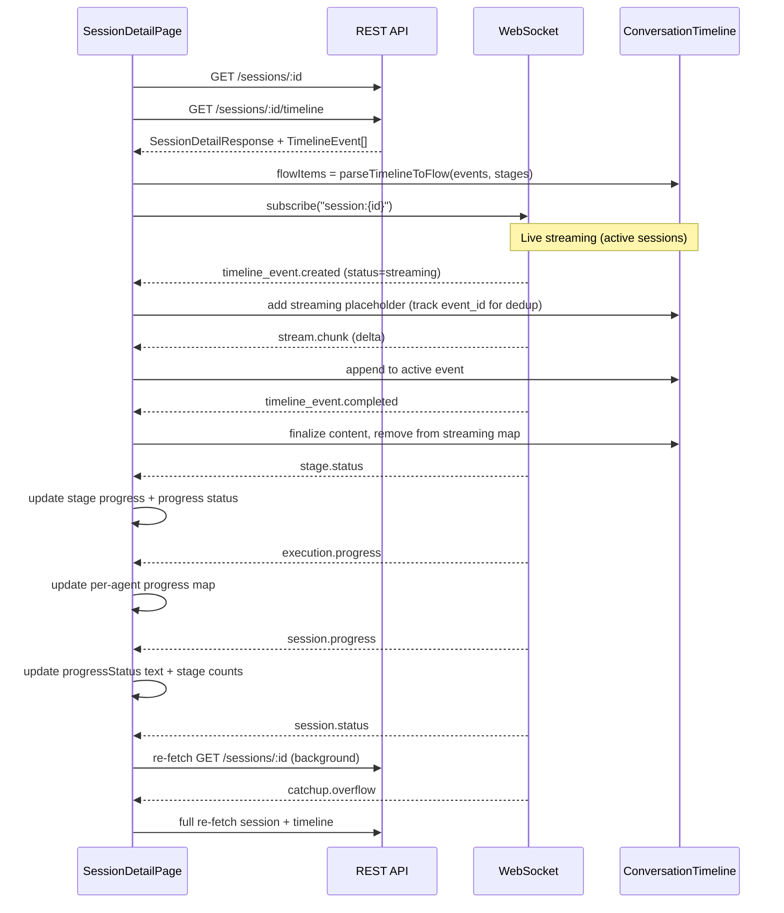

# Phase 7.4: Session Detail & Conversation Timeline

## Scope

Replace the placeholder `SessionDetailPage` with the full session detail view including:

- Session header with status, tokens, MCP summary, stage progress, segmented control
- Original alert card (collapsible)
- Conversation timeline with all event type renderers
- Live streaming with typewriter effect and streaming deduplication
- Stage separators and parallel stage tabs with per-agent progress
- Final analysis card with executive summary (counter-based expand/collapse)
- Markdown rendering
- Advanced auto-scroll during streaming (MutationObserver-based)
- Progress status system (session-level + per-agent)
- Jump navigation buttons between summary and chat slot

**NOT in scope** (Phase 7.5): Chat panel, chat input, chat state management. The page layout reserves a slot between timeline and FinalAnalysisCard for the future chat panel, rendering a placeholder for terminal sessions with chat enabled.

## Architecture

### Data Flow




### File Structure (new files to create)

```
src/
├── utils/
│   ├── timelineParser.ts          # TimelineEvent[] → FlowItem[]
│   └── markdownComponents.tsx     # Custom ReactMarkdown renderers
├── constants/
│   └── chatFlowAnimations.ts     # FADE_COLLAPSE_ANIMATION, EMOJI_ICON_STYLES
├── hooks/
│   └── useAdvancedAutoScroll.ts   # MutationObserver-based auto-scroll
├── components/
│   ├── shared/
│   │   ├── CopyButton.tsx         # Reusable copy-to-clipboard
│   │   ├── MarkdownRenderer.tsx   # Wrapper around react-markdown
│   │   ├── JsonDisplay/           # JSON viewer (directory with index, types, CSS, utils)
│   │   │   ├── index.tsx
│   │   │   ├── types.ts
│   │   │   ├── JsonDisplay.css
│   │   │   └── utils/
│   │   │       ├── index.ts
│   │   │       ├── contentParser.ts
│   │   │       └── yamlHighlighter.ts
│   │   ├── EmojiIcon.tsx          # Emoji with optional tooltip for collapsed state
│   │   ├── ContentPreviewTooltip.tsx # Markdown-rendered tooltip for collapsed items
│   │   ├── ErrorBoundary.tsx      # React error boundary for graceful failures
│   │   ├── CollapsibleItemHeader.tsx  # Reusable header with animated ellipsis
│   │   ├── CollapseButton.tsx     # "Collapse" link for expanded items
│   │   └── TokenUsageDisplay.tsx  # Token counts display (inline/badge variants)
│   ├── session/
│   │   ├── SessionHeader.tsx      # Status, tokens, MCP, stages, segmented control
│   │   ├── OriginalAlertCard.tsx  # Collapsible alert data
│   │   └── FinalAnalysisCard.tsx  # Final analysis + executive summary
│   ├── timeline/
│   │   ├── ConversationTimeline.tsx # Main container + streaming state + dedup
│   │   ├── TimelineItem.tsx       # Router: event_type → renderer (memoized)
│   │   ├── ThinkingItem.tsx       # llm_thinking renderer (memoized)
│   │   ├── ResponseItem.tsx       # llm_response renderer (memoized)
│   │   ├── ToolCallItem.tsx       # llm_tool_call renderer
│   │   ├── ToolSummaryItem.tsx    # mcp_tool_summary renderer (memoized)
│   │   ├── UserQuestionItem.tsx   # user_question renderer
│   │   ├── NativeToolItem.tsx     # code_execution, google_search, url_context
│   │   ├── ErrorItem.tsx          # error renderer
│   │   ├── StageSeparator.tsx     # Stage boundary divider
│   │   └── ParallelStageTabs.tsx  # Tabs for multi-agent stages
│   └── streaming/
│       ├── StreamingContentRenderer.tsx  # Route to streaming renderers (memoized)
│       ├── TypewriterText.tsx     # Typewriter effect
│       ├── TypingIndicator.tsx    # Dots animation
│       └── ProcessingIndicator.tsx # "Investigating..." status at bottom of timeline
```

Existing files to modify:

- `[src/pages/SessionDetailPage.tsx](web/dashboard/src/pages/SessionDetailPage.tsx)` — Replace placeholder with full implementation

## Implementation Details

### 1. Shared Components (Foundation)

**CopyButton** (`components/shared/CopyButton.tsx`):

- Port from old dashboard's `CopyButton.tsx`
- Two variants: `'button'` (MUI Button with startIcon) and `'icon'` (IconButton with Tooltip)
- `navigator.clipboard.writeText`, 2s "Copied!" feedback via `Check` icon
- Props: `text`, `variant`, `size`, `label`, `tooltip`

**MarkdownRenderer** (`components/shared/MarkdownRenderer.tsx`):

- Wrapper around `react-markdown` with `remark-breaks`
- Pre-configured with `react-syntax-highlighter` (Prism with `vs` style) for code blocks
- Props: `content`, `variant` (thinking | response | finalAnalysis | executiveSummary)
- Each variant maps to different component overrides from `markdownComponents.tsx`

**JsonDisplay** (`components/shared/JsonDisplay/`):

- Port from old dashboard's `JsonDisplay/` **directory structure** (not a single file):
  - `index.tsx` — main component with `react-json-view-lite`, content type detection (JSON, YAML, mixed, plain), accordion sections, tab interface for mixed content, copy buttons per section
  - `types.ts` — `JsonDisplayProps`, `ParsedContent`, `SectionType`
  - `JsonDisplay.css` — custom JSON view styling (transparent bg, colored syntax)
  - `utils/contentParser.ts` — smart content parsing (JSON, YAML, Python objects, markdown detection)
  - `utils/yamlHighlighter.ts` — YAML syntax highlighting with regex-based coloring
- Props: `data`, `collapsed`, `maxHeight`

**EmojiIcon** (`components/shared/EmojiIcon.tsx`):

- Port from old dashboard: emoji display with optional tooltip for collapsed state
- Props: `emoji`, `opacity`, `showTooltip`, `tooltipContent`, `tooltipType`
- Uses `EMOJI_ICON_STYLES` from `chatFlowAnimations.ts`
- When `showTooltip` is true, renders `ContentPreviewTooltip` with the preview content

**ContentPreviewTooltip** (`components/shared/ContentPreviewTooltip.tsx`):

- Port from old dashboard (87 lines): renders markdown content preview inside a styled MUI Tooltip
- Truncates long content, renders via `markdownComponents` for consistent styling
- Props: `content`, `type` (thinking | response | summary), `children`
- Used by `EmojiIcon` when items are collapsed to show a preview on hover

**ErrorBoundary** (`components/shared/ErrorBoundary.tsx`):

- Port from old dashboard (168 lines): React class component error boundary
- Catches render errors in child tree, displays fallback UI (MUI Alert with error details)
- Props: `fallback?`, `onError?`, `children`
- Used by `OriginalAlertCard` (per-field and overall wrapping) for robustness against malformed data

**CollapsibleItemHeader** (`components/shared/CollapsibleItemHeader.tsx`):

- Port from old dashboard: reusable header for collapsible chat flow items
- Shows animated ellipsis dots on hover when collapsed (`cfi-ellipsis-dot` with wave keyframe)
- Props: `headerText`, `headerColor`, `headerTextTransform`, `shouldShowCollapsed`, `collapsedHeaderOpacity`, `onToggle`

**CollapseButton** (`components/shared/CollapseButton.tsx`):

- Port from old dashboard: "Collapse" link with `ExpandLess` icon shown at bottom of expanded items
- Props: `onClick`

**TokenUsageDisplay** (`components/shared/TokenUsageDisplay.tsx`):

- Port from old dashboard: reusable token count display
- Multiple variants: `inline` (compact) and `badge` (full display)
- Shows input/output/total tokens
- Used in `SessionHeader` and `ParallelStageTabs`

**chatFlowAnimations.ts** (`constants/chatFlowAnimations.ts`):

- Port from old dashboard: shared animation constants
- `FADE_COLLAPSE_ANIMATION` — fadeCollapse keyframe + hover restore for dimmed elements + ellipsis wave animation
- `EMOJI_ICON_STYLES` — base styles for emoji icon container

**markdownComponents.tsx** (`utils/markdownComponents.tsx`):

- Port from old dashboard: `hasMarkdownSyntax()`, `thoughtMarkdownComponents`, `finalAnswerMarkdownComponents`, `executiveSummaryMarkdownStyles`
- Same MUI Typography-based overrides, same `alpha()` backgrounds, same monospace code styling

### 2. Timeline Parser

**timelineParser.ts** (`utils/timelineParser.ts`):

```typescript
interface FlowItem {
  id: string;                    // timeline event id (used for dedup with streaming)
  type: 'thinking' | 'response' | 'tool_call' | 'tool_summary' | 'error' |
        'final_analysis' | 'executive_summary' | 'user_question' |
        'code_execution' | 'search_result' | 'url_context' | 'stage_separator';
  stageId?: string;
  executionId?: string;
  content: string;
  metadata?: Record<string, unknown>;
  status: 'streaming' | 'completed' | 'failed' | 'cancelled' | 'timed_out';
  timestamp: string;
  sequenceNumber: number;
  // For parallel stage rendering
  isParallelStage?: boolean;
}

function parseTimelineToFlow(
  events: TimelineEvent[],
  stages: StageOverview[]
): FlowItem[]
```

Key mapping from `TimelineEvent.event_type`:

- `llm_thinking` → `thinking`
- `llm_response` → `response` (check metadata for forced_conclusion flag to render differently)
- `llm_tool_call` → `tool_call`
- `mcp_tool_summary` → `tool_summary`
- `final_analysis` → `final_analysis`
- `executive_summary` → `executive_summary`
- `user_question` → `user_question`
- `code_execution` → `code_execution`
- `google_search_result` → `search_result`
- `url_context_result` → `url_context`
- `error` → `error`

Stage separators inserted at `stage_id` boundaries. For parallel stages (detected from `StageOverview.parallel_type`), events are grouped by `execution_id`.

Also provides:

- `getTimelineStats(items: FlowItem[])` for header chips (thought count, tool call count, etc.)
- `isFlowItemCollapsible(item: FlowItem): boolean` — determines if an item type supports auto-collapse (thinking, tool_summary)

### 3. Streaming Infrastructure

**TypewriterText** (`components/streaming/TypewriterText.tsx`):

- Port from old dashboard: `requestAnimationFrame`-based typewriter
- Props: `text`, `speed` (default 3ms/char), render prop `children: (displayText, isAnimating) => ReactNode`
- Handles growing text (append) and replacement text (reset)

**StreamingContentRenderer** (`components/streaming/StreamingContentRenderer.tsx`):

- **Memoized** with `React.memo()` for performance
- Routes to appropriate renderer based on parent event's `event_type`:
  - `llm_thinking` → `ThinkingBlock` (fixed 150px height box, grey bg, auto-scroll to bottom, `info.main` header "Thinking...")
  - Native thinking → same `ThinkingBlock` with `isItalic` + `text.secondary` color
  - `llm_response` / `intermediate_response` → Markdown with `💬` emoji + typewriter
  - `final_analysis` → Green "FINAL ANSWER" header with `🎯` emoji + typewriter
  - `mcp_tool_summary` → Amber `📋` header "TOOL RESULT SUMMARY" + left border + typewriter (with pulse placeholder "Summarizing tool results..." when empty)
- All use `TypewriterText` for streaming state, `MarkdownRenderer` for completed state

**TypingIndicator** (`components/streaming/TypingIndicator.tsx`):

- Animated dots ("...") with pulse animation
- Shown when streaming starts but no content yet

**ProcessingIndicator** (`components/streaming/ProcessingIndicator.tsx`):

- Port from old dashboard: shown at bottom of timeline when session/chat is in progress or streaming items exist
- Props: `message` (e.g., "Investigating...", "Synthesizing...", "Processing...")
- Pulsing animation

### 4. Timeline Item Renderers

All renderers ported from old dashboard visual patterns. Each receives `FlowItem` props. **All wrapped in `React.memo()**` for performance (old dashboard pattern).

**ThinkingItem** (for `thinking` / native thinking):

- Port from old `ChatFlowItem` THOUGHT/NATIVE_THINKING rendering
- `💭` `EmojiIcon` with opacity dimming when collapsed, tooltip preview
- `CollapsibleItemHeader` with "Thought" or "Thought for {duration}" header, `info.main` color
- `Collapse` wrapper for auto-collapse/expand
- Grey box (`alpha(grey[300], 0.15)`, border `alpha(grey[400], 0.2)`) with markdown content
- `CollapseButton` at bottom when expanded
- Native thinking: same structure but italic + `text.secondary` color
- `FADE_COLLAPSE_ANIMATION` applied when collapsed

**ResponseItem** (for `response` / `intermediate_response`):

- `💬` emoji icon, no header label
- Markdown rendering via `thoughtMarkdownComponents`
- For `final_analysis` type: `🎯` emoji, green "FINAL ANSWER" header (`#2e7d32`), uppercase
- Check metadata for forced conclusion → render as "FINAL ANSWER (Warning: Max Iterations)"
- Uses shared `renderFinalResult()` pattern from old `ChatFlowItem`

**ToolCallItem**:

- Port from old `ToolCallBox.tsx` exactly
- Expandable box: `ml: 4`, `my: 1`, `mr: 1`, 2px border, `borderRadius: 1.5`
- Header: status icon (CheckCircle/Error), tool name (monospace, `0.9rem`), args preview (first 2 keys, truncated 25 chars), duration, expand icon
- Expanded: server name, error box (if failed), arguments section (SimpleArgumentsList for flat args, JsonDisplay for complex), result section (JsonDisplay), copy buttons for each
- Border/bg colors: `alpha(primary.main, 0.5)` / `alpha(primary.main, 0.08)` for success, `alpha(error.main, *)` for failure
- Metadata mapping: `server_name`, `tool_name`, `arguments` from `TimelineEvent.metadata`; `is_error` for success/failure; content = tool result

**ToolSummaryItem**:

- `📋` `EmojiIcon`, "TOOL RESULT SUMMARY" header in `rgba(237, 108, 2, 0.9)` (amber), uppercase
- Left border `2px solid rgba(237, 108, 2, 0.2)` with `pl: 3.5, ml: 3.5`
- `text.secondary` content color
- Collapsible with `FADE_COLLAPSE_ANIMATION`

**UserQuestionItem**:

- Port from old `ChatFlowItem` USER_MESSAGE rendering exactly
- Absolute-positioned circular avatar (`primary.main`, `AccountCircle` icon, 28px)
- Message box: `ml: 4`, `grey.50` bg, `alpha(grey[300], 0.4)` border, `borderRadius: 1.5`
- Author name: uppercase `caption`, `primary.main`, `0.7rem`, `letterSpacing: 0.3`
- Content: `body1`, `0.95rem`, `lineHeight: 1.6`

**NativeToolItem**:

- Port from old `NativeToolsBox.tsx` (314 lines, full complexity):
  - `react-syntax-highlighter` (Prism, `vs` style) for Python code execution
  - Google Search: numbered query list
  - URL Context: title + URI display
  - Code execution: code blocks + output blocks with outcome chips
  - Info/teal color scheme (`theme.palette.info.main`)
  - Same expandable box pattern as ToolCallItem but distinct color
  - Multi-tool header only when >1 tool type used

**ErrorItem**: MUI `Alert` severity=error, error message content

**StageSeparator**:

- Port from old `ChatFlowItem` STAGE_START rendering exactly
- `Divider` with clickable `Chip` (`Flag` icon, "Stage: {stageName}", primary/error color based on stage status)
- `IconButton` for expand/collapse (`ExpandMore`/`ExpandLess`) with hover bg
- Caption "Agent: {agentName}" below divider, centered italic
- Error `Alert` for failed/timed_out/cancelled stages (shown when not collapsed)

**ParallelStageTabs**:

- Port from old `ParallelStageReasoningTabs.tsx` (413 lines, full complexity):
  - Header: `CallSplit` icon, "PARALLEL EXECUTION" label, agent count chip
  - Agent cards: clickable, `border: 2`, selected = `secondary.main` border + `alpha(secondary.main, 0.08)` bg
  - Each card: status icon, agent label, model name (monospace), status chip, per-agent progress chip (non-terminal only), `TokenUsageDisplay`
  - **Note**: Old dashboard showed `iteration_strategy` per agent, but new `StageOverview` does not include this field. Omit unless available in timeline event metadata at implementation time.
  - Tab panels: per-agent `FlowItem[]` + streaming items + placeholder when empty + error alert for failed executions
  - `onSelectedAgentChange` callback for parent progress status tracking

### 5. Conversation Timeline Container

**ConversationTimeline** (`components/timeline/ConversationTimeline.tsx`):

State management:

- `flowItems: FlowItem[]` — from initial REST load + live events
- `streamingEvents: Map<string, { eventType: string; content: string; stageId?: string; executionId?: string; isParallelStage?: boolean }>` — active streaming events keyed by `event_id`
- `collapsedStages: Map<string, boolean>` — collapsed stage IDs
- `expandAllReasoning: boolean` — toggle for expanding/collapsing all thoughts
- `autoCollapsedItems: Set<string>` — items auto-collapsed after completion
- `manuallyExpandedItems: Set<string>` — items user manually expanded (override auto-collapse)

**Auto-collapse system** (ported from old dashboard):

- `shouldAutoCollapse(item)` — returns true for collapsible items that are in `autoCollapsedItems` and NOT in `manuallyExpandedItems`
- `handleToggleItemExpansion(item)` — toggles between auto-collapsed and manually expanded
- `isItemCollapsible(item)` — thinking and tool_summary types are collapsible
- When `expandAllReasoning` is true, all items are shown expanded regardless
- Items fade when collapsed (`FADE_COLLAPSE_ANIMATION`), with hover restoring opacity

**Streaming deduplication** (critical for correctness):

- When `timeline_event.created` arrives with `status=streaming`: add to `streamingEvents` map keyed by `event_id`
- When `timeline_event.completed` arrives: remove from `streamingEvents`, update matching FlowItem content
- When REST-loaded FlowItems include an event that's in `streamingEvents`: prefer the streaming version (more current content)
- On WebSocket reconnection for terminal sessions: clear `streamingEvents` (stale data)

Header (matching old dashboard — wrapped in `Card`):

- Chain ID, "Expand All / Collapse All Reasoning" button
- Stats chips: stages, completed, failed, thoughts, tool calls, analyses (from `getTimelineStats`)
- "AI Reasoning Flow" blue bar
- "Copy Chat Flow" via CopyButton

Body:

- Group `flowItems` by stage → `groupedChatFlow` array
- For each group: `StageSeparator` + items wrapped in `Collapse` (for stage collapse/expand)
- Parallel groups → `ParallelStageTabs`; non-parallel → direct `TimelineItem` list
- Streaming items rendered inline after their stage group's DB items
- Orphaned streaming items (no stage yet) shown after last stage group or standalone

Footer:

- `ProcessingIndicator` shown when session is `in_progress` or streaming items exist

### 6. Session Header

**SessionHeader** (`components/session/SessionHeader.tsx`):

Port from old dashboard's `SessionHeader.tsx`:

- **Left column**: Alert type title, chain ID, `StatusBadge`, parallel chip (`CallSplit` icon, if applicable), chain description, timestamps (started, session ID), author, runbook URL link
- **Right column**: Duration (live or final), stage progress (N/M completed), action buttons (Cancel, Re-submit)
- **Summary badges**: Total interactions, LLM count, MCP count (with tool list tooltip), errors, tokens via `TokenUsageDisplay`
- **Segmented control**: `ToggleButtonGroup` with `Psychology` icon + "Reasoning" and `BugReport` icon + "Trace" labels (matching old dashboard's icon+label pattern, but with "Trace" replacing "Debug" per plan doc exception). Uses `useNavigate` to switch between `/sessions/:id` and `/sessions/:id/trace`. Styled with `rgba(255,255,255,*)` glass styling inside AppBar.
- Breathing glow animation for active sessions (reuse `breathingGlowSx` from `ActiveSessionCard`)
- "Live" indicator with `CircularProgress` for active sessions

### 7. Session Detail Cards

**OriginalAlertCard** (`components/session/OriginalAlertCard.tsx`):

- Port from old dashboard: collapsible `Paper` with alert data parsing
- **Note**: Old dashboard's `alertData` is a parsed object with typed fields. New TARSy's `alert_data` is a TEXT string. Must parse JSON string → object, with fallback to raw text display if not valid JSON.
- Dynamic field rendering via `FieldRenderer` (URL, JSON, multiline, timestamp, simple)
- `renderValue()`, `formatKeyName()`, `sortAlertFields()` utility functions
- Severity/environment color chips in header
- `ErrorBoundary` wrapping (per-field and overall) for robustness
- Field count display, expand/collapse with `ExpandMore` rotation animation

**FinalAnalysisCard** (`components/session/FinalAnalysisCard.tsx`):

- Port from old dashboard: `Paper` with Psychology icon in circular accent border, `forwardRef` for scroll targeting
- **Counter-based expand/collapse** (critical UX pattern):
  - `collapseCounter` prop: incrementing from parent forces collapse (e.g., "Jump to Chat")
  - `expandCounter` prop: incrementing from parent forces expand (e.g., "Jump to Summary")
  - Internal `analysisExpanded` state responds to both counters via `useEffect`
- Executive summary section: `alpha(success.main, 0.10)` bg, `alpha(success.main, 0.35)` border, 4px left accent bar `success.main`, `AutoAwesome` icon, "EXECUTIVE SUMMARY" uppercase header, `CopyButton`, `executiveSummaryMarkdownStyles`
- AI-Generated Content warning `Alert` (info severity, `AutoAwesome` icon)
- Full analysis section in `Collapse`: divider "Full Detailed Analysis", `Paper variant="outlined"` with `grey.100` bg, full markdown rendering with custom h1-h3/p/ul/li/code/blockquote components, `CopyButton`
- "Updated" pulse badge (`success.main` bg, green, `pulse` keyframe) for active sessions
- `generateFakeAnalysis()` for terminal sessions without analysis (cancelled/failed/completed) — distinct messages per status
- Error alert for failed sessions with real analysis

### 8. Session Detail Page (Orchestrator)

**SessionDetailPage** (`pages/SessionDetailPage.tsx`):

**Layout**: `Container maxWidth={false}` with `sx={{ py: 2, px: { xs: 1, sm: 2 } }}` — **full viewport width** matching old dashboard (NOT `maxWidth="lg"`).

**Header title**: `SharedHeader` with `title="AI Reasoning View - {sessionIdSuffix}"` (matching old dashboard, with last 8 chars of session ID).

**Lazy loading**: Use `React.lazy()` + `Suspense` with skeleton fallbacks for `SessionHeader`, `OriginalAlertCard`, and `FinalAnalysisCard` (old dashboard pattern for performance).

Data loading:

- `useParams<{ id: string }>()` to get session ID
- `useEffect` with `Promise.all([getSession(id), getTimeline(id)])` on mount
- Parse timeline into flow items via `parseTimelineToFlow(events, session.stages)`

WebSocket subscription:

- Subscribe to `session:{id}` channel on mount, unsubscribe on unmount
- Event handlers (all within `useCallback`, using refs to avoid stale closures):
  - `timeline_event.created` (status=streaming) → add to `streamingEvents` map + create placeholder FlowItem (track `event_id` for dedup)
  - `timeline_event.created` (status=completed) → add completed FlowItem directly (dedup check against `streamingEvents`)
  - `stream.chunk` → append delta to matching event in `streamingEvents`
  - `timeline_event.completed` → finalize: remove from `streamingEvents`, update FlowItem content
  - `stage.status` → update `session.stages` locally for progress display + update `progressStatus` state
  - `execution.progress` → update `agentProgressStatuses` Map keyed by `execution_id` (phase + message)
  - `session.progress` → update `progressStatus` with `status_text`, update stage counts from `current_stage_index`/`total_stages` (source for ProcessingIndicator text)
  - `session.status` → optimistic status badge update + background re-fetch `getSession(id)` for full computed data (throttled)
  - `catchup.overflow` → full re-fetch both session + timeline
- On reconnection for terminal sessions: clear `streamingEvents` (stale data)
- Throttled updates via ref-based throttle pattern (matching `DashboardView`)

**Progress status system**:

- `progressStatus: string` — session-level status text (e.g., "Investigating...", "Synthesizing...", "Processing...")
- `agentProgressStatuses: Map<string, string>` — per-agent progress keyed by `execution_id`
- `selectedAgentExecutionId: string | null` — currently selected parallel agent tab
- Display status derived from: if agent selected and has non-terminal status → show agent status; if agent terminal but others running → "Waiting for other agents..."; else → session-level status
- Passed to `ConversationTimeline` and `ParallelStageTabs`

Layout (top to bottom, with `data-autoscroll-container` attribute on content Box):

1. `SharedHeader` with `title="AI Reasoning View - {id.slice(-8)}"`, `showBackButton`, children: stage/interaction counts, Live indicator, `ToggleButtonGroup` (Reasoning/Trace), Auto-scroll toggle (active sessions only), loading spinner
2. Loading state: progressive skeletons (`HeaderSkeleton`, `AlertCardSkeleton`, `TimelineSkeleton`)
3. Error state: `Alert` with retry button
4. Session content:
  - `Suspense` → `SessionHeader` (lazy)
  - `Suspense` → `OriginalAlertCard` (lazy)
  - "Jump to Summary" button (visible when `final_analysis` exists, `KeyboardDoubleArrowDown` icons, increments `expandCounter`)
  - Timeline content (or empty state variants — see below)
  - **Chat slot** (between timeline and FinalAnalysisCard): placeholder for Phase 7.5, rendered for terminal sessions with chat enabled
  - `Suspense` → `FinalAnalysisCard` (lazy, with `ref` for scroll target, receives `collapseCounter`/`expandCounter`)
  - "Jump to Follow-up Chat" button (visible when chat available, `KeyboardDoubleArrowUp` icons, increments `collapseCounter`, scrolls to bottom)
5. Empty state (after `<VersionFooter />` area):
  - `<VersionFooter />` — same as old dashboard
  - `<FloatingSubmitAlertFab />` — floating action button for quick alert submission

**Empty state variants** (matching old dashboard):

- Active session, no stages yet → `CircularProgress` + "Initializing investigation..."
- Cancelled before processing → Info `Alert`: "This session was cancelled before processing started."
- Terminal with no stages → Error `Alert`: "Backend Chain Execution Error" with session details

**Jump button counter mechanism**:

- `collapseCounter` state: incremented by "Jump to Chat" → triggers `FinalAnalysisCard` collapse via `useEffect`
- `expandCounter` state: incremented by "Jump to Summary" → triggers `FinalAnalysisCard` expand + smooth scroll to `finalAnalysisRef`

Auto-scroll:

- `useAdvancedAutoScroll` hook (ported from old dashboard)
- Only enabled by default for active sessions
- Delayed disable (2s) when session transitions to terminal (allows final content to render)
- Re-enable on future chat activity (Phase 7.5)
- Toggle switch in header (only shown for active sessions)
- Initial scroll to bottom on first load for active sessions

### 9. Advanced Auto-Scroll Hook

**useAdvancedAutoScroll** (`hooks/useAdvancedAutoScroll.ts`):

Port from old dashboard's 381-line implementation:

- `MutationObserver` watching `[data-autoscroll-container]` selector for childList + subtree changes
- Config: `threshold` (default 10px), `scrollDelay` (default 300ms)
- Detects whether user is "near bottom" of page
- On DOM mutation: if user is near bottom, smooth scroll to new bottom
- Does NOT scroll if user has manually scrolled up (preserves reading position)
- `enabled` prop controls activation
- Debug mode logging in development

**Page-level auto-scroll management** (in `SessionDetailPage`):

- `autoScrollEnabled` state, initialized based on session status (active → true, terminal → false)
- On status transition active→terminal: delayed disable (2s timeout via ref)
- On status transition terminal→active: immediate enable + clear pending disable
- Initial scroll to bottom for active sessions on first load (500ms delay for content render)
- Auto-scroll toggle switch in header (`FormControlLabel` + `Switch`, caption "Auto-scroll")

## Key Patterns to Follow

- **Visual layer from old dashboard**: Copy MUI component choices, sx props, spacing, colors, text labels exactly. When in doubt, read the old component source.
- **Data layer new**: All TypeScript types already defined in `src/types/`, API methods in `src/services/api.ts`, WebSocket service in `src/services/websocket.ts`
- **Memoization**: Wrap all timeline item renderers and `StreamingContentRenderer` in `React.memo()` (old dashboard pattern for performance with many items)
- **Component pattern**: Functional components with hooks, no class components
- **State management**: `useState` + `useEffect` + `useCallback` with refs to avoid stale closures (pattern from `DashboardView.tsx`)
- **WebSocket pattern**: `websocketService.subscribeToChannel()` in `useEffect` cleanup return; separate `useEffect` blocks for different concerns (chat tracking, session lifecycle)
- **Constants**: Use existing `TIMELINE_EVENT_TYPES`, `TIMELINE_STATUS`, `EVENT_*` (including `EVENT_SESSION_PROGRESS`, `EVENT_EXECUTION_PROGRESS`) constants from `src/constants/eventTypes.ts`
- **Formatting**: Use existing utilities from `src/utils/format.ts` (`formatTimestamp`, `formatDurationMs`, `liveDuration`, `formatTokens`, `formatTokensCompact`)
- **Status helpers**: Use existing `src/constants/sessionStatus.ts` (`isTerminalStatus`, `canCancelSession`, etc.)
- **Throttled updates**: Use ref-based throttle pattern (same as `DashboardView.tsx`) for WebSocket-triggered re-fetches

## Dependencies

All dependencies are already in `package.json`:

- `react-markdown`, `react-syntax-highlighter`, `remark-breaks` (markdown)
- `react-json-view-lite` (JSON display)
- `@mui/material`, `@mui/icons-material` (UI)
- `date-fns` (formatting)

All API endpoints already exist and are typed in `src/services/api.ts`:

- `getSession(id)`, `getTimeline(id)`, `getSessionSummary(id)`, `cancelSession(id)`

All TypeScript types already defined:

- `SessionDetailResponse`, `StageOverview`, `TimelineEvent` in `src/types/session.ts`
- `TimelineCreatedPayload`, `StreamChunkPayload`, `StageStatusPayload`, `ExecutionProgressPayload`, etc. in `src/types/events.ts`

