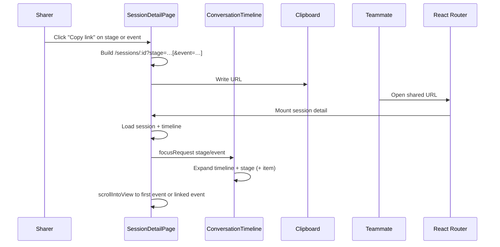

# ADR-0021: Session Deep Links

**Status:** Implemented  
**Date:** 2026-08-10

## Overview

Session pages are already shareable via `/sessions/:id`. Timeline stages (including follow-up chat turns) live on that same page with no URL identity, so teammates cannot point each other at a specific stage or event.

This decision adds **shareable deep links** into the session detail timeline: copy a URL that opens the session, expands the target stage, and scrolls to a stage or event anchor. Auth stays unchanged — anyone who can open the session can open the deep link.

## Design Principles

1. **Reuse the session page** — deep links are query params on `/sessions/:id`, not a new route family.
2. **Stable server IDs only** — anchors are `stage_id` and `timeline_event.id` (no optimistic `temp-*` ids, no scroll offsets).
3. **Dashboard-only** — no backend API changes; both ids are already on stage and timeline payloads.
4. **Expand then scroll** — collapsed timelines, stages, and collapsible events open so the target is visible (same idea as in-session search).
5. **Graceful miss** — invalid anchors open the session normally with a non-blocking toast; never hard-fail the page.
6. **Copy-only URL updates** — the address bar is not live-synced while browsing; Copy link builds the share URL explicitly. This is about the **query string only**, not session data: after a deep link opens and focuses once, the page keeps behaving like a normal session detail view (WebSocket stream, new timeline events, new follow-up chats all still appear).

## Decisions

| # | Decision | Choice | Rationale |
|---|----------|--------|-----------|
| Q1 | Primary deep-link target | Stage required, optional event | Stage is the natural “chat turn” unit; optional event adds precision without a second system. Event focus reuses existing search expand/scroll. Rejected: stage-only (leaves easy precision on the table), event-only (too granular as the sole model). |
| Q2 | URL encoding | Query parameters (`?stage=` / optional `&event=`) | First-class in React Router; composes cleanly with optional event; copy-paste friendly. Rejected: hash (weaker for two params), nested path (fights `/trace` and `/scoring`). |
| Q3 | Copy surfaces and focus rules | Stage + event copy controls; stage → first real event; event → that item | Clear mental model for both granularities; stage URLs stay stable if in-stage event order shifts. User-question “copy link” uses the stage URL (more resilient). Rejected: stage-only / separator-only / overflow-only copy UI. |
| Q4 | Which stages are linkable | All stages from day one | One mechanism for investigation, synthesis, chat, exec_summary, scoring, etc.; stage ids already exist everywhere. Rejected: chat-only or chat-first. |
| Q5 | Address-bar updates | Copy-only (no live URL sync) | Simple; doesn’t fight auto-scroll or collapse toggles; keeps browser history clean. Rejected: live scroll-spy sync. |
| Q6 | Missing stage/event | Non-blocking snackbar; event miss falls back to stage focus | Clear feedback without blocking the still-useful session page. Rejected: silent ignore, hard error. |
| Q7 | Layout on open | Minimal — expand + scroll only | Reuses normal session layout; matches search-match scrolling. Rejected: hide/collapse executive summary for deep links. |

## Architecture

### Domain model (relevant facts)

```
AlertSession 1──0..1 Chat
Chat         1──* ChatUserMessage
ChatUserMessage 1──0..1 Stage (stage_type=chat)
Stage        1──* TimelineEvent
```

- Routes: `/sessions/:id`, `/sessions/:id/trace`, `/sessions/:id/scoring` — deep links add in-page focus params on the main session route only.
- Product language “N follow-up chats” counts **chat stages (turns)**, not Chat entities (there is one Chat per session).
- Chat content renders inline in the conversation timeline; the chat panel is the input strip only.
- Timeline items already expose a DOM hook keyed by `timeline_event.id` (same path as in-session search).
- Stage separators need a DOM stage hook for empty-stage / fallback scroll targets.
- Optimistic chat messages use ids `temp-${timestamp}` until WebSocket replace — **never copy-link these**.
- Page-level executive summary / final analysis cards sit **outside** the timeline flow (legacy unstaged `executive_summary` events are filtered out). Stage-typed `exec_summary` stages may still appear **inside** the timeline.

### Flow



### URL shape

```
/sessions/{sessionId}?stage={stageId}
/sessions/{sessionId}?stage={stageId}&event={timelineEventId}
```

| Link type | Params | Open behavior |
|-----------|--------|----------------|
| **Stage** | `stage` only | Expand timeline + stage; scroll/focus to the **first real timeline event** in the stage (for chat: the user question — chat `user_question` is sorted first in the parser). First event is resolved client-side — not baked into the URL. |
| **Event** | `stage` + `event` | Expand timeline + stage; expand the target event if collapsible; scroll/focus to the event DOM hook. |

Copy always emits absolute URLs via an extended path helper that accepts optional `{ stage?, event? }`.

**Open robustness:** if the URL has `event` but omits `stage`, resolve `stage_id` from the matching timeline event when possible. Copy UI always includes `stage` when emitting event links.

### Focus contract

Session detail owns reading/validating search params after REST load, emitting a focus request, scrolling, and showing a page-local snackbar on miss.

The conversation timeline accepts an external **focus request** (stage id, optional event id, nonce to re-run) mirroring existing expand knobs used by search:

1. Expand the whole timeline if collapsed.
2. Expand the target stage.
3. If an event id is set and that item is collapsible, expand it (same as search expand).

Deep-link focus runs **once** after the initial REST load. Live session updates continue as usual afterward; focus/scroll does not re-run when new events or chat turns arrive.

### Resolution algorithm (on load)

1. Read `stage` / `event` from search params (ignore if both absent).
2. Wait until session + timeline REST load finishes and timeline items are rendered.
3. Keep the normal session layout (executive summary / analysis cards unchanged).
4. Normalize params: if `event` present without `stage`, look up the event’s `stage_id`.
5. **Stage missing/invalid (and event not resolvable):** snackbar; show session unfocused.
6. **Stage valid, event absent:** emit focus request for stage; scroll to first non-separator item in that stage, else to the stage separator when the stage has no events yet (no toast).
7. **Stage + event valid:** emit focus request with both; scroll to the event.
8. **Stage valid, event invalid:** snackbar + fall back to stage behavior (step 6).
9. Short-lived highlight on the focused element after scroll.

**First real timeline event** = first timeline item in that stage group that is not a stage separator, in parser/timeline order. Does **not** include page-level final analysis cards outside the flow.

### Copy-link UX

Available on **all stages** (investigation, synthesis, chat, exec_summary, scoring, etc.):

| Control | Location | URL built |
|---------|----------|-----------|
| Copy stage link | Stage separator; for chat also the user question | `?stage=` only |
| Copy event link | Individual timeline items within a stage (server ids only) | `?stage=&event=` |

- User-question “copy link” uses the **stage** URL (same landing for chat; more resilient than pinning the event id).
- Distinct from existing **Copy content** — a link affordance that copies `origin` + session path with query params.
- Hide or disable copy-link for optimistic `temp-*` items.
- No live sync of `?stage=` / `?event=` as the user scrolls or expands stages. Params may remain in the address bar after opening a shared link; that is fine and is not live browsing sync.

### Edge cases

| Case | Behavior |
|------|----------|
| Optimistic `temp-*` item | No copy-link control |
| `event` without `stage` | Resolve stage from timeline event; else snackbar |
| Stage exists, no events yet | Expand timeline + stage; silent scroll to stage separator (no toast) |
| Event in a different stage than `stage` param | Treat as invalid event → snackbar + stage fallback |
| Deep link while session still streaming | Focus once from the REST snapshot; WebSocket keeps appending new events as today — do not re-run focus/scroll on each update |

### Backend

**None.** Anchors are `stage_id` and `timeline_event.id` on existing session/timeline payloads.

## Core Concepts

| Concept | Meaning |
|---------|---------|
| **Session link** | Existing `/sessions/:id` — whole investigation page |
| **Deep link** | Session link + `stage` / optional `event` query params |
| **Chat turn** | One `Stage` with `stage_type=chat` (one user message → one answer block) |
| **Stage anchor** | `stage_id` — opens on first real event in the stage (or stage separator if empty) |
| **Event anchor** | `timeline_event.id` — opens on that item inside its stage |
| **Focus request** | External ask for the conversation timeline to expand for a deep link |
| **Focus behavior** | Expand relevant UI + `scrollIntoView` (layout unchanged) |

## Out of Scope

- Public / unauthenticated sharing (see session-authorization proposals).
- Slack message format changes (can adopt deep links later).
- Trace / scoring page deep links.
- Live URL sync while browsing the timeline.
- Shared global toast/notification framework.

## Future Considerations

- Slack (or other integrations) can adopt these deep-link URLs once session sharing needs richer anchors.
- Trace and scoring pages could get analogous focus params if operators need shareable anchors there.
- A shared notification framework could replace page-local snackbars if the dashboard standardizes toasts later.
