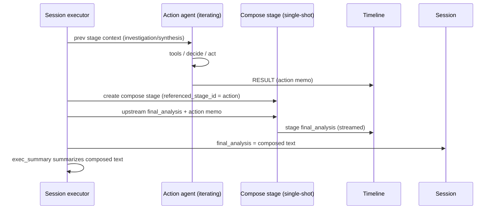

# ADR-0025: Action Report Compose Pass

**Status:** Implemented  
**Date:** 2026-08-23

## Overview

When a chain ends with an action/remediation stage, session `final_analysis` is taken from that last stage. Action agents were originally prompted to **copy the investigation report and amend it** (see [ADR-0007](0007-automated-actions.md)). Claude 4.6 followed that contract. Claude 5 often does not: it writes a short action memo, and that memo becomes the session's Final Analysis card.

Mechanical concatenation of synthesis + action output is also a poor session report: duplicated sections, stale "recommended actions" next to "already done", two summaries.

This decision splits the jobs. The action agent only decides and acts (short memo). After each successful action stage, TARSy inserts an automatic **compose** sibling that copy-edits two `final_analysis` documents into the session report: investigation text as the body, action outcome as an amendment.

This ADR supersedes the preserve/copy contract on the action agent in ADR-0007. Action safety (evidence, no re-investigation, prefer inaction, explain before tools, YES/NO marker) is unchanged.

## Design Principles

1. **Split jobs.** The action agent evaluates and executes. It does not author the canonical session report.
2. **Investigation-first document.** The composed report is the investigation/synthesis with an actions amendment — not an action memo with a nod to the investigation.
3. **Copy-edit, not rewrite.** Keep the upstream document's own structure and wording (whatever format that agent or skill used). Fold in the action result. Do not re-author the investigation into a TARSy template.
4. **Fail-open.** A failed compose LLM must not fail the session. Action tools already ran. Stage status is still `failed`; the card uses mechanical concat.
5. **Visible.** Compose is its own collapsible stage (`{actionStage} - Amended Report`), distinct from the action RESULT memo.
6. **Cheap.** One shot, no tools, two `final_analysis` documents in, one document out.

## Decisions

| # | Topic | Decision | Rationale |
|---|--------|----------|-----------|
| Q1 | Placement | Automatic sibling stage after each successful action stage (same pattern as synthesis) | Compose is a first-class session document, not a helper nested on the remediator. Fail-open is clean: action stays completed; compose can fail without rewriting action status. Independent provider, `referenced_stage_id`, own LLM interaction type. Rejected: in-stage extra call (wrong analogy — compose combines two stages and becomes the session report); chain YAML (product invariant, too easy to omit). |
| Q2 | Prompt | Strict format-agnostic copy-edit; fold in the action result; no rewrite and no TARSy-imposed template | Closest to the 4.6 document operators liked, without assuming one investigation layout. Constrains even a "helpful" model. Rejected: light rewrite (that is how Claude 5 already replaces the investigation). |
| Q3 | Model | Builtin compose agent. Default: `defaults.compose` (mid-tier). Override: `chain.compose`. Last resort: `chain.llm_provider` → `defaults.llm_provider`. `chain.llm_provider` does **not** override the defaults compose knob | Copy-edit does not need tools or a frontier model. Same default whether or not synthesis ran. Do not copy exec-summary resolution (`defaults.llm_provider` → `chain.llm_provider` → override) — `chain.llm_provider` is often Opus and would undo cost control. Rejected: provider of whoever wrote the upstream report (chain-shape dependent; frontier-priced copy-edit); exec-summary provider (that prompt is trained to compress). |
| Q4 | LLM failure | Compose stage `failed`; append mechanical concat; `extractFinalAnalysis` still uses that stage | Timeline is honest. The Final Analysis card stays complete (findings + actions). Ugly is acceptable on a rare error path. Do **not** skip a failed compose and land on the action memo — that recreates the original bug. Rejected: completed stage + warning (hides LLM failure). |
| Q5 | Skip | Only when there is no upstream investigation/synthesis/prior-compose report. Still compose if the remediator took no action | Avoids a no-op stage on action-only chains. "No action" is an amendment operators should see on the card, not a reason to leave the memo as the session report. Rejected: skip when no tools ran (common NO-ACTION path is today's bug); always insert (pointless copy-edit on action-only chains). |
| Q6 | Naming | `stage_type: compose`; UI `{actionStage} - Amended Report` | `compose` sits with `synthesis` / `exec_summary` as a document-producing stage. List label is unambiguous next to Final Analysis / Exec Summary. Collapsed by default. `referenced_stage_id` → the action stage (trigger). Upstream report is prompt context, not a second FK. Rejected: schema `amendment`; UI `Report`. |
| Q7 | Action prompt | Memo only; strip preserve/copy language | Stops wasting action-model output tokens on a reprint compose will not trust. Aligns the prompt with what Claude 5 already emits. Preserve/copy moves entirely to compose. Rejected: keep "you may copy the report" (models oscillate; compose input becomes inconsistent). |
| Q8 | Inputs | Two `final_analysis` blobs only (upstream report + action memo). No tool traces | Smallest, cheapest, clearest prompt. Compose does not re-evaluate the investigation. Rejected: compact tool-call summary (second interpretation of tools; add later only if memos are too thin); full action conversation (not a cheap pass). |
| Q9 | Downstream | Memory / chat / Slack / exec summary use compose output. Scoring skips compose *process*, includes compose *output* | Operators, Slack, memory, and exec summary must see the same document as the Final Analysis card. Scoring still judges investigation + action *work*; feeding the card text lets it notice a garbage compose relative to those inputs without grading copy-edit craft. Rejected: full compose stage in the scoring timeline; memory using the action memo. |

## Architecture

### Flow

```
investigation → [synthesis] → action (memo only) → compose stage → extractFinalAnalysis(compose) → exec_summary
                                                     ↑
                         automatic sibling: two final_analysis docs → amended report
```

Synthesis is optional: TARSy inserts it only after parallel/replica **investigation**. Upstream report = synthesis `final_analysis` if that stage ran, otherwise the investigation agent's `final_analysis`.



### Trigger

After **each successful action stage** (and that stage's synthesis sibling, if parallel agents ran), the executor inserts an automatic compose sibling. Not YAML, not buried in the action stage. YAML `type: compose` is rejected at config load (executor-only, like `exec_summary`).

**Skip** only when there is no upstream investigation/synthesis (or prior compose) report.

Action-only chains skip compose. Session `final_analysis` stays the action memo.

### Inputs

Exactly two stage `final_analysis` strings, as already stored:

1. **Upstream report** — last investigation / investigation-synthesis / **prior compose** `final_analysis`, snapshotted **before** this action stage (and its synthesis, if any) is appended.
2. **Action memo** — the result of this action work: the action stage `final_analysis` when a single agent ran, or the **synthesis** `final_analysis` when parallel action agents ran.

The action agent still ends with a YES/NO line for `actions_executed`. That marker is stripped before the action stage's `final_analysis` is written. Compose never sees it.

Prompt fences:

```
=== UPSTREAM REPORT ===
...
=== END UPSTREAM REPORT ===

=== ACTION MEMO ===
...
=== END ACTION MEMO ===
```

### Outputs

One markdown document. The compose prompt is **format-agnostic**: the upstream report's structure is defined by that chain's investigation/synthesis agent or skill, not by TARSy.

The model is told to:

- Emit the upstream report as the body. Keep its headings, tables, lists, and wording.
- Fold the action memo into that document (new section if there is no natural place; or fill an existing actions/status area if the upstream already has one).
- Patch only upstream text the memo makes stale (e.g. a "do X" recommendation that was already done or declined). Do not invent a TARSy-standard template, improve prose, drop sections, or add facts that are in neither document.
- Keep human follow-ups distinct from automated actions: restarting a pod does not fulfill a recommendation to change a resource limit.

### Parallel action agents

The executor already inserts synthesis whenever more than one agent produced results, with no stage-type check. Parallel action memos are merged into one synthesis document; that document **is** the action-side input. Compose does not read per-agent transcripts.

```
… → action (N agents) → [synthesis of those memos, if N>1] → compose
```

- **Upstream report** is snapshotted **before** this action stage is appended. Do not pick the action's own synthesis as upstream — that would send the same blob twice.
- **Action memo** is whatever was just appended: action `final_analysis` when N=1, synthesis `final_analysis` when N>1.

Auto-synthesis is unchanged. (The builtin synthesis prompt is investigation-flavored. That is a pre-existing mismatch if someone actually runs parallel remediator agents; it is not a compose problem.)

### Compose stage

| Aspect | Contract |
|--------|----------|
| `stage_type` | `compose` |
| Stage name / UI | `{actionStage} - Amended Report` |
| Builtin agent | ComposeAgent, type `compose`, SingleShotController, no MCP |
| Native Gemini tools | Explicitly off (`google_search`, `url_context`, `code_execution` all false). Omitting MCP is not enough: SingleShot still allows provider-native tools on Google-native backends. |
| `referenced_stage_id` | The triggering action stage ([ADR-0005](0005-referenced-stage-id.md)) |
| Dashboard | Collapsed by default; presentation **AMENDED REPORT** (action RESULT stays the memo) |
| LLM interaction type | `composition` |
| Empty model text | Failure → concat, not a thinking dump |

### Session `final_analysis` and later stages

Action stage analysis stays the memo. Compose stage analysis is the composed report (or concat on failure).

`extractFinalAnalysis` runs once at the end of the chain loop. Allowlist: `investigation`, `synthesis`, `action`, `compose`. Last non-empty wins, so the last compose wins over the action memo. `exec_summary`, `scoring`, and `chat` stay excluded. Stage status is **not** checked — a failed compose with concat still wins.

`buildStageContext` uses the same type allowlist. If a later YAML stage runs after action+compose, it would otherwise see **both** the action memo and the composed report. Treat compose like synthesis does for parallel investigation: the composed report **supersedes** that action memo for downstream context.

- Completed stages keep the action row, its synthesis sibling if any, and compose.
- Stage context **omits** that action stage (and a synthesis whose `referenced_stage_id` points at it) when a later compose points at the action.
- A later compose's upstream report is the previous compose `final_analysis`.

Executive summary already takes `extractFinalAnalysis` as previous context, so it summarizes the composed document automatically.

### Failure and cancellation

If compose **LLM** errors, times out, or returns empty (after the existing single-shot empty retry):

- Session still completes (**fail-open**, like exec summary — not fail-closed like synthesis).
- Compose **stage status is `failed`**.
- Executor writes mechanical concat to the compose stage's `final_analysis` **and still appends** that stage. Concat format: upstream report + `\n\n## Action result\n\n` + raw memo. Generic heading on purpose — fail-open concat must not assume an investigation template.
- The chain **continues** (further YAML stages, then exec summary).

Session **cancel / session timeout** during compose: honour it. Do not concat-and-complete a cancelled session. Fail-open is for the compose LLM call, not for operator cancel.

### Progress count

Expected stage count is computed once from chain YAML (stages + synthesis for multi-agent/replica investigation + 1 exec summary). Add **+1 per action stage that has an earlier investigation stage in the same chain** (static approximation of the skip rule). Action-only chains do not pre-count compose. If investigation produced an empty report and compose is skipped at runtime, the total may be 1 high — acceptable.

### Token cost

| Call | Tools | Typical in | Typical out |
|------|-------|------------|-------------|
| Action agent (old copy+amend) | yes, many | large | full report (2–6k) on the expensive action model |
| Action agent (this design) | yes, many | large | short memo (~0.5–2k) |
| Compose pass | no | two docs (~3–10k) + short prompt | one report (~2–6k) |

Net vs the copy+amend prompt: action **output** shrinks; compose adds one modest call on `defaults.compose`. Do not send the action agent's iteration history into compose.

## Configuration

```yaml
defaults:
  llm_provider: "google-default"
  compose:
    llm_provider: "google-default"   # mid-tier copy-edit; beats chain.llm_provider

agent_chains:
  kubernetes-with-action:
    alert_types: ["SecurityIncident"]
    llm_provider: "anthropic-default"  # investigation / action (often frontier)
    compose:
      llm_provider: "google-default" # optional chain override
    stages:
      - name: "investigation"
        agents:
          - name: "KubernetesAgent"
      - name: "remediation"
        agents:
          - name: "remediator"         # type: action on the agent definition
```

Provider resolution (do **not** copy exec-summary order):

1. `chain.compose.llm_provider` if set
2. else `defaults.compose.llm_provider` if set
3. else `chain.llm_provider` → `defaults.llm_provider`

Both knobs must name a provider that exists in the LLM provider registry. Unset both compose knobs still runs compose via the last-resort chain/defaults LLM provider.

## Downstream consumers

| Consumer | Behavior |
|----------|----------|
| Exec summary | Unchanged path; previous context is already `extractFinalAnalysis` |
| Slack / notifications / memory | Session `final_analysis` (automatic) |
| Scoring timeline | Skip compose *process* (default continue in the investigation-context builder) |
| Scoring inputs | Append compose stage `final_analysis` as one extra document after the timeline |
| Chat | Compose is a document stage (`final_analysis` only). Action memo stays on the action stage in the UI |

## Timeline visibility

| Artifact | Where | What |
|----------|--------|------|
| Investigation / synthesis conclusion | that stage | canonical findings |
| Action RESULT | action stage | memo: decided / acted / skipped |
| Composed report | `{action} - Amended Report` | session-facing document (Final Analysis card) |

## Future considerations

- If action memos omit tool outcomes often enough that compose cannot recover them, consider a compact tool-call summary as a third input (rejected for v1).
- Builtin synthesis is investigation-flavored. Parallel remediator agents inherit that mismatch; fix synthesis prompting separately if that configuration becomes real.
- ADR-0004 recorded `compose` as reserved until this work landed. This ADR is the implemented contract.

## References

- [ADR-0004: Stage Types](0004-stage-types.md) — `stage_type` enum including `compose`
- [ADR-0005: Referenced Stage ID](0005-referenced-stage-id.md) — compose → action pairing
- [ADR-0007: Automated Actions](0007-automated-actions.md) — action agent/stage; preserve/copy contract superseded here
