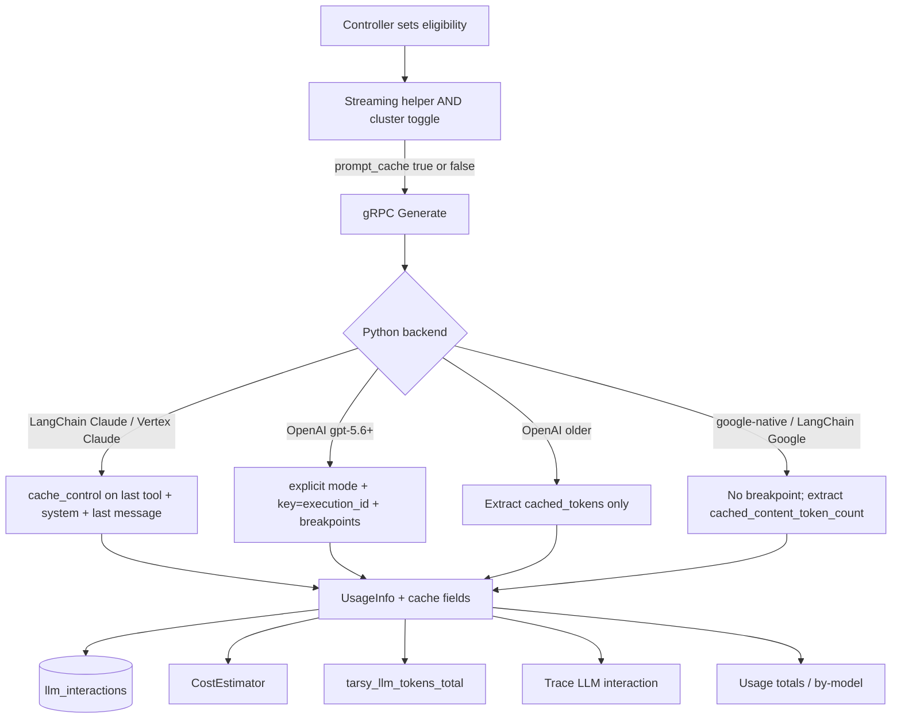

# ADR-0026: Prompt Caching

**Status:** Implemented  
**Date:** 2026-08-26

## Overview

TARSy’s iterating agents resend the full conversation and tool list on every LLM Generate. The Python LLM service is stateless; Go owns history. That is the textbook workload for **provider prompt caching**: a stable prefix (tools + system prompt + prior turns) is stored by the model provider so later turns pay ~10% of input price for that prefix instead of 100%, and time-to-first-token drops because the prefix is not re-prefilled.

This is **not** a TARSy-side cache of completions, tokens, or thought signatures. Those already exist and solve different problems:

| Existing cache | What it does |
|----------------|--------------|
| Google-native model contents + `clear_cache` | Replay Gemini `Content` objects so thought signatures survive multi-turn |
| LangChain model-instance cache | Reuse SDK chat-model instances |
| Runbook HTTP cache | Avoid refetching runbook markdown |
| MCP tool cache | Avoid re-listing tools on a short-lived client |

[ADR-0020](0020-session-usage-cost.md) left cache tokens out of persistence and pricing. Cost estimates therefore **overcounted** models that discount cached input (Gemini `prompt_token_count` was stored as `input_tokens` and priced at the full input rate). Gemini 2.5+ implicit caching may already have been saving money; TARSy never looked at `cached_content_token_count`. Claude (Anthropic API and Vertex) does not cache unless `cache_control` is set. GPT-5.6+ OpenAI does cache by default, but the implicit breakpoint sits on the latest user/tool message and does not fall back to a partial prefix — on an iterating agent that is a 1.25× write of the whole prompt and ~0 reads.

Python now normalizes `input_tokens` to **uncached** input. Shipping that without pricing cache tokens would **undercount**. v1 therefore ships observe + looping-call breakpoints + cache pricing + scoped operator UI together.

This decision:

1. Surfaces provider cache usage through proto → DB → Prometheus → trace LLM interactions → Usage totals / by-model, and prices those tokens.
2. Turns on Anthropic/Vertex Claude `cache_control` and GPT-5.6+ OpenAI explicit breakpoints on investigation-style iterating loops (not action, scoring, or one-shots).
3. Leaves Gemini implicit caching alone except to measure and price it.
4. Does **not** introduce Gemini explicit `CachedContent` objects, a local prompt store, or response caching.

**Operator guide:** [Session Usage Cost Estimation](../session-usage-cost.md)

## Design Principles

1. **Provider-side only.** TARSy marks breakpoints and records usage. The provider owns TTL, hashing, and storage. Python stays stateless aside from the existing thought-signature cache.
2. **Pay for reads, not writes-with-no-read.** One-shots, scoring, and **action** agents must not pay a cache-write surcharge. Those paths are usually one or two Generates; the last write is never read.
3. **TTL matches the loop.** Claude looping calls use 1h (orchestrator and sub-agent waits exceed 5m). OpenAI only supports `30m`; that is what we send on GPT-5.6+.
4. **Measure Gemini; do not manage it.** Implicit caching is already on for Gemini 2.5+. Explicit `CachedContent` is a later, stateful follow-up if hit rate is proven poor. The cluster kill switch does **not** disable Gemini implicit caching.
5. **Honest estimates.** Cache tokens are priced (catalog rates, or derived 0.1× / 1.25× / 2× from the resolved input rate). Never silent undercount.
6. **Surgical surface.** One proto flag, cache usage fields, LangChain breakpoints on Claude/Vertex and GPT-5.6+ OpenAI, Google usage extraction. No new LLM client, no new RPC.

## Decisions

| # | Topic | Decision | Rationale |
|---|-------|----------|-----------|
| Q1 | v1 scope | Persist cache usage, enable Claude `cache_control` and GPT-5.6+ explicit OpenAI caching on looping calls, price cache tokens, and ship scoped operator UI | Behavior, telemetry, Est. $, and per-call hit/miss land together so ADR-0020’s gap actually closes. Prompt layout, Gemini explicit caches, Usage-page charts, and session-list cache SUMs stay follow-ups. Rejected: observe-only (Claude iterating agents keep paying full input); observe + breakpoints without pricing (Est. $ undercounts once input is normalized). |
| Q2 | Kill switch | Cluster `system.prompt_caching.enabled` (default true, omit-means-on). Python 400-retry strips Claude `cache_control` / OpenAI cache options. Toggle does **not** disable Gemini implicit caching. No per-agent YAML | GitOps kill switch, same pattern as cost estimation. Python has no `tarsy.yaml`; Go ANDs the toggle onto `GenerateRequest.prompt_cache`. Vertex projects with caching disabled (or older OpenAI models that reject 5.6 fields) degrade instead of failing. Rejected: no YAML (Vertex 400s until a code change); per-provider/per-agent YAML (duplicates eligibility). |
| Q3 | Eligibility | Controllers set `PromptCache` from eligibility only (`AgentTypeDefault` iterating **loop**). Action, forced conclusion, scoring, single-shot, and summarization stay off | Eligibility is a property of the control flow. Action is usually one “no action” Generate — a 2× Claude write never read. Scoring is two turns with the same last-write problem. Python applies breakpoints only when the proto field is true (already AND-ed with the cluster toggle). Rejected: Python heuristic; all Generate calls. |
| Q4 | Claude breakpoints | Last tool + system + last message (growing prefix). Skip the tool breakpoint when there are no tools | Each turn writes the new suffix and reads the prior conversation; stays within Anthropic’s four-breakpoint cap. Rejected: last tool only (skills and history stay full-price); tools + system only (growing history stays uncached). |
| Q5 | Claude TTL | Hardcoded 1h. On 400, retry without `ttl` (5m default), then strip `cache_control` entirely | Covers sub-agent waits and typical session timeouts; TTL refreshes on hits. Old Vertex Claude 3.x may reject 1h. Rejected: 5m (orchestrator and slow MCP sequences miss); YAML `5m`\|`1h` (extra knob). |
| Q6 | Gemini explicit caches | Implicit only in v1. Extract and price `cached_content_token_count`. No `CachedContent` objects | Evidence-driven; Gemini looping agents may already get implicit hits. Explicit caches need named objects and replica state. |
| Q7 | `input_tokens` meaning | Python normalizes so `input_tokens` is uncached (full-price) input. Persist `cache_read_tokens` / `cache_creation_tokens` when > 0 | One cost formula and one dashboard meaning. Go/cost do not branch on provider. TARSy `input_tokens` is not Gemini’s raw `prompt_token_count`. Historical rows keep the old meaning. Rejected: leave provider-reported input (cost math must branch; easy to double-count Gemini); no columns (cannot price per interaction). |
| Q8 | Cost formula | Price cache-read and cache-creation. Catalog/snapshot cache rates when present; overlays stay flat and derive 0.1× read and 2× (Claude) / 1.25× (else) create. Tier selection uses prompt size | Closes the known gap. YAML promotions/`model_rates` stay input/output only (same v1 limit as ADR-0020). Claude 1h writes must not use the 5m catalog create rate. Prompt size = uncached + cache_read + cache_creation so Gemini 200k tiers still fire on cache-heavy calls. Missing cache rates still derive so a row is not silently undercounted. Rejected: keep the gap; defer pricing. |
| Q9 | System-prompt layout | Leave layout in v1. Intra-session looping is the win | Tier 0 wall-clock time sits first in the system prompt, so cross-session reuse of skills + tools will not hit. Reorder/split is golden-prompt churn for little token volume. Growing-history breakpoints already cache intra-session turns. |
| Q10 | Operator surfaces | DB + Prometheus `cache_read` / `cache_creation` + Config Viewer toggle + **trace LLM list/detail** + **Usage totals and by-model**. No session-list / header / `ExecutionOverview` / by-alert / by-chain / top-sessions / Usage-chart SUMs | Per-call hit/miss is the diagnostic that matters; fleet hit rate lives on Usage totals and the by-model table. Session totals do not locate a miss. `TokenUsageDisplay` renders cache only when the DTO has the fields (session surfaces omit them). Thinking tokens never landed on trace DTOs; cache does. |
| Q11 | OpenAI | GPT-5.6+ looping calls: explicit mode, 30m TTL, key = `execution_id`, breakpoints on last tool, system-as-content-block, last **non-tool-result** message. GPT-5.5 and older: extract only | Implicit 5.6 breakpoints sit on the volatile last message and bill 1.25× writes with ~0 prefix reads. Walk back past tool results so a `function_call_output` breakpoint is not relied on to write. Do not bake cache policy into the shared LangChain model instance; pass key/options per request. 400 → retry stripped. Rejected: extract-only on 5.6; ignore OpenAI; tools+system only; key-only; explicit on all OpenAI. |

## Architecture

### Generate path (unchanged shape)

```
IteratingController / ScoringController / SingleShot / summarizer
  → GenerateInput (full messages + tools)
  → gRPC llm.v1.Generate
  → Python GoogleNativeProvider | LangChainProvider
  → UsageInfo { input, output, total, thinking, cache_read, cache_creation }
  → llm_interactions + session token SUMs + tarsy_llm_tokens_total
```

Go builds the iterating prefix **once** and appends turns. Tools are listed once and reused. That prefix is identical across iterations of one execution.

Python has **no** `tarsy.yaml`. The only request it sees is `GenerateRequest`. Cluster policy therefore lives in Go.

### Plumbing

- `GenerateInput.PromptCache` → proto `GenerateRequest.prompt_cache`
- `UsageInfo.cache_read_tokens` / `cache_creation_tokens` → `llm_interactions` columns
- Cluster kill switch: `system.prompt_caching.enabled` (default **true**, same `*bool` omit-means-on pattern as `system.cost_estimation.enabled`)

Controllers set `PromptCache` from **eligibility only**. The streaming LLM helper ANDs the cluster toggle before gRPC (`prompt_cache = eligible && enabled`). Python applies Claude `cache_control` / OpenAI `prompt_cache_options` **only** when `GenerateRequest.prompt_cache` is true. When the toggle is false, Go still records cache usage if the provider sent it (Gemini implicit still happens).

Copy cluster `PromptCaching.Enabled` onto the execution context when the executor builds it — it is cluster-wide, not per-agent YAML.



### Call-site eligibility

| Call site | Loops? | `PromptCache` |
|-----------|--------|----------------|
| Investigation / chat / sub-agent / orchestrator loop (`AgentTypeDefault`) | Yes | **on** |
| Action / remediation loop (`AgentTypeAction`, same iterating controller) | Usually 1 turn | **off** |
| Forced conclusion (no tools; same iterating controller) | No | **off** |
| Scoring controller (score + tool-report) | 2 turns | **off** |
| Single-shot (synthesis, exec summary, compose, memory reflector) | No | **off** |
| Tool / `search_past_sessions` summarization | No | **off** |

Do **not** set the flag true for every iterating-controller Generate. Gate the loop call on agent type ≠ action. Forced conclusion stays off.

### Claude / Vertex Claude

When `prompt_cache` is set and the LangChain model is Anthropic or Vertex Claude:

1. Bind tools in Anthropic dict form; put `cache_control: {type: ephemeral, ttl: 1h}` on the **last tool**. If there are no tools, skip this breakpoint.
2. Convert the system message to a content block with the same `cache_control`.
3. Put `cache_control` on the **last** conversation message (growing-history breakpoint, including tool results).

Do **not** pass `cache_control` as an invoke/astream kwarg — Vertex Claude 400s that. Use content blocks / additional kwargs on messages and tools.

Writes cost 1.25× (5m TTL) or 2× (1h TTL) of input; reads cost 0.1×. Subsequent identical prefixes refresh TTL.

**400 retry (same Generate, before any chunks are yielded):** a dedicated strip path, not the existing retryable-error loop (that retries the *same* request and would 400 three times).

1. If Vertex/Anthropic returns 400 on `ttl: 1h` (old Claude 3.x), retry once without `ttl` (5m default).
2. If that still 400s (project has prompt caching disabled, or other extra-input rejection), retry once stripping `cache_control` entirely.

Provider fallback (`ClearCache`) already switches model; the new prefix cannot hit the old cache. First post-fallback call is a cold write.

### OpenAI (GPT-5.6+ explicit; older extract-only)

Keep the LangChain model-instance cache keyed by `(provider, model, api_key_env)`. **Do not** put `prompt_cache_key` or `prompt_cache_options` on the shared `ChatOpenAI` constructor — the instance is shared across executions and across looping vs one-shot calls. Pass key and options **per request**.

**GPT-5.5 and older** (anything that does not match `gpt-5.` with integer minor ≥ 6, including `gpt-5.2`, `gpt-5`, `gpt-5-mini`): automatic prefix cache. Extract `cached_tokens` / `cache_write_tokens` if present. Send no `prompt_cache_options`.

**GPT-5.6 and later** (model id matches `gpt-5.` with integer minor **≥ 6**, case-insensitive, including dated/variant suffixes such as `gpt-5.6-sol`). Built-in `openai-default` is GPT-5.6 and therefore takes this path when `prompt_cache` is set:

1. `prompt_cache_options: {mode: "explicit", ttl: "30m"}` — disables the implicit last-message breakpoint; 30m is the only supported TTL.
2. `prompt_cache_key: execution_id`. Skip explicit mode if `execution_id` is empty.
3. `prompt_cache_breakpoint: {mode: "explicit"}` on:
   - the **last tool** schema (if any tools),
   - the **system** text as an `input_text` block on a developer/system message — OpenAI rejects breakpoints on top-level Responses `instructions`,
   - the last **non-tool-result** message (walk back past `role=tool` / `function_call_output`).

If the SDK 400s on these fields, retry the call stripped (same dedicated degrade path as Claude).

Writes bill at 1.25× (`cache_write_tokens` → `cache_creation_tokens`); reads at 0.1× (`cached_tokens` → `cache_read_tokens`).

### Gemini (observe, don’t manage)

Gemini 2.5+ implicit caching is on by default. Minimum prefix is on the order of 2k–4k tokens depending on model. Investigation prompts with MCP tools usually clear that by early turns.

Extract `cached_content_token_count` as `cache_read_tokens`. Implicit writes are billed at standard input (no separate creation surcharge); `cache_creation_tokens` stays 0. LangChain Google / Vertex Gemini follow the same extract + subtract rules.

Explicit `CachedContent` objects are **out of v1**. `system.prompt_caching.enabled: false` does not turn Gemini implicit caching off.

xAI has no comparable API. Extract cache fields if they ever appear in usage; do not send breakpoints.

### Token semantics (normalize in Python)

Provider raw usage differs; LangChain’s unified `usage_metadata.input_tokens` is documented as **sum of all input token types** (includes cache). Anthropic’s native `usage.input_tokens` is **uncached only**. Prefer provider `response_metadata["usage"]` when present.

| Source | Typical input | Cache fields | Normalize |
|--------|---------------|--------------|-----------|
| Google native | `prompt_token_count` **includes** cached | `cached_content_token_count` | `input -= cache_read`; create = 0 |
| LangChain Google | inclusive `input_tokens` | `input_token_details.cache_read` (or equivalent) | same |
| Anthropic **raw** `usage` | uncached only | `cache_read_input_tokens`, `cache_creation_input_tokens` | do **not** subtract |
| LangChain Anthropic `usage_metadata` | inclusive | `cache_read`; `cache_creation` **or** `ephemeral_5m_input_tokens` + `ephemeral_1h_input_tokens` | `uncached = inclusive - cache_read - cache_creation`; create = raw or sum of ephemeral |
| OpenAI | `input_tokens` / `prompt_tokens` **includes** cached **and** cache writes | `cached_tokens`, `cache_write_tokens` | `uncached = inclusive - cache_read - cache_creation` |

v1 convention:

- `input_tokens` = **uncached** billed input.
- `cache_read_tokens` / `cache_creation_tokens` stored separately; persist when > 0 (same as thinking tokens).
- `total_tokens` left as provider-reported (or reconstruct if needed). After normalization, `input + output` will not equal `total` when cache hit; trace UI shows cache next to input so that is readable. Session SUMs of `input_tokens` mean “tokens paid at full input rate.”
- Cache fields on LangChain streams: **last-wins** (do not sum across chunks). Keep today’s sum for input/output, then normalize.

Historical rows keep the old meaning (Gemini `input_tokens` included cached). Usage windows that mix pre- and post-ship rows are inexact on `input_tokens`; `total_tokens` is unchanged.

### Cost estimation

```
cost = uncached_input * rates.input
     + cache_read     * rates.cache_read
     + cache_create   * rates.cache_creation
     + output * rates.output
     + thinking * rates.reasoning
```

Resolve order stays promotion → `model_rates` → catalog → snapshot.

**Tier selection:** pick `above_Nk` / `tiered_pricing` from **prompt size** = `uncached + cache_read + cache_creation` (Gemini: original `prompt_token_count`), not uncached `input_tokens` alone.

- Parse LiteLLM `cache_read_input_token_cost` / `cache_creation_input_token_cost` / `cache_creation_input_token_cost_above_1hr` into the catalog and bundled snapshot.
- Flat YAML promotions/`model_rates` stay input/output in v1. When they win, **derive** from the resolved (possibly intro-priced) input rate: read = 0.1×; cache create = **2×** if the model name contains `claude`, else **1.25×** (OpenAI 30m; Gemini unused because create is 0).
- If catalog/snapshot has explicit cache rates and no overlay won: use catalog `cache_read`; for Claude 1h writes use `cache_creation_input_token_cost_above_1hr` when present, otherwise **derive 2× from `rates.input`** — do **not** apply the 5m `cache_creation_input_token_cost` to 1h writes.
- Missing cache rates after that still use the same multipliers on `rates.input`.
- Missing cache rates does not mark the row unpriced if base input/output resolved.
- 400-retry Claude 5m fallback is not reported to Go; overlay/derived Claude create stays 2×. That rare write is slightly overestimated. Acceptable.
- Token-bearing completeness includes cache columns: any of input / output / thinking / cache_read / cache_creation > 0. Estimate must run when cache pointers are set even if uncached input is 0.
- Prometheus records cache directions. Do **not** SUM cache on session-list / `ExecutionOverview` APIs.

### Prefix stability

Tier 0 wall-clock time is injected **first** in the system prompt. Memory briefing is also session-specific. Within one execution the prompt is built once, so **intra-session** caching is unaffected. Cross-session reuse of skills + MCP instructions + tool schemas will not hit as long as time sits at the front of the cached block.

### Operator surfaces (v1)

| Surface | Cache tokens |
|---------|----------------|
| `llm_interactions` columns | yes |
| Prometheus `tarsy_llm_tokens_total` `direction=cache_read\|cache_creation` | yes (extra label values; existing series unchanged) |
| Config Viewer `system.prompt_caching.enabled` | yes — a small enabled block, not only the leftover System JSON dump |
| Trace LLM list + detail | yes — per-`Generate` hit/miss |
| Usage totals + by-model (StatCards + by-model columns; **Input tokens** = uncached) | yes |
| Usage by-alert-type, by-chain, top-sessions, Usage *charts* | **no** |
| Session list, session header, `ExecutionOverview` | **no** (same as thinking tokens) |

## Core Concepts

### Prompt cache (provider)

A hashed prefix of tools + messages the provider keeps for a TTL. TARSy does not name or delete entries. Hits require identical bytes up to the breakpoint, same model, and the provider-specific markers (`cache_control` or OpenAI explicit breakpoints + key).

### `prompt_cache` flag

Per-Generate boolean meaning **this call is an investigation-style iterating loop** (`AgentTypeDefault`: investigation, chat, sub-agent, orchestrator). Scoring and `AgentTypeAction` are ineligible even when they call Generate more than once. Python never reads `tarsy.yaml`. It applies Claude `cache_control` / OpenAI 5.6+ explicit options only when the proto field is true.

### Cache read / cache creation tokens

Provider-reported counts for discounted prefix reuse vs the write that populated the cache. Nullable; persist when > 0.

### Eligible vs ineligible calls

Eligible = `AgentTypeDefault` iterating **loop** only (investigation, chat, sub-agent, orchestrator). Ineligible = one-shot, scoring, **action**, and forced conclusion (the last still lives in the iterating controller).

## Configuration

```yaml
system:
  prompt_caching:
    enabled: true   # default true if the whole block is omitted
```

Setting `enabled: false` is a GitOps kill switch for Claude `cache_control` and GPT-5.6+ OpenAI explicit breakpoints. Gemini implicit caching is unaffected. Exposed read-only in Config Viewer next to cost estimation.

## Out of Scope

- Cache LLM **responses**.
- Store prefixes in Postgres/Redis.
- Gemini explicit `CachedContent`.
- OpenAI explicit breakpoints on GPT-5.5 and older.
- xAI prompt-cache breakpoints.
- Change Google thought-signature cache behavior.
- Change system-prompt layout.
- Session-list / execution-overview cache SUMs.
- YAML cache rate fields on promotions/`model_rates`.
- Disable Gemini implicit caching via the cluster toggle.

## Future Considerations

- Move Tier 0 time / memory after stable system text, or split system into two blocks.
- Gemini explicit `CachedContent` if production data shows poor implicit hit rate on large looping sessions.
- Session-list / execution-overview cache SUMs.
- YAML cache rate fields on promotions/`model_rates`.
- OpenAI 1h TTL if the API ever supports it (orchestrator waits > 30m).
- xAI if they add a comparable API.
- Relabel Usage “Input tokens” to “Uncached input” if operators find the StatCard confusing next to cache cards.

## References

- [ADR-0020: Session Usage Cost](0020-session-usage-cost.md) — write-time estimates; this ADR closes the cache-token persistence/pricing gap left out of scope there
- [ADR-0023: Cost Promotions](0023-cost-promotions.md) — overlay still beats catalog; cache rates derive from the resolved (possibly intro-priced) input rate
- [ADR-0010: Prometheus Metrics](0010-prometheus-metrics.md) — `tarsy_llm_tokens_total` `direction` extended with `cache_read` / `cache_creation`
- [Session Usage Cost Estimation](../session-usage-cost.md) — operator-facing formula and surfaces
