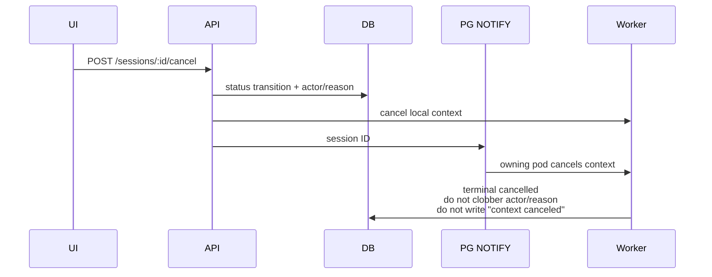

# ADR-0032: Session Cancel Reason and Actor

**Status:** Implemented  
**Date:** 2026-09-24  
**Relates to:** [ADR-0002](0002-orchestrator-impl.md) (`cancel_agent`), [ADR-0015](0015-implicit-orchestrator.md), [ADR-0029](0029-sub-agent-execution-limits.md) (operator cancel stays fail-fast)

## Overview

A session can be cancelled from the dashboard or `POST /api/v1/sessions/:id/cancel`, but TARSy previously did not record **who** cancelled it or **why**. The confirmation dialog was yes/no only. After the worker observed the cancelled context, `error_message` was typically `"context canceled"`, which showed up in the UI and Slack as an error.

This decision records an optional cancel reason, persists who cancelled and why on the session, and surfaces that as **cancel attribution** (not an error): tooltip on cancelled status, session header, detail copy, and Slack. It also attributes the rare system-initiated session cancel, records who stopped a follow-up chat, and lets `cancel_agent` take an optional reason.

## Design Principles

1. **Optional, never blocking.** The user and the LLM may omit a reason. Empty or whitespace-only becomes `NULL`.
2. **Persist at request time.** Actor and reason are written on the cancel HTTP request, in the same compare-and-swap as `cancelling` or `cancelled`. That is a shared-database write, so it does not matter which pod owns the worker. Cross-pod notification carries only the session ID so the owning pod can cancel its in-memory context. The worker is not the source of who or why.
3. **Do not overload session `error_message`.** That column is an error string and used to be overwritten with `context canceled` on the terminal write. Session actor and reason are first-class nullable columns. Stage and execution `error_message` may hold a friendly attribution string for chat Stop and `cancel_agent` (same pattern as timeout causes), but the dashboard keys display off **status**, not that string.
4. **Cancelled is not failed.** Status stays `cancelled`. UI and Slack never treat cancelled work as an error card, error severity, red accent, or `*Error:*`.
5. **No new timeline event type.** Status fields plus existing `cancel_agent` tool-call arguments are enough. No general operator-audit table.

## Decisions

| # | Topic | Decision | Rationale |
|---|-------|----------|-----------|
| Q1 | Where session cancel metadata lives | Dedicated nullable columns on the session | Queryable and typed, same pattern as author and assignee. The worker can leave them alone on the terminal write. Rejected: reuse `error_message` (the worker overwrites it, and it means failure), unstructured session metadata (not in the list query), and an audit table (one terminal transition). |
| Q2 | Who / why fields | `cancelled_by` + `cancel_reason` only. `"system"` is a safety net, not a source enum | Smallest schema. Tooltip is one format: `Cancelled by {actor}` plus optional `: {reason}`. Detail for the rare system path goes in `cancel_reason`. Rejected: a `cancel_source` enum (no real production values beyond user and API client) and reason-only (does not record who). |
| Q3 | Queued (`pending`) sessions | `pending` → `cancelled` immediately, with actor and reason. The handler publishes status events; no worker | The dashboard already offers Cancel on queued sessions. Nothing is running, so there is no `cancelling` hop. The list and detail pages only live-update on `session.status` and `review.status`. Rejected: leave queued cancel broken, or hop through `cancelling` with nothing to observe it. |
| Q4 | Chat Stop on an already-terminal session | Not a session cancel. No reason dialog. Persist `Cancelled by {actor}` on the in-progress chat stage and its active execution. Do not clobber that string. Non-error UI | Chat does not change session status; session-level “who cancelled the investigation” would be misleading. Stop stays one click. Rejected: a reason dialog on an immediate control. |
| Q5 | System auto-cancel | If terminal status is `cancelled` and `cancelled_by` is still null, set `cancelled_by = "system"` and `cancel_reason = "worker context cancelled"`. Do not reclassify `timed_out` | Parent-context cancel while a worker is executing is the leftover path. Timeouts, orphans, and graceful shutdown stay `timed_out`. Scoring and chat stop cancel those jobs, not the session. |
| Q6 | `cancel_agent` reason | Optional `reason`, passed as a cancel cause. Friendly execution `error_message`. Over-cap is a tool error. Land after cancelled chrome treats cancelled as non-error | Old calls keep working. No new execution columns; the tool-call timeline already stores arguments. Attribution must not land on error chrome. Rejected: a dedicated execution column, and leaving `context canceled`. |
| Q7 | Reason length | 500 Unicode runes. Trim; empty after trim → `NULL`. Session API returns HTTP 400; `cancel_agent` returns a tool error. Dashboard counter counts runes | Fits a confirmation dialog and a tooltip. Same cap for the tool. Rejected: 2000 characters and unbounded text. |
| Q8 | Where attribution shows | Status tooltip, session header, detail copy, and Slack. No new timeline event. No Slack message for a queued-only cancel | Operators see cancelled sessions on the list, the session page, and Slack. Pending cancel has no Slack start thread. Rejected: dashboard-only (Slack would still say `*Error:*`) and a new timeline event. |

## Architecture

### Current control flow

Cancel still fail-fast (no wrap-up). Chat-only cancel on an already-terminal session uses the same endpoint and only stops the chat executor.



### What becomes `cancelled`

| Path | Session outcome | Attribution |
|------|-----------------|-------------|
| Dashboard / API cancel while `in_progress` | `cancelling`, then `cancelled` | `cancelled_by` + optional `cancel_reason` on the compare-and-swap. Worker finalizes status and does not clobber those columns or write `"context canceled"` into session `error_message`. |
| Dashboard cancel while `pending` | `cancelled` immediately, with `completed_at` and `review_status = reviewed` | Same columns. Handler publishes `session.status` and `review.status` (no worker) and counts the terminal session. No Slack (no start thread). |
| Chat Stop on a **terminal** session | Session unchanged; chat stage `cancelled` | Not a session cancel. `Cancelled by {actor}` on the in-progress chat stage and its execution, written at request time. |
| Session / orphan timeout, startup orphans, graceful shutdown | `timed_out` | Unchanged. |
| Parent process context cancelled mid-flight | `cancelled` | If `cancelled_by` is still null: `cancelled_by = "system"`, `cancel_reason = "worker context cancelled"`. |
| Scoring or chat executor stop | Those records cancelled; **session** unchanged | Out of session-cancel scope. Score badges may keep treating scoring `cancelled` as failed locally. |
| Orchestrator `cancel_agent` | Sub-agent execution `cancelled`; session continues | Optional `reason`; friendly execution `error_message`; non-error UI. |

### Target session-cancel path

```mermaid
sequenceDiagram
    participant UI
    participant API
    participant DB
    participant Worker
    participant Slack

    UI->>API: POST /cancel { reason? }
    Note over API: actor from proxy headers
    alt pending
        API->>DB: cancelled + cancelled_by + cancel_reason<br/>completed_at, review_status=reviewed
        API->>API: publish session.status=cancelled<br/>and review.status=reviewed
    else in_progress
        API->>DB: cancelling + cancelled_by + cancel_reason
        API->>Worker: cancel context
        Worker->>DB: cancelled (do not clobber cancel fields;<br/>do not write "context canceled")
        Worker->>Slack: Analysis Cancelled + actor/reason
    end
```

A pending cancel that only wrote the row would leave other dashboards stuck on `pending` until a manual refresh. The handler publishes the same status and review payloads the worker publishes when the transition lands on terminal `cancelled`.

Do not start publishing `session.status=cancelling` for in-progress cancels. The worker still publishes terminal `cancelled`.

### API

`POST /api/v1/sessions/:id/cancel` remains the only cancel endpoint.

The body is optional (backward compatible). An empty body or an omitted `reason` is valid. When JSON is present:

```json
{ "reason": "duplicate of session abc" }
```

Actor is not a client-supplied field. It comes from the same proxy-header identity as alerts, chat, review, and scoring (`X-Forwarded-User`, email, `X-Remote-User`, or `"api-client"`).

Shared validation (HTTP and the tool map the error differently):

- Trim whitespace.
- Empty after trim → omitted (`NULL`).
- Max **500 Unicode runes**. Over cap: the session API returns HTTP 400; `cancel_agent` returns a tool error. Do not truncate silently.
- The dashboard counter counts Unicode code points, not UTF-16 code units.

The handler still persists cancel metadata with the status transition, cancels the local worker and chat executor, and broadcasts the session ID. Success if either the session or an active chat was cancelled.

The cancel operation returns the status it wrote (`cancelling` or `cancelled`) so the handler can tell a pending session (already terminal) from an in-progress session (the worker publishes later).

Compare-and-swap, in order:

1. `pending` → `cancelled`, with `cancelled_by`, `cancel_reason`, `completed_at`, `review_status = reviewed`, and `reviewed_at`. Return `cancelled`.
2. Else `in_progress` → `cancelling`, with `cancelled_by` and `cancel_reason`. Return `cancelling`.
3. Otherwise the existing not-found / not-cancellable distinction. An already-`cancelling` session stays not-cancellable and does not overwrite actor or reason.

If a worker claims the row between (1) and (2), the pending update misses and the in-progress update takes the cancelling path.

List, detail, and status responses expose both fields. They are not added to the live `session.status` payload; the dashboard refetches on that event.

### Chat Stop

Chat-only cancel (session already terminal) does not write session `cancelled_by` or `cancel_reason`. Before cancelling the chat:

1. Resolve the chat and its in-progress stage (pending or active).
2. Set that stage’s `error_message` and the active execution’s `error_message` to `Cancelled by {actor}`.
3. The attribution write is best-effort: log failure, still cancel.

Later terminal writes must **skip a non-empty `error_message` when status is cancelled**. Otherwise the executor replaces the actor string with `context canceled` and then `all agents cancelled`. Empty investigation stages with no prior message still get `all agents cancelled`.

### Persistence

| Column | Type | Set when |
|--------|------|----------|
| `cancelled_by` | optional string | User/API cancel: proxy-header identity. System safety net: `"system"`. |
| `cancel_reason` | optional text | Trimmed user, model, or system text. `NULL` if omitted. |

Written **once** on the cancel request. A later terminal update must not overwrite these columns and must not set session `error_message` to `"context canceled"` for a cancelled session.

No general audit table. Review keeps its own activity log. Cancel is a one-shot current-state field on the session.

### Worker terminal write

For `status = cancelled`:

- Do not write `context canceled` into session `error_message`.
- Do not overwrite `cancelled_by` / `cancel_reason` if already set.
- If `cancelled_by` is still null: set `cancelled_by = "system"` and `cancel_reason = "worker context cancelled"`.
- Do not reclassify `timed_out` or orphans as cancelled. Do not treat scoring or chat stop as session cancel.

Slack notification reads actor and reason from the session (the in-memory session is stale). They are not placed in `ErrorMessage`.

### Slack

For `status = cancelled`:

- Keep the cancelled header (`Analysis Cancelled`).
- Append attribution, not `*Error:*`:
  - both: `Cancelled by alice@example.com: duplicate alert`
  - actor only: `Cancelled by alice@example.com`
  - historical, both null: header only
- Do not send `context canceled` as the error body on cancelled sessions.

Failed and timed-out Slack copy is unchanged. A queued-only cancel does not invent a Slack message.

### Dashboard

Cancel dialogs (session header and queued alerts) keep the existing confirm copy and add an optional multiline field (“Reason (optional)”) with a remaining-character counter (500). The client posts `{ reason }` only when the trimmed reason is non-empty. Chat Stop stays one click, with no dialog and no body.

Status tooltip (main list, triage, session header) when status is `cancelled`:

| Data | Tooltip |
|------|---------|
| `cancelled_by` + `cancel_reason` | `Cancelled by alice@example.com: duplicate alert` |
| `cancelled_by` only | `Cancelled by alice@example.com` |
| Historical row, both null | `Cancelled` |

The same format appears on the empty-timeline “cancelled before processing started” alert and the cancelled final-analysis placeholder when the fields are present.

**Non-error display contract** (timeline, trace, chat, sub-agents):

Cancelled work is grey/info **Cancelled** plus attribution. It is never an error card, an error alert, or a red accent. Trace and timeline key off status. A cancelled `error_message` is detail, not failure.

Scoring shutdown may still mark a score `cancelled`. The score badge keeps its own failed set that includes that status. Session and execution cancelled rows do not share that set.

Chat Stop’s actor string is shown as cancelled copy, never as a failure.

Historical cancelled sessions may still have session `error_message = "context canceled"`. Do not treat session `error_message` as a failure, or as analysis, when status is `cancelled`.

### `cancel_agent`

`cancel_agent` keeps `execution_id` required and adds an optional `reason`. The sub-agent context is cancelled with that cause. The persisted execution `error_message` is `Cancelled by {parent agent name}`, plus `: {reason}` when a reason is present — not `context canceled`. If the parent name is empty, the actor is `orchestrator`.

The same 500-rune trim, omit, and cap apply. Over cap is a tool error.

The orchestrator prompt says a short reason is optional. It does not demand one.

The session stays in progress. The reason lives on that execution’s `error_message` and in the `cancel_agent` tool arguments, not on the session. Only a result whose status is itself `cancelled` takes the friendly string; a completed or failed result that races the cancel keeps its own error.

## Core Concepts

**Cancel metadata** — who asked and why, stored on the session at request time. Independent of the `cancelling` → `cancelled` status machine.

**Actor** — identity from proxy headers, or `"system"` for the safety-net path. Not submitted in the JSON body.

**Reason** — optional free text, max 500 runes. Not a required category list.

**System cancel** — the session reached `cancelled` without a user or API request (parent context cancelled while the worker was executing). Distinct from timeout and orphan (`timed_out`).

**Sub-agent cancel** — an orchestrator stop of one worker. The session stays in progress.

**Display contract** — `cancelled` means cancelled. Attribution strings are details, not errors.
