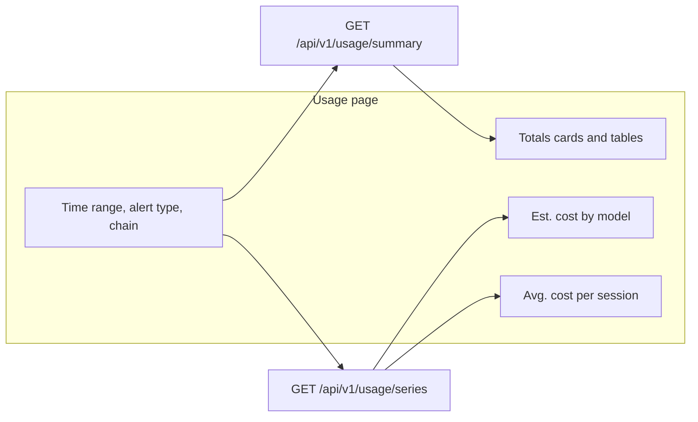

# ADR-0033: Usage Charts

**Status:** Implemented
**Date:** 2026-09-25
**Relates to:** [ADR-0020](0020-session-usage-cost.md) (Usage page and list-price estimates)

## Overview

The Usage page (`/usage`) already shows estimated spend for a date window: stat cards (including **Est. cost** and **Avg. cost / session**) and tables by model, alert type, chain, and top sessions. Those numbers are one snapshot. They do not show how spend accumulated, which models drove it, or whether a typical session got more expensive over the window.

This decision adds two charts on that page, using the same filters (time range, alert type, chain):

1. **Estimated total cost, broken down by model** — a cumulative stacked area of list-price spend.
2. **Average estimated cost per session** — one line, the stat-card ratio computed per calendar day.

The cost chart follows the shape of a cumulative usage chart. TARSy keeps its own **Est.** labels and existing completeness warnings, and does not add group-by or metric controls.

Charts render only when cost estimation is enabled. Token tables stay as they are when estimation is off.

**Operator guide:** [Session Usage Cost Estimation](../session-usage-cost.md)

## Design Principles

1. **Same honesty as the stat cards.** Figures are list-price estimates, not invoices. Copy stays **Est.** Incomplete pricing uses the existing partial-cost warning. Unpriced interactions contribute nothing to the stack and are not drawn as a model.
2. **Same window and filters.** Charts use the Usage page's `start_date` / `end_date`, optional `alert_type`, and optional `chain_id`. Soft-deleted sessions stay excluded. All `interaction_type` values count, matching session and Usage sums.
3. **Charts explain the cards.** Cost is attributed to session `created_at`. Within one series response, the sum of day costs equals that population's `totals.estimated_cost_usd`, the sum of day session counts equals `totals.session_count`, and the session-weighted average of the days equals `totals.average_cost_usd`. The live page loads summary and series separately, so the card and the chart can differ by a session that finished between the two calls until the next refresh.
4. **Server owns the calendar.** The client does not receive raw interactions. Days are calendar buckets in the operator timezone, including empty days.
5. **Client owns geometry.** The API returns per-day deltas. The cost chart turns those into a cumulative stack. The average chart plots the per-day ratio.
6. **Tables remain the source for exact breakdowns.** Charts are for shape over time. The by-model table stays the full, uncollapsed list.
7. **Do not refetch the series for top-session ranking.** `rank_by` affects only the top-sessions table.

## Decisions

| # | Topic | Choice | Rationale |
|---|--------|--------|-----------|
| Q1 | Timestamp used to bucket | Session `created_at` | Chart totals match the Usage cards and the documented window edge case (a session started before the range is absent; later chat on an in-range session is included). A Monday session that keeps chatting on Wednesday shows all of its cost on Monday. Rejected: interaction `created_at` (spend follows each call, but buckets stop matching the cards and the average needs a different denominator). |
| Q2 | Cost chart | Cumulative stacked area by model | The right edge equals **Est. cost**. The tooltip carries that day's model split, the day total, and the cumulative total. Rejected: per-day stacked bars (spikes are obvious, but no point equals the card) and one cumulative line with models only in the tooltip. |
| Q3 | Average chart | Per-day fleet average | Point = that day's cost / that day's session count, including sessions with no LLM rows. Days with no sessions gap the solid line, with a dotted bridge and no mark of its own, so a quiet day does not read as a $0 session. A day with exactly one session uses a hollow mark, and the tooltip says the figure is that session's cost. Every tooltip includes the session count. The line is not split by model. Rejected: a running average (lands on the card and dilutes spikes), both lines, confidence bands, and a fade for small counts beyond the single-session mark. |
| Q4 | Bucket size | Calendar day | One rule for Last day through 365-day windows. Tick labels are dates. Last day is one partial point, sometimes two. Rejected: adaptive hours below 48h, and an operator hour/day control. |
| Q5 | Whose calendar | Browser IANA timezone; missing or unknown falls back to UTC | Month-to-date and last calendar month are already computed in the browser, then sent as RFC3339. Truncating in UTC would put an evening session on the next date for anyone not on UTC. A bad or absent zone still returns a chart. The response echoes the zone that was applied. A name PostgreSQL does not recognize is retried in UTC. Rejected: UTC always. |
| Q6 | Model series | Top 6 by window cost; the rest are Other | The six models with positive window cost, largest first then `model_name` ascending, each get a band. Remaining positive-cost models are one **Other** band, listed in that day's tooltip with each model's Est. cost. A $0 or unpriced-only model takes no slot and does not appear in Other. The by-model table still lists every model. Rejected: a band per model, and a control to expand all. |
| Q7 | API | `GET /api/v1/usage/series` | Sibling of the summary. Same window and filters, plus `timezone`. `rank_by` stays on the summary, so re-ranking top sessions does not recompute buckets. A series failure leaves the tables up. Rejected: embedding the series in the summary (every summary caller, including a `rank_by` change, pays for the bucket query). |
| Q8 | Chart library | `@mui/x-charts` v9 (community) | Same major as Material UI 9 and the date pickers, so shared MUI internals stay aligned. Stacked area and a null-gapped line are in the community package. Rejected: Recharts (a second styling system) and hand-rolled SVG. v8 depends on older MUI utils and does not belong next to the v9 date pickers. |

## Architecture



The page loads the summary and the series in parallel, with the same window and filters. The series also sends the browser IANA timezone. Changing **Rank top sessions** refetches the summary only. A WebSocket terminal-session event refreshes both calls on the existing throttle.

The series request fails on its own. Tables still render. The chart region shows an error and a retry.

Charts render only when the summary says estimation is enabled. A parallel series call is safe when it is not: the disabled body is `{ "cost_estimation_enabled": false }`, and the page ignores it. After a summary has reported estimation disabled, later filter changes on that page skip the series call. The flag is process-wide, so this does not miss a toggle without a reload.

### Charts

Placed directly under the Totals cards. When the chart panel is at least 860px wide, the two charts share one row, each half the width and the same height, with their plot areas aligned. The cost legend sits above its plot and does not change that height. Below 860px they stack, cost chart on top, each full width.

**Cost chart.** Stacked area of cumulative estimated USD by model. The client adds each day's delta onto the previous days, treating a missing model that day as +0. A day with sessions and $0 spend keeps the stack flat; it is not a gap. The right edge matches the **Est. cost** card when the two responses see the same rows. Hovering a point shows that day's spend by model, the day total, and the cumulative total, with **Est.** in the title. Bands follow the `models` array (largest window cost first), then **Other** when that day has collapsed cost. The largest band sits on the bottom and Other on top. The **Other** row lists `other_models` for that day (cost descending, then `model_name`) with each model's Est. cost. When no day has collapsed cost, Other is absent from the stack and the legend.

**Average chart.** One line. Each point is that day's estimated cost divided by that day's session count. Days with zero sessions break the solid line. A dotted segment joins the previous session-day to the next. The tooltip always includes the session count. A day with exactly one session uses a hollow mark. Days with two or more sessions use a filled mark.

Both charts use the same estimated-cost formatting as the cards. The partial-completeness caption on the cost chart reads the series payload and uses the same copy as the **Est. cost** card. Per-day completeness is not shown.

When every returned day has `session_count == 0`, the chart region uses the tables' "No data in this window." treatment. It does not draw a flat $0 stack. A window that has sessions and $0 priced spend still draws the charts.

Colors come from a fixed categorical palette so a series keeps its color across refreshes, in both themes.

### Series population

The population matches the summary: non-deleted sessions with `created_at` in the half-open window, plus optional exact `alert_type` / `chain_id`.

- **Session counts** come from sessions, grouped by the calendar day of `created_at`. This includes sessions with no LLM rows. Counting interaction rows would drop those sessions and break **Avg. cost / session**.
- **Cost** is `SUM(estimated_cost_usd)` of interactions on those sessions (all `interaction_type` values), grouped by the calendar day of the **session's** `created_at` and by `model_name`. Null costs add nothing. Do not bucket by interaction time.

The denominator of a day's average is that day's session count, not the number of sessions that called a given model.

A session created before the window is excluded even if an interaction falls inside it. That is the same edge case the Usage page already documents.

### Buckets

- Every bucket is one calendar day in the applied timezone, including Last day.
- The dashboard sends the browser IANA timezone. A known name is applied to session `created_at`. A missing or unknown name, including one the database rejects, falls back to UTC and is not an error. The response `timezone` field is the zone actually used.
- Days are calendar days in that zone, not fixed 24-hour steps. A daylight-saving day is not 24 hours long.
- The series is half-open. A window that ends exactly on local midnight does not include that day's bucket. The first bucket is the local day that contains `start`, and the last bucket is the local day that contains the instant just before `end`.
- Days inside the window with no sessions are still returned: `session_count: 0`, `estimated_cost_usd: 0`, `average_cost_usd` omitted, no model costs. The client treats `session_count == 0` as a gap on the average line.
- Each point's `start` and `end` are that local day clipped to the request window, so the first and last days of a rolling range can be shorter than a calendar day. Tick labels are the calendar date of `start` in the applied timezone. The tooltip shows the clipped interval.

No new index. The series scans the same session population as the summary.

Model series: rank models by window priced cost descending, then `model_name` ascending. The first six with cost greater than zero become `models`. Remaining models with a positive window cost are **Other**. Each point's `other_models` lists the collapsed models with a non-zero cost that day. Fewer than six positive-cost models means a shorter `models` list and no Other.

## API

```text
GET /api/v1/usage/series?start_date=&end_date=&alert_type=&chain_id=&timezone=
```

| Param | Required | Notes |
|-------|----------|--------|
| `start_date` | yes | RFC3339. Same half-open window rules as the summary, including the 365-day cap. |
| `end_date` | yes | RFC3339, exclusive. |
| `alert_type` | no | Exact match. |
| `chain_id` | no | Exact match. |
| `timezone` | no | IANA name, for example `America/Los_Angeles`. Missing or unknown → UTC. The response echoes the zone that was applied. |

When estimation is enabled:

```json
{
  "cost_estimation_enabled": true,
  "window": { "start": "2026-07-01T07:00:00Z", "end": "2026-08-01T07:00:00Z" },
  "timezone": "America/Los_Angeles",
  "bucket": "day",
  "cost_completeness": "partial",
  "unpriced_interaction_count": 12,
  "unpriced_token_count": 1200000,
  "models": ["claude-sonnet", "gpt-5"],
  "points": [
    {
      "start": "2026-07-01T07:00:00Z",
      "end": "2026-07-02T07:00:00Z",
      "session_count": 4,
      "estimated_cost_usd": 12.5,
      "average_cost_usd": 3.125,
      "by_model": { "claude-sonnet": 10.0, "gpt-5": 2.5 }
    }
  ]
}
```

The example is one day of the window. A real response includes every local day from `start` through the day before `end`, including days with no sessions.

- `bucket` is always `day`.
- `timezone` is the zone that was applied. It can be `UTC` when the request omitted the parameter or sent an unknown name.
- `models` is the stack order: up to six names, largest window cost first, then `model_name` ascending on ties. It does not include Other. The chart must not infer order from `by_model` key order.
- `by_model` contains only those named series. A missing key means zero for that day.
- `other_models` lists collapsed models with a non-zero cost that day, cost descending then `model_name` ascending. Omit the field when the day has none. Shape: `[{ "model_name": "gemini-flash", "estimated_cost_usd": 0.4 }]`. The Other band is their sum. The key is not a `model_name`.
- `average_cost_usd` is omitted when `session_count` is 0. Otherwise it is `estimated_cost_usd / session_count`.
- `estimated_cost_usd` on a point is the sum of `by_model` plus `other_models` (priced rows only).
- Completeness uses the same rules as the summary, repeated here so the chart caption does not wait on the summary.

When estimation is disabled, the handler still returns 200:

```json
{ "cost_estimation_enabled": false }
```

The summary response stays unchanged.

## Core Concepts

### Bucket

A half-open calendar day in the applied timezone. Points cover the request window without gaps in the day sequence. Each session in the window is assigned to exactly one day, the local day of its `created_at`. A session created before `start` is not in the window, even when that local day overlaps the window.

### Attributed cost

`SUM(estimated_cost_usd)` of interactions belonging to sessions created on that day. Null costs add nothing. Explicit `$0` is a real zero. This is the same sum the summary uses, split by day and model.

### Average cost per session

`day estimated_cost_usd / day session_count`, with `session_count` equal to non-deleted sessions created that day, including sessions with no LLM rows. The population matches **Avg. cost / session** on the Totals card. It is a fleet ratio, not a per-model ratio. The field is omitted when `session_count` is 0.

### Named series and Other

A display grouping for the cost chart. Up to six models with positive window cost get their own band, in `models` order. **Other** is the sum of `other_models` on that day and is not a `model_name`.

## Out of Scope

- Group-by (alert type, chain) and a metric toggle (tokens vs spend).
- Token time series and hourly buckets.
- Per-bucket completeness markers, confidence intervals, and a fade for small session counts beyond the single-session hollow mark.
- Cache-token series. Cost already includes cache pricing at write time; the charts do not draw cache volume.
- Budget lines, forecasts, and invoice reconciliation.
- A new database index, unless the series query shows up as slow later.
- Changes to how the summary, stat cards, or breakdown tables compute their numbers.

## Future Considerations

- Hourly buckets for short windows, if a calendar day is too coarse for Last day.
- An index on the session population if the series scan becomes slow.
- Group-by or a token series only if operators need shape the tables cannot show.

## References

- [Session Usage Cost Estimation](../session-usage-cost.md) — operator-facing guide, including the series endpoint
- [ADR-0020: Session Usage Cost](0020-session-usage-cost.md) — estimates, completeness, and `GET /api/v1/usage/summary`
