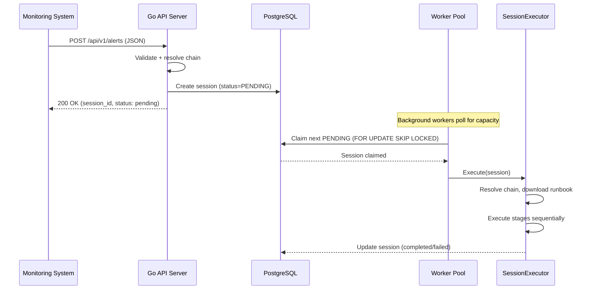
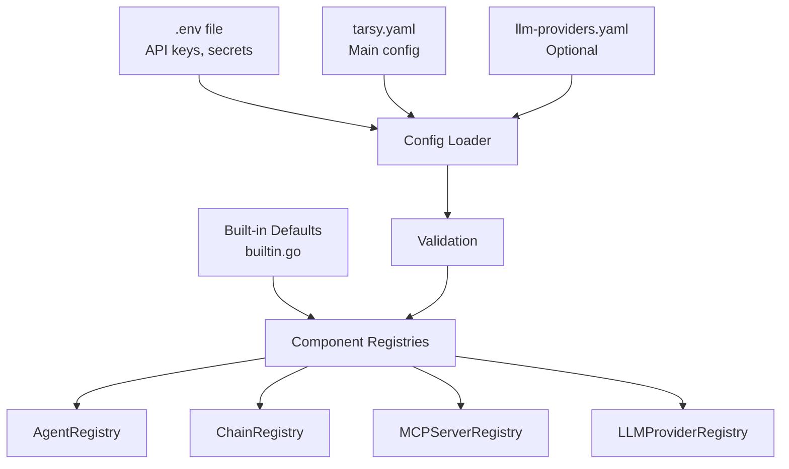
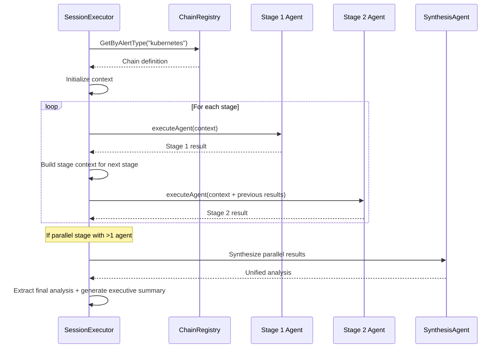
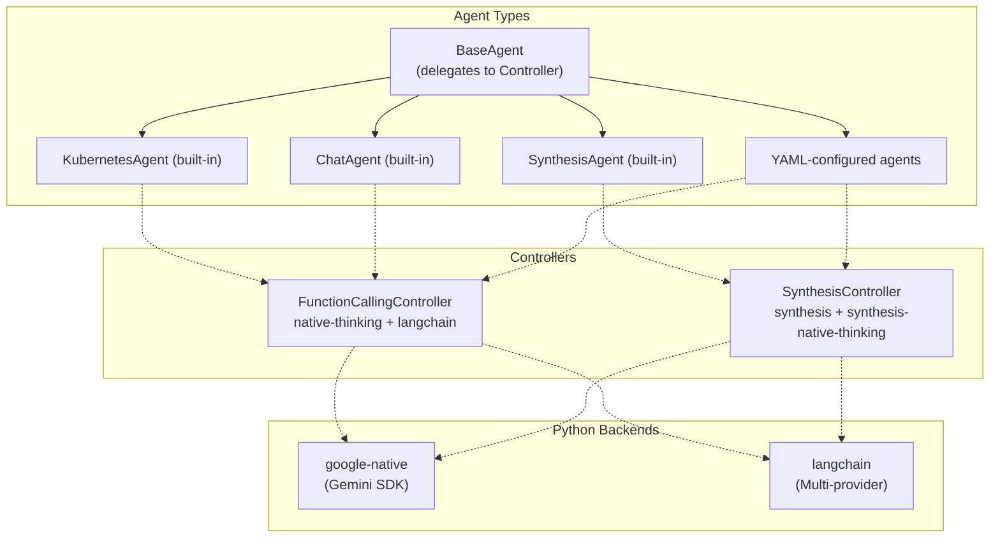
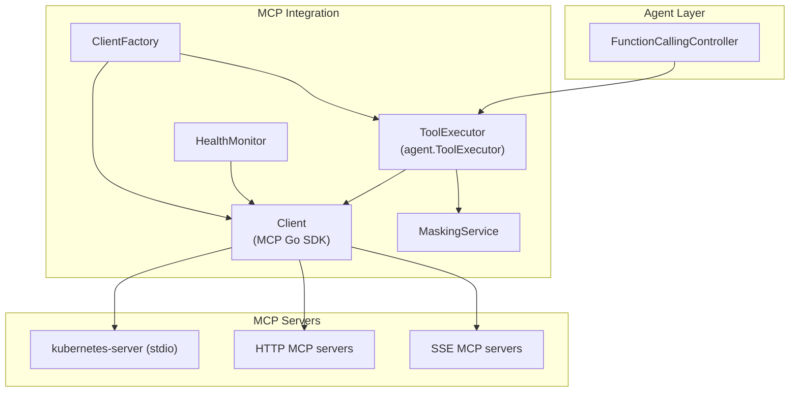
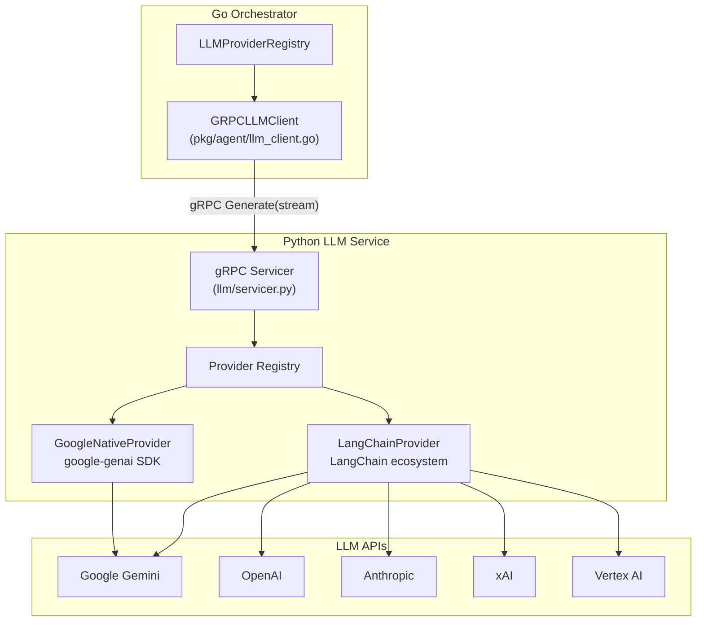
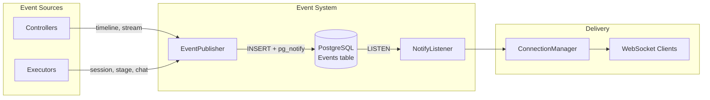
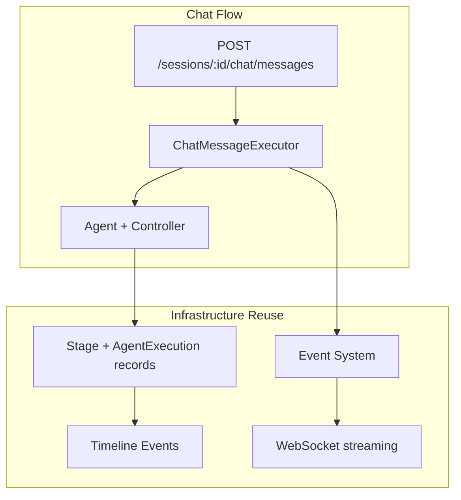
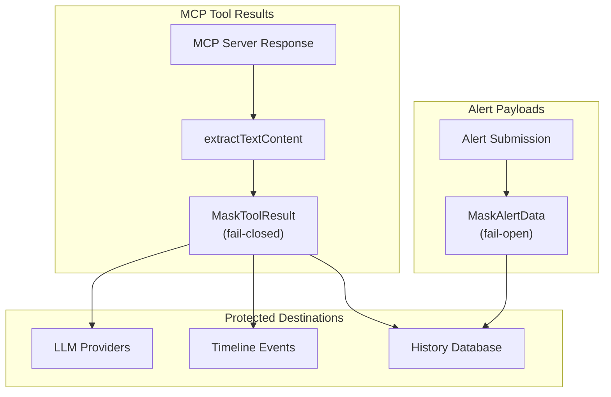

# TARSy System Design - Functional Areas Overview

**Purpose**: Modular system understanding guide for targeted improvements

---

## Introduction

This document provides a functional area breakdown of the TARSy system, enabling engineers to understand and work on specific parts of the system without needing to comprehend the entire codebase. Each section focuses on a distinct functional area with clear boundaries and responsibilities.

**How to Use This Document:**
- Start with the [High-Level System Overview](#high-level-system-overview) for context
- Jump to specific functional areas based on what you're working on
- Each area includes core concepts, key components, and integration points
- Cross-references help you understand dependencies between areas

---

## High-Level System Overview

TARSy is an AI-powered incident analysis system built on a Go/Python split architecture. The Go orchestrator manages the entire lifecycle of alert processing -- from API submission through chain execution to WebSocket streaming. The Python LLM service is a stateless gRPC proxy for LLM provider interactions.

**Core Flow**: Alert -> Queue -> Chain Selection -> Sequential Stage Execution -> Analysis & Recommendations -> Dashboard Display

---

## Table of Contents

### Foundation Layer
- [1. Alert Processing & Orchestration](#1-alert-processing--orchestration)
  - [Background Processing & Concurrency Management](#background-processing--concurrency-management)
- [2. Configuration Management](#2-configuration-management)

### Core Processing Pipeline
- [3. Chain Management & Execution](#3-chain-management--execution)
- [4. Agent Architecture & Controller System](#4-agent-architecture--controller-system)
- [5. MCP Integration & Tool Management](#5-mcp-integration--tool-management)
- [6. LLM Integration & Multi-Provider Support](#6-llm-integration--multi-provider-support)

### Event Capture & Observability
- [7. Event System & Real-time Streaming](#7-event-system--real-time-streaming)
  - [WebSocket & Cross-Pod Communication](#websocket--cross-pod-communication)
- [8. History & Audit Trail](#8-history--audit-trail)
- [9. Follow-up Chat](#9-follow-up-chat)
- [10. Dashboard & Real-time Monitoring](#10-dashboard--real-time-monitoring)
- [11. Slack Notifications](#11-slack-notifications)

### Cross-Cutting Concerns
- [12. Security & Data Protection](#12-security--data-protection)
- [13. Authentication & Access Control](#13-authentication--access-control)
- [14. Trace / Observability API](#14-trace--observability-api)
- [15. Cleanup & Retention](#15-cleanup--retention)

---

## Functional Areas

### 1. Alert Processing & Orchestration
**Purpose**: Core workflow management from alert receipt to completion
**Key Responsibility**: Coordinating the entire alert processing pipeline

TARSy accepts alerts from any monitoring system through a REST API, validates them, and coordinates the entire processing workflow. The system uses async background processing with database-backed concurrency control across multiple replicas.

#### Core Alert Flow



#### Key Components

**Main Entry Point**: `cmd/tarsy/main.go`
- Application startup, flag parsing, service wiring
- Initializes database, gRPC client, MCP health monitor, worker pool
- Serves dashboard static files via `-dashboard-dir` flag

**Alert API Handler**: `pkg/api/handler_alert.go`
- `POST /api/v1/alerts` with validation
- Queue size check (rejects with HTTP 429 when full)
- Alert data masking before database storage

**Alert Service**: `pkg/services/alert_service.go`
- `SubmitAlert()` -- creates session with chain resolved from alert type
- Validates runbook URL (domain allowlist)
- Applies alert data masking

**Alert Model** (submitted via API):
```json
{
  "alert_type": "kubernetes",
  "data": { "namespace": "production", "pod": "app-1" },
  "runbook": "https://github.com/org/repo/blob/main/runbooks/k8s.md",
  "mcp_selection": { "servers": [{ "name": "kubernetes-server" }] },
  "slack_message_fingerprint": "alert-12345"
}
```

#### Background Processing & Concurrency Management

**Global Alert Queue System**:

TARSy uses a database-backed global queue to manage alert processing across all pods in multi-replica deployments. PostgreSQL `FOR UPDATE SKIP LOCKED` ensures atomic session claiming without conflicts.

**Architecture Components**:

1. **Database-Backed Queue**: Sessions created in `PENDING` state, stored in PostgreSQL
2. **Worker Pool** (`pkg/queue/`): Configurable number of worker goroutines per replica
3. **Atomic Claiming**: `FOR UPDATE SKIP LOCKED` prevents duplicate claims across pods
4. **Global Concurrency Limit**: `max_concurrent_sessions` enforces system-wide active session limit
5. **Orphan Detection**: Periodic scan for stuck sessions with stale heartbeats

**Configuration** (`deploy/config/tarsy.yaml`):
```yaml
queue:
  worker_count: 5
  max_concurrent_sessions: 5
  poll_interval: 1s
  poll_interval_jitter: 500ms
  session_timeout: 15m
  orphan_detection_interval: 5m
  orphan_threshold: 5m
```

**Worker Implementation**: `pkg/queue/worker.go`
- Each worker runs a poll loop checking for available capacity
- Claims sessions atomically, dispatches to `SessionExecutor`
- Handles Slack start/terminal notifications
- Updates session status using `context.Background()` for post-cancellation reliability

**Session Executor**: `pkg/queue/executor.go`
- `RealSessionExecutor.Execute()` orchestrates the full chain lifecycle
- Resolves chain config, downloads runbook, iterates stages
- Extracts final analysis, generates executive summary (fail-open)
- Maps context errors to session status (timed_out / cancelled)

**Key Implementation Files**:
- `pkg/queue/worker.go` -- Worker poll loop and session lifecycle
- `pkg/queue/pool.go` -- WorkerPool management and cancellation
- `pkg/queue/executor.go` -- RealSessionExecutor and shared helpers
- `pkg/queue/chat_executor.go` -- ChatMessageExecutor for follow-up chat
- `pkg/services/alert_service.go` -- Alert submission and validation
- `pkg/api/handler_alert.go` -- HTTP handler with queue size check

---

### 2. Configuration Management
**Purpose**: System configuration and extensibility
**Key Responsibility**: Flexible system configuration without code changes

TARSy supports both built-in components and YAML-based configuration, enabling system extension without code changes. Configuration defines agents, chains, MCP servers, LLM providers, and their relationships.

#### Configuration Architecture



#### Key Configuration Types

**Built-in Configuration**: `pkg/config/builtin.go`
- Single source of truth for built-in agents, MCP servers, chains, and LLM providers
- Data structures only, no circular imports

**YAML Configuration**: `deploy/config/tarsy.yaml` (see `tarsy.yaml.example`)
- **Go template variables**: `{{.VARIABLE_NAME}}` resolved from environment
- **Agent definitions**: Custom agents with MCP servers and instructions
- **Chain definitions**: Multi-stage workflows with alert type mappings
- **MCP server configurations**: Custom tool servers with transport, masking, summarization
- **Override support**: YAML definitions override built-in components with same name/ID

**LLM Provider Configuration**: `deploy/config/llm-providers.yaml` (optional)
- Override built-in provider models, add custom proxy configurations
- Per-provider content truncation controls (`max_tool_result_tokens`)
- Native tools for Gemini (google_search, code_execution, url_context)

#### Configuration Registries

| Registry | Package | Lookup | Key Fields |
|----------|---------|--------|------------|
| `AgentRegistry` | `pkg/config/` | `Get(name)` | MCPServers, CustomInstructions, IterationStrategy, MaxIterations |
| `ChainRegistry` | `pkg/config/` | `Get(id)`, `GetByAlertType(type)` | AlertTypes, Stages[], Chat, LLMProvider, MCPServers |
| `MCPServerRegistry` | `pkg/config/` | `Get(id)` | Transport, Instructions, DataMasking, Summarization |
| `LLMProviderRegistry` | `pkg/config/` | `Get(name)`, `GetAll()` | Type, Model, APIKeyEnv, BaseURL, NativeTools |

#### Configuration Loading Process

**Config Loader**: `pkg/config/loader.go`
1. Load and parse YAML files with Go template variable resolution
2. Merge with built-in defaults (YAML takes precedence)
3. Validate references (MCP server references exist, LLM provider types valid)
4. Build registries for runtime lookup

**Config Validator**: `pkg/config/validator.go`
- Validates chain stage references, MCP server existence, runbook domains
- Startup-time validation prevents runtime failures

**Key Implementation Files**:
- `pkg/config/loader.go` -- YAML loading, template resolution, merging
- `pkg/config/builtin.go` -- Built-in agents, MCP servers, chains, LLM providers
- `pkg/config/validator.go` -- Configuration validation
- `pkg/config/system.go` -- System config types (GitHub, Runbook, Slack, Retention)
- `pkg/config/enums.go` -- IterationStrategy, LLMProviderType, SuccessPolicy, TransportType

---

### 3. Chain Management & Execution
**Purpose**: Chain definition, selection, and sequential stage execution
**Key Responsibility**: Managing multi-stage agent workflows with parallel execution support

Chains enable multi-stage workflows where specialized agents build upon each other's work. Each chain maps to one or more alert types and consists of sequential stages. Stages can run multiple agents in parallel, with automatic synthesis of results.

#### Chain Architecture



#### Key Components

**Chain Registry**: `pkg/config/` (built via config loader)
- O(1) chain lookup by alert type
- YAML chains override built-in chains for same alert type
- Built-in + YAML merging with YAML taking precedence

**Chain Execution**: `pkg/queue/executor.go`
- `executeStage()` -- unified handler for all stages (single or multi-agent)
- `executeAgent()` -- per-agent lifecycle (DB record, config resolution, MCP creation, agent execution)
- `executeSynthesisStage()` -- automatic synthesis after parallel stages with >1 agent
- `buildConfigs()` / `buildMultiAgentConfigs()` / `buildReplicaConfigs()` -- execution config building

#### Parallel Stage Execution

All stages use the same goroutine + WaitGroup + channel machinery regardless of agent count. A single-agent stage is N=1 -- not a special case.

**Multi-Agent Parallelism** (different agents run concurrently):
```yaml
stages:
  - name: "investigation"
    agents:
      - name: "KubernetesAgent"
        llm_provider: "gemini-2.5-flash"
        iteration_strategy: "native-thinking"
      - name: "performance-agent"
        llm_provider: "gemini-2.5-pro"
        iteration_strategy: "langchain"
    synthesis:
      iteration_strategy: "synthesis-native-thinking"
      llm_provider: "gemini-3-pro"
```

**Replica Parallelism** (same agent runs multiple times):
```yaml
stages:
  - name: "analysis"
    agents:
      - name: "KubernetesAgent"
    replicas: 3
```

**Key parallel execution features**:
- **Automatic synthesis**: SynthesisAgent synthesizes results after stages with >1 agent
- **Success policies**: `all` (strict) or `any` (resilient, default) success requirements
- **Per-agent configuration**: Each parallel agent can specify its own LLM provider and iteration strategy
- **Synthesis replaces investigation**: For downstream context, the synthesis result replaces raw per-agent results

#### Stage Context & Data Flow

**Chain Context Builder**: `pkg/agent/context/stage_context.go`
```go
type StageResult struct {
    StageName     string
    FinalAnalysis string
}

func BuildStageContext(stages []StageResult) string
```

Each stage sees all previous stage results formatted with `<!-- CHAIN_CONTEXT_START/END -->` markers. Context flows in-memory through the chain loop -- no additional DB query needed.

**Design principle**: No stored output fields on Stage or AgentExecution. Context is built lazily via `BuildStageContext()` when the next stage needs it.

#### Per-Stage LLM Provider Configuration

Chains support flexible LLM provider configuration with a resolution hierarchy:

1. **Stage-level `llm_provider`** (highest priority for stages)
2. **Chain-level `llm_provider`** (default for all stages in the chain)
3. **Global `defaults.llm_provider`** (system-wide default)

Non-stage components (executive summary, follow-up chat) use chain-level provider if defined, otherwise global default.

---

### 4. Agent Architecture & Controller System
**Purpose**: Agent framework and processing strategies
**Key Responsibility**: Agent behavior and iteration patterns

Agents are specialized AI-powered components that analyze alerts using domain expertise and configurable iteration controllers. The system supports both built-in agents (KubernetesAgent, ChatAgent, SynthesisAgent) and YAML-configured agents.

#### Agent Framework Architecture



#### Core Interfaces

**Agent Interface** (`pkg/agent/agent.go`):
```go
type Agent interface {
    Execute(ctx context.Context, execCtx *ExecutionContext, prevStageContext string) (*ExecutionResult, error)
}
```

**Controller Interface** (`pkg/agent/base_agent.go`):
```go
type Controller interface {
    Run(ctx context.Context, execCtx *ExecutionContext, prevStageContext string) (*ExecutionResult, error)
}
```

**Strategy-to-controller mapping**:

| Strategy | Controller | Backend | Use Case |
|----------|-----------|---------|----------|
| `native-thinking` | FunctionCallingController | `google-native` | Gemini structured function calling with thinking |
| `langchain` | FunctionCallingController | `langchain` | Multi-provider function calling |
| `synthesis` | SynthesisController | `langchain` | Tool-less synthesis of parallel results |
| `synthesis-native-thinking` | SynthesisController | `google-native` | Gemini thinking for synthesis |

#### FunctionCallingController (`pkg/agent/controller/function_calling.go`)

Handles both `native-thinking` and `langchain` strategies:

1. Build initial messages (system prompt + user context)
2. List tools from MCP servers
3. **Iteration loop** (up to `MaxIterations`):
   - Call LLM with streaming AND tool bindings (structured function calling)
   - If **tool calls** in response: execute each tool, append results, continue
   - If **no tool calls**: this is the final answer -- create `final_analysis` event, return
4. If max iterations reached: `forceConclusion()` -- call LLM WITHOUT tools to force text-only response

#### SynthesisController (`pkg/agent/controller/synthesis.go`)

Single LLM call without tools for synthesizing multi-agent investigation results. Receives full investigation history via timeline events (thinking, tool calls, results, analyses).

#### Instruction Composition

**Three-tier system** (`pkg/agent/prompt/builder.go`):
```
System prompt = General SRE instructions
              + MCP server instructions (per configured server)
              + Agent custom instructions
```

**PromptBuilder** methods:
- `BuildFunctionCallingMessages()` -- system + user messages for investigation
- `BuildSynthesisMessages()` -- system + user for synthesis
- `BuildForcedConclusionPrompt()` -- force answer at max iterations
- `ComposeInstructions()` / `ComposeChatInstructions()` -- instruction composition
- `BuildMCPSummarizationSystemPrompt()` / `BuildMCPSummarizationUserPrompt()` -- tool result summarization
- `BuildExecutiveSummarySystemPrompt()` / `BuildExecutiveSummaryUserPrompt()` -- executive summary

#### Forced Conclusion

At max iterations, `forceConclusion()` makes one extra LLM call without tools, asking for the best conclusion with available data. Every investigation produces actionable output.

**Key Implementation Files**:
- `pkg/agent/agent.go` -- Agent interface
- `pkg/agent/base_agent.go` -- BaseAgent with Controller delegation
- `pkg/agent/controller/function_calling.go` -- FunctionCallingController
- `pkg/agent/controller/synthesis.go` -- SynthesisController
- `pkg/agent/controller/tool_execution.go` -- Shared tool execution logic
- `pkg/agent/controller/summarize.go` -- Tool result summarization
- `pkg/agent/controller/timeline.go` -- Timeline event helpers
- `pkg/agent/prompt/` -- PromptBuilder, templates, instructions
- `pkg/agent/config_resolver.go` -- Hierarchical config resolution, `ResolveBackend()`
- `pkg/agent/iteration.go` -- IterationState tracking
- `pkg/agent/context.go` -- ExecutionContext, ResolvedAgentConfig, ChatContext

---

### 5. MCP Integration & Tool Management
**Purpose**: External tool server integration and tool orchestration
**Key Responsibility**: Connecting agents to external systems and tools

MCP (Model Context Protocol) servers provide agents with external tools and system access. TARSy integrates with MCP servers using the official Go SDK v1.3.0, supporting stdio, HTTP, and SSE transports with automatic data masking and tool result summarization.

#### MCP Architecture



#### Package Layout (`pkg/mcp/`)

| File | Purpose |
|------|---------|
| `client.go` | Client -- MCP SDK session manager, per-server mutex |
| `client_factory.go` | ClientFactory -- per-session client creation |
| `executor.go` | ToolExecutor -- implements `agent.ToolExecutor` |
| `params.go` | ActionInput parameter parsing (JSON/YAML/key-value/raw cascade) |
| `router.go` | Tool name normalization (`server__tool` to `server.tool`), splitting, validation |
| `recovery.go` | Error classification, retry with session recreation |
| `health.go` | HealthMonitor -- background health checks every 15s |
| `tokens.go` | Token estimation, two-tier truncation (storage 8K / summarization 100K) |
| `transport.go` | Transport creation from config (stdio/HTTP/SSE) |

#### Tool Lifecycle During Execution

```
Controller: LLM returns ToolCallChunk with "server__tool" + JSON args
  -> ToolExecutor.Execute(ToolCall)
    -> NormalizeToolName: server__tool -> server.tool
    -> SplitToolName: "server" + "tool"
    -> Validate server in allowed list, check tool filter
    -> ParseActionInput: JSON -> YAML -> key-value -> raw string cascade
    -> Client.CallTool(ctx, serverID, toolName, params)
      -> MCP SDK session.CallTool() with 90s timeout
      -> On error: classify -> retry once with session recreation (if transient)
    -> extractTextContent(result)
    -> MaskingService.MaskToolResult(content, serverID)
    -> Return ToolResult{Content, IsError}
```

#### Per-Agent-Execution Isolation

Every agent execution gets its own `Client` instance with independent MCP SDK sessions. Created via `createToolExecutor()` in the executor, torn down via `defer Close()`. No shared state between agents or stages.

#### Hierarchical MCP Server Configuration

Configuration hierarchy (lowest to highest priority):
1. **Agent level** -- defined in agent's `mcp_servers` config
2. **Chain level** -- optional `mcp_servers` in chain definition
3. **Stage level** -- optional `mcp_servers` in stage definition
4. **Parallel agent level** -- optional per parallel agent
5. **Chat level** -- optional in chat config
6. **Alert level** -- via API `mcp_selection` field (highest, replaces all)

#### Custom MCP Configuration (Per-Alert Override)

When an alert provides `mcp_selection`, it **replaces** the chain/agent's MCP server list entirely. Tool filtering within a server is additive restriction (empty list = all tools).

```json
{
  "mcp_selection": {
    "servers": [
      { "name": "kubernetes-server", "tools": ["kubectl_get_pods"] }
    ],
    "native_tools": { "google_search": true }
  }
}
```

**API Discovery**: `GET /api/v1/system/default-tools?alert_type=kubernetes` returns the default MCP tool configuration for a given alert type. `GET /api/v1/system/mcp-servers` returns all configured servers with their available tools and health status.

#### Health Monitoring

**HealthMonitor** (`pkg/mcp/health.go`): Dedicated long-lived MCP Client (not shared with sessions) that checks server health every 15s via `ListTools`. On failure: attempts session recreation, marks unhealthy, adds `SystemWarning`. On recovery: clears warning automatically.

**Startup validation**: All configured MCP servers are validated eagerly at startup. Failures are logged as warnings -- TARSy starts in a degraded state rather than refusing to start.

**Key Implementation Files**:
- `pkg/mcp/client.go` -- MCP Client wrapping Go SDK
- `pkg/mcp/executor.go` -- ToolExecutor implementing `agent.ToolExecutor`
- `pkg/mcp/client_factory.go` -- Per-session client creation
- `pkg/mcp/health.go` -- Background health monitoring
- `pkg/mcp/transport.go` -- Transport creation (stdio/HTTP/SSE)
- `pkg/mcp/params.go` -- Multi-format ActionInput parsing
- `pkg/mcp/router.go` -- Tool name routing and validation

---

### 6. LLM Integration & Multi-Provider Support
**Purpose**: AI/LLM provider abstraction and management
**Key Responsibility**: Unified LLM access across multiple providers via gRPC

TARSy uses a Go/Python split for LLM integration. The Go orchestrator communicates with the Python LLM service via gRPC, which routes to the appropriate provider backend.

#### LLM Architecture



#### Go Side: LLMClient

**GRPCLLMClient** (`pkg/agent/llm_client.go`):
```go
type LLMClient interface {
    Generate(ctx context.Context, input *GenerateInput) (<-chan Chunk, error)
    Close() error
}
```

Chunk types: `TextChunk`, `ThinkingChunk`, `ToolCallChunk`, `CodeExecutionChunk`, `UsageChunk`, `ErrorChunk`, `GroundingChunk`.

**GenerateInput** carries: `SessionID`, `ExecutionID`, `Messages`, `Config` (LLMProviderConfig), `Tools`, `Backend`.

#### Python Side: Provider Routing

```
Generate(request) -> backend = request.llm_config.backend || "google-native"
  -> registry.get(backend) -> provider.generate(request) -> stream chunks
```

**GoogleNativeProvider** (`llm/providers/google_native.py`):
- `google-genai` SDK with `generate_content_stream()`
- Native thinking with `ThinkingConfig(include_thoughts=True)`
- Thought signatures for multi-turn reasoning continuity
- Native function calling (structured tool calls)
- Per-execution content caching (1-hour TTL)

**LangChainProvider** (`llm/providers/langchain_provider.py`):
- Multi-provider: OpenAI (`ChatOpenAI`), Anthropic (`ChatAnthropic`), xAI (`ChatXAI`), Google (`ChatGoogleGenerativeAI`), VertexAI
- Model caching by `(provider, model, api_key_env)` tuple
- `bind_tools()` for structured function calling
- Streaming via `astream()` with thinking content extraction

#### Tool Name Encoding

Shared convention between Go and Python:
- **Canonical**: `server.tool` (Go backend, internal routing)
- **API**: `server__tool` (LLM APIs -- dots invalid in function names)
- Go: `NormalizeToolName()` in `pkg/mcp/router.go`
- Python: `tool_name_to_api()` / `tool_name_from_api()` in `llm/providers/tool_names.py`

#### gRPC Protocol (`proto/llm_service.proto`)

- **RPC**: `Generate(GenerateRequest) returns (stream GenerateResponse)`
- **LLMConfig**: `backend`, `provider`, `model`, `api_key_env`, `base_url`, `native_tools`, `max_tool_result_tokens`
- **Response streaming**: `TextDelta`, `ThinkingDelta`, `ToolCallDelta`, `UsageInfo`, `ErrorInfo`, `CodeExecutionDelta`, `GroundingDelta`

#### Built-in LLM Providers

| Name | Type | Model | Context |
|------|------|-------|---------|
| `google-default` | google | gemini-3-flash-preview | 1M |
| `gemini-2.5-flash` | google | gemini-2.5-flash | 1M |
| `gemini-2.5-pro` | google | gemini-2.5-pro | 1M |
| `gemini-3-pro` | google | gemini-3-pro-preview | 1M |
| `openai-default` | openai | gpt-5.2 | 400K |
| `anthropic-default` | anthropic | claude-sonnet-4-6 | 1M (beta) |
| `xai-default` | xai | grok-4-1-fast-reasoning | 2M |
| `vertexai-default` | vertexai | claude-sonnet-4-6 | 1M (beta) |

Google providers include native tools (google_search, url_context enabled; code_execution disabled by default). Native tools are disabled when MCP tools are present.

**Key Implementation Files**:
- `pkg/agent/llm_client.go` -- GRPCLLMClient, GenerateInput, Chunk types
- `proto/llm_service.proto` -- gRPC service definition
- `llm-service/llm/servicer.py` -- gRPC servicer with provider routing
- `llm-service/llm/providers/google_native.py` -- GoogleNativeProvider
- `llm-service/llm/providers/langchain_provider.py` -- LangChainProvider
- `llm-service/llm/providers/tool_names.py` -- Tool name encoding

---

### 7. Event System & Real-time Streaming
**Purpose**: Event-driven real-time system coordination
**Key Responsibility**: Enabling loose coupling through typed events and cross-pod delivery

The event system powers real-time dashboard updates through PostgreSQL LISTEN/NOTIFY for cross-pod delivery, with WebSocket connections to browser clients.

#### Event Architecture



#### Key Components

**EventPublisher** (`pkg/events/publisher.go`):
```go
func (p *EventPublisher) Publish(ctx, sessionID, channel, payload) error        // Persistent (DB + NOTIFY)
func (p *EventPublisher) PublishTransient(ctx, channel, payload) error           // Transient (NOTIFY only)
func (p *EventPublisher) PublishStageStatus(ctx, sessionID, payload) error       // Stage lifecycle
```

The `agent.EventPublisher` interface (`pkg/agent/context.go`) exposes typed methods: `PublishTimelineCreated`, `PublishTimelineCompleted`, `PublishStreamChunk`, `PublishSessionStatus`, `PublishStageStatus`, `PublishChatCreated`, `PublishChatUserMessage`.

**Event Types**:
- **Persistent** (DB + NOTIFY): `timeline_event.created`, `timeline_event.completed`, `session.status`, `stage.status`, `chat.created`, `chat.user_message`
- **Transient** (NOTIFY only): `stream.chunk` (LLM token deltas)

**Event Channels**:
- `sessions` -- global session lifecycle events
- `session:{session_id}` -- per-session detail events (including chat)

#### WebSocket & Cross-Pod Communication

**WebSocket Endpoint**: `pkg/api/handler_ws.go`
- Single connection per browser tab at `/api/v1/ws`
- Client actions: `subscribe`, `unsubscribe`, `catchup`, `ping`

**ConnectionManager** (`pkg/events/manager.go`):
- Tracks active WebSocket connections and channel subscriptions
- Broadcasts events to all subscribers of a channel

**NotifyListener** (`pkg/events/listener.go`):
- PostgreSQL `LISTEN` via `pgx.WaitForNotification`
- Dispatches notifications to registered handlers

**Cross-Pod Event Delivery**:
```
Event Published -> DB (INSERT + NOTIFY) -> All Backend Pods (LISTEN) -> WebSocket Clients
```

**Auto-catchup**: New channel subscriptions automatically receive prior events. On reconnect, clients send `catchup` with `last_event_id` for fine-grained replay. Server returns missed events (limit: 200). Overflow triggers `catchup.overflow` signaling the client to do a full REST reload.

**Cross-Pod Cancellation**: Uses a dedicated `cancellations` NOTIFY channel. Cancel handler sets DB status to `cancelling`, cancels locally, publishes session ID to the channel. All pods LISTEN and cancel the session context on the owning pod.

**Key Implementation Files**:
- `pkg/events/publisher.go` -- EventPublisher (persistent + transient)
- `pkg/events/manager.go` -- ConnectionManager (WebSocket routing)
- `pkg/events/listener.go` -- NotifyListener (PostgreSQL LISTEN)
- `pkg/api/handler_ws.go` -- WebSocket endpoint and protocol
- `pkg/services/event_service.go` -- Event persistence and cleanup

---

### 8. History & Audit Trail
**Purpose**: Complete processing history capture and timeline reconstruction
**Key Responsibility**: Providing comprehensive audit trails and operational visibility

The history system captures the complete lifecycle of alert processing through a five-layer data model, providing detailed audit trails for debugging, monitoring, and compliance.

#### Five-Layer Data Model

```
AlertSession (session metadata, status, alert data)
  +-- Stage (chain stage -- configuration + coordination)
  |     +-- AgentExecution (individual agent work within a stage)
  |           +-- Layer 1: TimelineEvent (UX timeline -- what the user sees)
  |           +-- Layer 2: Message (LLM conversation -- linear, no duplication)
  |           +-- Layer 3-4: LLMInteraction / MCPInteraction (trace/observability)
  +-- Event (WebSocket distribution -- transient)
  +-- Chat -> ChatUserMessage (follow-up chat)
```

#### Key Entity Fields

**AlertSession** (`ent/schema/alertsession.go`):
`id`, `alert_data`, `agent_type`, `alert_type`, `status` (pending/in_progress/cancelling/completed/failed/cancelled/timed_out), `chain_id`, `pod_id`, `final_analysis`, `executive_summary`, `mcp_selection`, `author`, `runbook_url`, `deleted_at` (soft delete), timestamps

**Stage** (`ent/schema/stage.go`):
`id`, `session_id`, `stage_name`, `stage_index`, `expected_agent_count`, `parallel_type`, `success_policy`, `chat_id`, `chat_user_message_id`, `status`, `error_message`, timestamps

**AgentExecution** (`ent/schema/agentexecution.go`):
`id`, `stage_id`, `session_id`, `agent_name`, `agent_index`, `iteration_strategy`, `llm_provider`, `status`, `error_message`, timestamps

**TimelineEvent** (`ent/schema/timelineevent.go`):
`id`, `session_id`, `stage_id` (optional), `execution_id` (optional), `sequence_number`, `event_type` (llm_thinking/llm_response/llm_tool_call/mcp_tool_summary/error/user_question/executive_summary/final_analysis/code_execution/google_search_result/url_context_result), `status` (streaming/completed/failed/cancelled/timed_out), `content`, `metadata` (JSON), timestamps

**Message** (`ent/schema/message.go`):
`id`, `session_id`, `stage_id`, `execution_id`, `sequence_number`, `role` (system/user/assistant/tool), `content`, `tool_calls` (JSON), `tool_call_id`, `tool_name`, timestamps

#### Service Layer

| Service | File | Purpose |
|---------|------|---------|
| `SessionService` | `pkg/services/session_service.go` | Session CRUD, status updates, pagination |
| `StageService` | `pkg/services/stage_service.go` | Stage lifecycle, parallel status aggregation |
| `TimelineService` | `pkg/services/timeline_service.go` | Timeline event CRUD, streaming updates |
| `MessageService` | `pkg/services/message_service.go` | LLM conversation message storage |
| `InteractionService` | `pkg/services/interaction_service.go` | LLM/MCP interaction recording |
| `ChatService` | `pkg/services/chat_service.go` | Chat and user message management |

#### REST API Endpoints

| Method | Endpoint | Purpose |
|--------|----------|---------|
| GET | `/api/v1/sessions` | Paginated session list with filtering |
| GET | `/api/v1/sessions/active` | Active + queued sessions |
| GET | `/api/v1/sessions/filter-options` | Distinct alert types and chain IDs |
| GET | `/api/v1/sessions/:id` | Session details |
| GET | `/api/v1/sessions/:id/summary` | Final analysis + executive summary |
| GET | `/api/v1/sessions/:id/timeline` | Timeline events ordered by sequence |
| POST | `/api/v1/sessions/:id/cancel` | Cancel running session or chat |
| GET | `/health` | Health check (DB, worker pool) |

---

### 9. Follow-up Chat
**Purpose**: Interactive investigation continuation after session completion
**Key Responsibility**: Enabling engineers to ask follow-up questions with full context and tool access

After an investigation reaches a terminal state, engineers can start follow-up chat conversations. The chat agent receives the full investigation timeline as context and has access to the same MCP tools.

#### Chat Architecture



#### Key Components

**ChatMessageExecutor** (`pkg/queue/chat_executor.go`):
- Spawns one goroutine per message (no pool -- chats are rare, one-at-a-time per chat enforced)
- Resolves chain + chat agent config via `ResolveChatAgentConfig()`
- Creates Stage and AgentExecution records (reusing existing audit trail infrastructure)
- Builds context from unified timeline (`GetSessionTimeline` + `FormatInvestigationContext`)
- Runs `agent.Execute()` with same controllers as investigation

**Chat Service** (`pkg/services/chat_service.go`):
- `GetOrCreateChat()` -- one Chat per session
- Chat metadata, context snapshot, pod tracking

**Design principle**: Chat is a prompt concern, not a controller concern. The same FunctionCalling and Synthesis controllers handle both investigation and chat -- the `ChatContext` on `ExecutionContext` triggers chat-specific prompting. Same iteration limits, same `forceConclusion()` at max iterations.

#### Lifecycle Constraints

- **One Chat per session**: enforced by schema uniqueness on `session_id`
- **Terminal sessions only**: available for completed/failed/timed_out sessions
- **One-at-a-time per chat**: new message while processing returns 409 Conflict
- **Chat enabled check**: `chain.Chat.Enabled` must be true

#### Configuration

```yaml
agent_chains:
  kubernetes-agent-chain:
    chat:
      enabled: true
      agent: "ChatAgent"
      iteration_strategy: "native-thinking"
      llm_provider: "google-default"
      mcp_servers: ["kubernetes-server"]
      max_iterations: 20
```

**REST Endpoints** (`pkg/api/handler_chat.go`):
- `POST /api/v1/sessions/:id/chat/messages` -- send message (202 Accepted, response via WebSocket)

---

### 10. Dashboard & Real-time Monitoring
**Purpose**: User interface and live system monitoring
**Key Responsibility**: Providing real-time visibility and historical analysis

TARSy provides a React SPA served statically by the Go backend, with real-time updates through WebSocket.

#### UI Architecture

**Technology**: React 19 + TypeScript + Vite 7 + MUI 7

**Pages**:

| Route | Page | Purpose |
|-------|------|---------|
| `/` | DashboardPage | Session list with active/queued/historical panels, filters, pagination |
| `/sessions/:id` | SessionDetailPage | Session detail with conversation timeline, streaming, chat |
| `/sessions/:id/trace` | TracePage | Trace view with LLM/MCP interaction details |
| `/submit-alert` | SubmitAlertPage | Alert submission with MCP override selection |
| `/system` | SystemStatusPage | MCP server health, tools, system warnings |

#### Data Flow

- **REST + WebSocket**: REST for initial load and paginated data; WebSocket for live updates
- **Streaming pattern**: `timeline_event.created` -> `stream.chunk` (token deltas) -> `timeline_event.completed`
- **Event-notification pattern**: Trace page debounces WebSocket events and re-fetches via REST
- **Optimistic UI**: Chat injects temporary `user_question` items before server confirmation

#### State Management

No global state library. State is local `useState` per page + two React Contexts:
- **AuthContext**: User identity, auth availability
- **VersionContext**: Polls `/health` and `index.html` for version mismatch detection

Filter state, pagination, and sort preferences persist in `localStorage`.

#### Static Serving from Go

`SetDashboardDir(dir)` on the HTTP server registers dashboard routes after API routes:
- `/assets/*` -- `Cache-Control: public, max-age=31536000, immutable` (Vite content-hashed filenames)
- All other non-API routes -- SPA fallback to `index.html` with `Cache-Control: no-cache`
- API routes registered first take priority over the SPA fallback

**Key Implementation Files**:
- `web/dashboard/src/pages/` -- Page components
- `web/dashboard/src/components/` -- UI components (timeline, trace, chat, session, etc.)
- `web/dashboard/src/services/websocketService.ts` -- WebSocket with reconnect + catchup
- `web/dashboard/src/services/api.ts` -- Axios-based API client with retry
- `web/dashboard/src/hooks/` -- useChatState, useVersionMonitor, useAdvancedAutoScroll
- `web/dashboard/src/contexts/` -- AuthContext, VersionContext

---

### 11. Slack Notifications
**Purpose**: External notification integration for alert processing outcomes
**Key Responsibility**: Delivering analysis results to Slack channels

TARSy provides optional Slack integration for automatic notifications at two lifecycle points: session start (for Slack-originated alerts) and terminal status (completed, failed, timed out, cancelled). Supports threaded replies via fingerprint correlation.

**For complete setup guide**: See [Slack Integration Documentation](slack-integration.md)

**Package**: `pkg/slack/`

| File | Purpose |
|------|---------|
| `service.go` | SlackService -- orchestrator, nil-safe, fail-open |
| `client.go` | SlackClient -- thin wrapper around slack-go SDK |
| `message.go` | Block Kit message builders |

**Key design patterns**:
- **Nil-safe service**: `NewService` returns nil when unconfigured; all methods are nil-receiver safe
- **Fail-open**: Slack API failures are logged but never block session processing
- **ThreadTS caching**: Start notification resolves fingerprint -> `thread_ts`; terminal notification reuses it

---

### 12. Security & Data Protection
**Purpose**: Sensitive data protection and secure operations
**Key Responsibility**: Preventing sensitive data exposure to LLM providers, logs, and storage

TARSy implements comprehensive data masking using a hybrid approach: code-based structural analysis + regex patterns.

#### Security Architecture



#### Masking Design Principles

1. **Fail-closed for MCP** -- on masking failure, redact entire content rather than leaking secrets
2. **Fail-open for alerts** -- on masking failure, continue with unmasked data (availability over secrecy)
3. **One-way masking** -- original values never stored or recoverable
4. **Code maskers before regex** -- structural maskers run first for precision, then regex patterns sweep
5. **Single chokepoint** -- MCP content masked in `ToolExecutor.Execute()` before `ToolResult` returns

#### Hybrid Masking Architecture

**Two-Phase Process**:

1. **Code-Based Maskers** (applied first):
   - `KubernetesSecretMasker` -- parses YAML/JSON to mask Secret resources but preserve ConfigMaps
   - Handles SecretList, mixed Lists, and JSON-in-annotations

2. **Regex Patterns** (applied second):
   - 15 built-in patterns: API keys, passwords, certificates, tokens, SSH keys, emails, etc.
   - Pattern groups: `basic`, `secrets`, `security`, `kubernetes`, `cloud`, `all`
   - Replacement format: `[MASKED_X]`

#### Configuration

Per-server MCP masking in `tarsy.yaml`:
```yaml
mcp_servers:
  kubernetes-server:
    data_masking:
      enabled: true
      pattern_groups: ["kubernetes"]
      patterns: ["certificate", "token"]
      custom_patterns:
        - pattern: "CUSTOM_SECRET_.*"
          replacement: "[MASKED_CUSTOM]"
```

Alert masking under `defaults.alert_masking`:
```yaml
defaults:
  alert_masking:
    enabled: true
    pattern_group: "security"
```

**Key Implementation Files**:
- `pkg/masking/service.go` -- MaskingService (core orchestrator)
- `pkg/masking/pattern.go` -- CompiledPattern, pattern resolution, group expansion
- `pkg/masking/masker.go` -- Masker interface for code-based maskers
- `pkg/masking/kubernetes_secret.go` -- KubernetesSecretMasker

---

### 13. Authentication & Access Control
**Purpose**: Optional authentication for enhanced security
**Key Responsibility**: Protecting dashboard and API access

TARSy supports two authentication paths via sidecar containers:

#### OAuth2-Proxy (Browser Access)

OAuth2-proxy handles GitHub OAuth for browser-based access with cookie-based sessions.

**Request flow**: User -> oauth2-proxy (:4180) -> GitHub OAuth redirect -> cookie set -> proxy with `X-Forwarded-User/Email` headers to TARSy

**Configuration**: `deploy/config/oauth2-proxy.cfg.template` + `oauth.env`

#### kube-rbac-proxy (API Client Access)

For OpenShift environments, kube-rbac-proxy validates Kubernetes ServiceAccount tokens via TokenReview/SubjectAccessReview APIs. Zero custom token code.

**Request flow**: API Client -> kube-rbac-proxy (:8443) -> SA token validation -> proxy with `X-Remote-User/Groups` to TARSy

**Author extraction** (`pkg/api/auth.go`):
```go
func extractAuthor(c *echo.Context) string {
    // oauth2-proxy headers (browser)
    if user := c.Request().Header.Get("X-Forwarded-User"); user != "" { return user }
    if email := c.Request().Header.Get("X-Forwarded-Email"); email != "" { return email }
    // kube-rbac-proxy headers (API clients)
    if user := c.Request().Header.Get("X-Remote-User"); user != "" { return user }
    return "api-client"
}
```

#### Security Middleware (`pkg/api/server.go`)

**Security headers**: X-Frame-Options DENY, X-Content-Type-Options nosniff, Referrer-Policy, Permissions-Policy

**CORS**: Dashboard URL-based origin allowlist + localhost variants for development

**WebSocket origins**: Configurable `OriginPatterns` derived from `system.dashboard_url` + localhost + `system.allowed_ws_origins`

#### Health Endpoint

`GET /health` returns minimal response for unauthenticated access: status, version, database and worker pool checks. External dependencies (MCP, LLM) excluded to prevent K8s from restarting TARSy when external services are unhealthy.

---

### 14. Trace / Observability API
**Purpose**: Deep investigation inspection for debugging and analysis
**Key Responsibility**: Exposing all four data layers through REST endpoints

Three-level trace endpoints for inspecting investigation internals, designed for the dashboard's trace view.

#### Trace Endpoints (`pkg/api/handler_trace.go`)

**Level 1: Interaction List** (`GET /sessions/:id/trace`)
Returns interactions grouped in a stage -> execution hierarchy:
```go
type TraceListResponse struct {
    Stages              []TraceStageGroup
    SessionInteractions []LLMInteractionListItem
}
```

**Level 2: LLM Interaction Detail** (`GET /sessions/:id/trace/llm/:interaction_id`)
Full LLM interaction with reconstructed conversation from the Message table. For self-contained interactions (summarization), conversation extracted from inline `llm_request` JSON.

**Level 2: MCP Interaction Detail** (`GET /sessions/:id/trace/mcp/:interaction_id`)
Full MCP interaction: tool arguments, result, available tools, timing, error details.

**Key Implementation Files**:
- `pkg/api/handler_trace.go` -- Trace HTTP handlers
- `pkg/models/interaction.go` -- Trace API response types
- `pkg/services/interaction_service.go` -- LLM/MCP interaction queries

---

### 15. Cleanup & Retention
**Purpose**: Data lifecycle management and storage hygiene
**Key Responsibility**: Enforcing retention policies and preventing unbounded growth

#### CleanupService (`pkg/cleanup/service.go`)

Standalone service with `Start`/`Stop` lifecycle running a periodic background loop:

1. **Soft-delete old sessions**: Completed sessions older than `session_retention_days` (default: 365 days) get `deleted_at` set. Also covers stale pending sessions.
2. **Remove orphaned events**: Event rows past `event_ttl` (default: 1 hour) are hard-deleted.

All operations are fail-open (log + continue). Cascade deletes for related records handled via Ent schema FK constraints.

#### Configuration

```yaml
system:
  retention:
    session_retention_days: 365
    event_ttl: 1h
    cleanup_interval: 12h
```

**Key Implementation Files**:
- `pkg/cleanup/service.go` -- CleanupService with periodic loop
- `ent/schema/` -- FK constraints for cascade deletes
