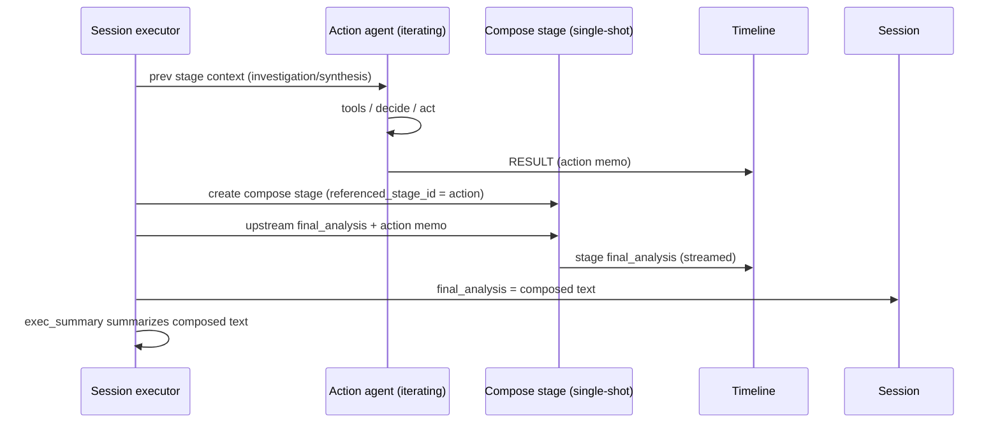

# Action Report Compose Pass

**Status:** Final — decisions from [action-report-compose-questions.md](action-report-compose-questions.md)

## Overview

When a chain ends with an action/remediation stage, session `final_analysis` is taken from that last stage. The action agent is currently prompted to **copy the investigation report and amend it**. Claude 4.6 followed that contract. Claude 5 often does not: it writes a short action memo (or a stub "preserved above verbatim") and that memo becomes the session's final analysis.

Mechanical concatenation of synthesis + action output is ugly: duplicated sections, stale "recommended actions" next to "already done", two summaries.

This design adds a **dedicated compose stage** after each successful action stage. The action agent only decides and acts (short memo). A single-shot LLM call then produces the session report: investigation text as the body, action outcome as an amendment. The copy-the-report instruction is removed from the action prompt.

## Design Principles

1. **Split jobs.** The action agent evaluates and executes. It does not author the canonical session report.
2. **Investigation-first document.** The composed report is the investigation/synthesis with an actions amendment — not an action memo with a nod to the investigation.
3. **Copy-edit, not rewrite.** Keep the upstream document's own structure and wording (whatever format that agent or skill used). Fold in the action result. Do not re-author the investigation into a canonical template.
4. **Fail-open.** A failed compose LLM must not fail the session. Action tools already ran. Stage status is still `failed`; the card uses mechanical concat.
5. **Visible.** Compose is its own collapsible stage (`{actionStage} - Amended Report`), distinct from the action RESULT memo.
6. **Cheap.** One shot, no tools, two `final_analysis` documents in, one document out.

## Architecture / How It Works

Today:

```
investigation → [synthesis] → action → extractFinalAnalysis(last stage) → exec_summary
                     ↑                         ↑
              canonical report         supposed to copy+amend; often doesn't
```

Proposed:

```
investigation → [synthesis] → action (memo only) → compose stage → extractFinalAnalysis(compose) → exec_summary
                                                     ↑
                         automatic sibling: two final_analysis docs → amended report
```

Synthesis is optional: TARSy inserts it only after parallel/replica **investigation**. Upstream report = synthesis `final_analysis` if that stage ran, otherwise the investigation agent's `final_analysis`.



### Trigger

After **each successful action stage** (and that stage's synthesis sibling, if parallel agents ran), the executor inserts an automatic compose sibling. Not YAML, not buried in the action stage.

**Skip** only when there is no upstream investigation/synthesis (or prior compose) report. Do **not** skip when the remediator took no action — that is the common path where today's card is wrong.

Action-only chains (no investigation/synthesis before the action) skip compose. Session `final_analysis` stays the action memo.

### Inputs

Exactly two stage `final_analysis` strings, as already stored — no extra parsing:

1. **Upstream report** — last investigation / investigation-synthesis / **prior compose** `final_analysis`, snapshotted **before** this action stage (and its synthesis, if any) is appended.
2. **Action memo** — the result of this action work: the action stage `final_analysis` when a single agent ran, or the **synthesis** `final_analysis` when parallel action agents ran.

Send both to the compose model as-is and ask it to copy-edit them into one report. Compose does not re-read tool traces or per-agent transcripts.

(The action agent still ends with a YES/NO line for `actions_executed`. The executor already strips that before writing the action stage's `final_analysis`. Compose never sees it.)

### Outputs

One markdown document. The compose prompt is **format-agnostic**: the upstream report's structure is defined by that chain's investigation/synthesis agent or skill, not by TARSy.

The prompt should tell the model to:

- Emit the upstream report as the body. Keep its headings, tables, lists, and wording.
- Fold the action memo into that document (new section if there is no natural place; or fill an existing actions/status area if the upstream already has one).
- Patch only upstream text the memo makes stale (e.g. a "do X" recommendation that was already done or declined). Do not invent a TARSy-standard template, improve prose, drop sections, or add facts that are in neither document.

### Token cost

| Call | Tools | Typical in | Typical out |
|------|-------|------------|-------------|
| Action agent today (4.6, copying) | yes, many | large | full report (2–6k) on the expensive action model |
| Action agent with this design | yes, many | large | short memo (~0.5–2k) |
| Compose pass | no | two docs (~3–10k) + short prompt | one report (~2–6k) |

Net vs 4.6: action **output** shrinks; compose adds one modest call on `defaults.compose_provider` (mid-tier). Do not send the action agent's iteration history into compose.

### Failure and cancellation

If compose **LLM** errors, times out, or returns empty (after the existing single-shot empty retry):

- Session still completes (**fail-open**, like exec summary — not fail-closed like synthesis).
- Compose **stage status is `failed`** (honest timeline).
- Executor writes mechanical concat to the compose stage's `final_analysis` **and** still **appends** that stage to `completedStages`. Concat format: upstream report + `\n\n## Action result\n\n` + raw memo. Generic heading on purpose — fail-open concat must not assume an investigation template.
- `extractFinalAnalysis` includes `compose` and does not check stage status. Concat is non-empty, so the last compose wins. Do **not** omit a failed compose from `completedStages` — that would land on the action memo (today's bug).
- Chain **continues** (further YAML stages, then exec summary). Do not `return` the way a failed investigation/synthesis does.

Session **cancel / session timeout** during compose: honour it. Do not concat-and-complete a cancelled session. Fail-open is for the compose LLM call, not for operator cancel.

### Session `final_analysis` and exec summary

Action stage analysis stays the memo. Compose stage analysis is the composed report (or concat on failure).

`extractFinalAnalysis` runs **once at the end** of the chain loop (today's `worker` persists `ExecutionResult.FinalAnalysis`). Do not write `alert_sessions.final_analysis` incrementally during compose; the stage timeline still streams.

`extractFinalAnalysis` allowlist today: `investigation`, `synthesis`, `action`. Add `compose`. Last non-empty wins, so the last compose wins over the action memo. `exec_summary`, `scoring`, and `chat` stay excluded.

Executive summary already takes `extractFinalAnalysis(...)` as `prevContext`. After this change it summarizes the composed document automatically.

### Context for later YAML stages

`buildStageContext` uses the same type allowlist as `extractFinalAnalysis`. Add `compose`.

If a later YAML stage runs after action+compose, it would otherwise see **both** the action memo and the composed report. Treat compose like synthesis does for parallel investigation: the composed report **supersedes** that action memo for downstream context.

- `completedStages` keeps the action row, its synthesis sibling if any, and compose.
- `buildStageContext` **omits** that action stage (and a synthesis whose `referenced_stage_id` points at it) when a later compose points at the action.
- A later compose's upstream report is the previous compose `final_analysis`.

### Parallel action agents (existing synthesis)

Today the executor inserts synthesis whenever `len(agentResults) > 1`, with no stage-type check. That is **fine for compose**. Parallel action memos are merged into one synthesis document; that document **is** the action-side input. Compose should not read per-agent transcripts.

Order:

```
… → action (N agents) → [synthesis of those memos, if N>1] → compose
```

- **Upstream report** is snapshotted **before** this action stage is appended (last investigation / investigation-synthesis / prior compose). Do not pick the action's own synthesis as upstream — that would send the same blob twice.
- **Action memo** is whatever was just appended for this action: the action stage `final_analysis` when N=1, or the synthesis `final_analysis` when N>1.

Keep auto-synthesis as it is. Do not special-case it off for action stages.

(The builtin synthesis prompt is investigation-flavored. That is a pre-existing mismatch if someone actually runs parallel remediator agents; it is not a compose problem. Compose still wants the one merged document.)

### Progress count

`countExpectedStages` is computed once from chain YAML (stages + synthesis for multi-agent/replica investigation + 1 exec summary).

Add **+1 per action stage that has an earlier investigation stage in the same chain** (static approximation of the skip rule). Action-only chains do not pre-count compose. If investigation produced an empty report and compose is skipped at runtime, `TotalStages` may be 1 high — acceptable.

## Core Concepts

### Action memo

The action agent's final text. Short, structured, about the decision and tool outcomes. Shown on the action stage as **RESULT**.

### Composed report

Single-shot copy-edit: upstream document preserved, action result folded in. This is session `final_analysis` (Final Analysis card, Slack, memory extraction).

### Compose stage

- `stage_type`: `compose` (new enum value on `ent/schema/stage.go`; Atlas migration)
- Stage name / UI label: `{actionStage.Name} - Amended Report` (same pattern as `{parent} - Synthesis`)
- Builtin agent `ComposeAgent`, type `compose`, `SingleShotController`, no MCP
- Native Gemini tools **explicitly off** (`google_search`, `url_context`, `code_execution` all false). Omitting MCP is not enough: `SingleShotController` still allows provider-native tools when the backend is Google-native.
- Executor-created; `referenced_stage_id` → the action stage (trigger). Upstream report is prompt context, not a second FK.
- Collapsed by default (`COLLAPSIBLE_STAGE_TYPES`)
- LLM interaction type: `composition` (new enum on `LLMInteraction`, same rollout as `synthesis` / `executive_summary`)
- `ThinkingFallback: false` — empty model text is failure → concat, not a thinking dump

## Timeline visibility

| Artifact | Where | What |
|----------|--------|------|
| Investigation / synthesis conclusion | that stage | canonical findings |
| Action RESULT | action stage | memo: decided / acted / skipped |
| Composed report | `{action} - Amended Report` | session-facing document |

## Implementation Plan

Three stacked PRs. Merge in order. Each PR must leave **existing** TARSy green: investigation, action, exec summary, scoring, chat, Slack/memory still complete sessions the way they do today. Compose may be unused or imperfect until the last PR.

**Hard ordering:** do not merge PR 3 before PR 2. Stripping the action prompt without compose writing `session.final_analysis` turns today's Claude 5 bug into guaranteed behavior for every model.

```
PR 1  plumbing (dormant)     →  compose type/agent/config exist; executor never creates a compose stage
PR 2  turn it on             →  compose runs; session card is the composed (or concat) document
PR 3  action is memo-only    →  stop asking the remediator to copy the investigation
```

Do not split further (schema-only, dashboard-only, scoring-only). Do not combine PR 2+3: if compose wiring is wrong, revert PR 2 and the action agent still copies — existing safety net.

### PR 1 — Compose plumbing (dormant) - DONE

**Goal:** Compose is a real agent type with a prompt, provider knobs, and a DB enum. The executor does not call it.

**Existing TARSy after merge:** Unchanged. Same stages, same `final_analysis`, same action prompt, same e2e stage counts (`test/e2e/action_test.go` still expects 3 stages / 5 LLM calls).

**New (ok if unused):** `ComposeAgent` constructs in unit tests; `defaults.compose_provider` shows up in YAML and system-config JSON; Postgres accepts `stage_type=compose`.

**In:**

- Schema: `stage_type` += `compose`; `llm_interactions.interaction_type` += `composition`. Atlas migration for both. Run the `db-migration-review` skill on the generated `.up.sql`.
- `pkg/config.AgentType` += `compose`. Validator: YAML chain agents must not use `type: compose` (executor-only, like `exec_summary`).
- Builtin `ComposeAgent` in `pkg/config/builtin.go`: type `compose`, no MCP, native tools all false (`google_search`, `url_context`, `code_execution`).
- Factory: `AgentTypeCompose` → `SingleShotController` with a compose message builder.
- Prompt (`pkg/agent/prompt/compose.go` + golden): two fenced docs (`UPSTREAM REPORT`, `ACTION MEMO`) + format-agnostic copy-edit rules. `ThinkingFallback: false`.
- Knobs (each set value must exist in the LLM provider registry):
  - `Defaults.ComposeProvider` (`defaults.compose_provider`) — set in `deploy/config/tarsy.yaml` and the sandbox config to a Flash/Sonnet ID that exists in that file.
  - `ChainConfig.ComposeProvider` (`compose_provider`) — same YAML/JSON shape as `executive_summary_provider`.
- Resolver (`ResolveComposeConfig` — do **not** copy exec-summary's `defaults.llm_provider → chain.llm_provider → override` order):
  1. `chain.compose_provider` if set
  2. else `defaults.compose_provider` if set
  3. else `chain.llm_provider` → `defaults.llm_provider`
- `chain.llm_provider` must **not** win over `defaults.compose_provider`.
- System-config JSON (`DefaultsView` + chain view) and dashboard `system.ts` types for the two new fields.
- ADR-0004: add `compose` to the enum table. ADR-0005: `referenced_stage_id` is also compose → action.

**Tests in this PR:** config / resolver / factory / compose-prompt golden / validator rejects YAML `type: compose`. No executor tests that insert a compose stage.

**Must not:** touch `executor.go`, `extractFinalAnalysis`, `buildStageContext`, `countExpectedStages`, the action prompt, e2e expected stage counts, or goldens that encode stage lists.

### PR 2 — Run compose after action

**Goal:** After each successful action stage (and its synthesis sibling if N>1), insert the compose sibling. Session `final_analysis` becomes that document. Dashboard renders it. Scoring and chat see the output.

**Existing TARSy after merge:**

- Chains with no action stage: identical.
- Action-only chains: compose skipped (no upstream report); card stays the action memo.
- Investigation + action: session still completes; action prompt **unchanged** (still asked to copy+amend). The Final Analysis card is now the compose output instead of the raw action blob — that is the product fix, not a regression.
- Compose LLM failure: session still completes (fail-open); compose stage is `failed`; card is mechanical concat.

**New (ok if imperfect):** Compose copy-edits whatever the action agent currently emits (full report on 4.6, memo on 5). Token-wasteful until PR 3, but the card is a full report either way.

**In:**

Executor (`pkg/queue/executor.go` + new `executor_compose.go`, same shape as `executor_exec_summary.go`):

1. Snapshot **upstream report** from `completedStages` **before** this action (and its synthesis) is appended — last investigation / investigation-synthesis / prior compose with non-empty analysis. If empty → skip.
2. Run the action stage as today (including auto-synthesis when `len(agentResults) > 1`). Do **not** disable auto-synthesis for action.
3. Action memo = the blob just appended: action `final_analysis` when N=1, synthesis `final_analysis` when N>1.
4. Create compose stage (`referenced_stage_id` = the action stage, next `dbStageIndex`). Name `{actionStage} - Amended Report`. Publish status + progress ("Amending report...").
5. Run `ComposeAgent` with the two blobs.
6. On success: compose `final_analysis` = model text; status completed; append to `completedStages`.
7. On LLM failure: status `failed`; `final_analysis` = mechanical concat (`upstream + \n\n## Action result\n\n + memo`); **still append**; **do not return**.
8. Session cancel / session timeout during compose: honour it. Do not concat-and-complete.
9. `extractFinalAnalysis` / `buildStageContext`: add `compose`. Omit superseded action (and a synthesis whose `referenced_stage_id` points at it) from `buildStageContext` when a later compose points at that action.
10. `countExpectedStages`: +1 per action stage that has an earlier investigation stage in the same chain.

Follow `executeSynthesisStage` for DB/progress/events; follow `executeExecSummaryStage` for fail-open. Do not copy synthesis fail-closed returns.

Dashboard (ship with the stages so operators never see an unknown type):

- `STAGE_TYPE.COMPOSE`, `COLLAPSIBLE_STAGE_TYPES`, separator icon, `getFinalAnalysisPresentation` → **AMENDED REPORT** (action RESULT stays the memo), trace label for `composition`. Final Analysis card still reads `session.final_analysis`. Failed compose: red stage chrome; card still shows concat.

Downstream (small, same PR — not worth a follow-up):

| Consumer | Behavior |
|----------|----------|
| Exec summary | Unchanged path; `prevContext` is already `extractFinalAnalysis` |
| Slack / notifications / memory | Session `final_analysis` (automatic). Do **not** add compose to `InvestigationContextBuilder`'s stage loop |
| Scoring timeline | Keep skipping compose in `InvestigationContextBuilder` (default `continue`) |
| Scoring inputs | `ScoringExecutor` appends compose stage `final_analysis` as one extra document after the timeline |
| Chat | Add compose as a document stage (`final_analysis` only). Action memo stays on the action stage in the UI |

**Tests in this PR:**

- Unit: `extractFinalAnalysis` prefers compose including failed+concat; `buildStageContext` includes compose and omits superseded action/synthesis; `countExpectedStages` +1 per action-after-investigation.
- Executor: action success → compose with two docs; skip when no upstream; still compose on "no action"; LLM failure → failed stage + concat, chain continues, exec summary still runs; cancel during compose does not concat-complete; parallel action → compose uses the synthesis blob (upstream snapshotted before that synthesis).
- Dashboard: stage type, `{name} - Amended Report`, AMENDED REPORT vs RESULT, failed chrome vs card.
- Scoring: investigation + action + compose **output**; no compose prompt as "work".
- Chat: compose FA in follow-up context.
- E2E **must be updated in this PR or CI is red.** `test/e2e/action_test.go` today asserts `Len(stages, 3)` and `CallCount() == 5`. Insert a scripted compose response between action and exec summary; expect 4 stages / 6 LLM calls; assert `session.final_analysis` is the compose text; update `ActionChainExpectedEvents`, trace goldens, and the exec-summary context assertion (it will see the composed doc, not the raw action memo). Same for any other action-chain e2e that hard-codes stage counts.

**Must not:** change `actionBehavioralInstructions` / `actionTaskFocus` / `actionTask`.

### PR 3 — Action agent emits a memo only

**Goal:** The remediator stops reprinting the investigation. Compose (already the session card after PR 2) is the only author of the combined document.

**Existing TARSy after merge:** Compose already writes `final_analysis`. This only changes the action stage's RESULT from "try to copy the investigation" to a short memo. Investigation, tools, YES/NO marker, fail-open compose, dashboard — unchanged.

**In:**

- `pkg/agent/prompt/action.go` and `templates.go`: drop preserve/copy / "final report becomes finalAnalysis" / "amended report that preserves investigation findings". Keep safety (evidence, no re-investigation, prefer inaction, explain before tools, YES/NO marker). Instruct a short action memo (decision, evidence, tools, outcome).
- Update action prompt goldens.
- ADR-0007: preserving the investigation report moves **off** the action agent and **onto** compose.

**Tests in this PR:** action prompt goldens; e2e that the action agent's captured system prompt no longer contains the copy/preserve sentences (the existing safety-preamble assertion in `action_test.go` stays). Do not require a new e2e that pattern-matches "memo vs report" on model output.

**Must not ship before PR 2.**

## Decisions

| # | Topic | Decision |
|---|--------|----------|
| Q1 | Placement | Automatic sibling stage after each successful action stage |
| Q2 | Prompt | Strict copy-edit of whatever format the upstream report already has; fold in the action result; no rewrite and no TARSy-imposed template |
| Q3 | Model | Builtin compose agent. Default: `defaults.compose_provider` (mid-tier, set in tarsy.yaml). Override: `chain.compose_provider`. Last resort: `chain.llm_provider` → `defaults.llm_provider`. `chain.llm_provider` does not override the defaults compose knob. |
| Q4 | LLM failure | Stage `failed`; append concat; session `final_analysis` via `extractFinalAnalysis` |
| Q5 | Skip | Only when there is no upstream report; still compose if no tools ran |
| Q6 | Naming | `stage_type: compose`; UI `{actionStage} - Amended Report` |
| Q7 | Action prompt | Memo only; strip preserve/copy language |
| Q8 | Inputs | Two `final_analysis` docs (upstream report + action memo) |
| Q9 | Scoring / memory / chat | Memory/chat/Slack/exec summary use compose output; scoring skips compose process, includes compose output |
