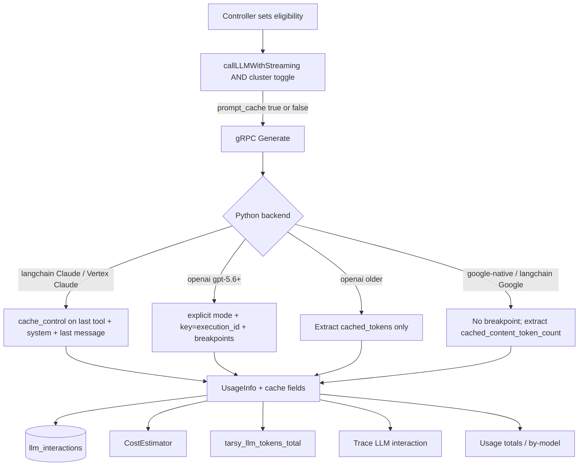

# Prompt Caching (Provider Token Cache)

**Status:** Final — decisions in [prompt-caching-questions.md](prompt-caching-questions.md)

## Overview

TARSy’s iterating agents resend the full conversation and tool list on every LLM `Generate` call. The Python LLM service is stateless; Go owns history. That is the textbook workload for **provider prompt caching**: a stable prefix (tools + system prompt + prior turns) is stored by the model provider so later turns pay ~10% of input price for that prefix instead of 100%, and TTFT drops because the prefix is not re-prefilled.

This is **not** a TARSy-side cache of completions, tokens, or thought signatures. Those already exist and solve different problems:

| Existing cache | What it does |
|----------------|--------------|
| Google-native `_model_contents` + `clear_cache` | Replay Gemini `Content` objects so thought signatures survive multi-turn |
| LangChain `_model_cache` | Reuse SDK chat-model instances |
| Runbook HTTP cache | Avoid refetching runbook markdown |
| MCP `toolCache` | Avoid re-listing tools on a short-lived client |

ADR-0020 documented the gap: cache read/write tokens are not persisted, so cost estimates **overcount** models that discount cached input (today Gemini `prompt_token_count` is stored as `input_tokens` and priced at the full input rate). Gemini 2.5+ **implicit** caching may already be saving money; TARSy never looks at `cached_content_token_count`. Claude (Anthropic API and Vertex) **does not cache unless `cache_control` is set**. GPT-5.6+ OpenAI **does** cache by default, but the implicit breakpoint sits on the latest user/tool message and does not fall back to a partial prefix — on an iterating agent that is a 1.25× write of the whole prompt and ~0 reads.

After this design, Python normalizes `input_tokens` to **uncached** input. Shipping that without pricing cache tokens would **undercount**. v1 therefore ships observe + looping-call breakpoints + cache pricing + scoped operator UI together.

This design:

1. Surfaces provider cache usage through proto → DB → Prometheus → trace LLM interactions → Usage totals / by-model, and prices those tokens.
2. Turns on Anthropic/Vertex Claude `cache_control` and GPT-5.6+ OpenAI explicit breakpoints on investigation-style iterating loops (not action, scoring, or one-shots).
3. Leaves Gemini implicit caching alone except to measure and price it.
4. Does **not** introduce Gemini explicit `CachedContent` objects, a local prompt store, or response caching.

## Design Principles

1. **Provider-side only.** TARSy marks breakpoints and records usage. The provider owns TTL, hashing, and storage. Python stays stateless aside from the existing thought-signature cache.
2. **Pay for reads, not writes-with-no-read.** One-shots, scoring, and **action** agents must not pay a cache-write surcharge. Those paths are usually one or two Generates; the last write is never read.
3. **TTL matches the loop.** Claude looping calls use 1h (orchestrator and sub-agent waits exceed 5m). OpenAI only supports `30m`; that is what we send on GPT-5.6+.
4. **Measure Gemini; do not manage it.** Implicit caching is already on for Gemini 2.5+. Explicit `CachedContent` is a later, stateful follow-up if hit rate is proven poor. The cluster kill switch does **not** disable Gemini implicit caching.
5. **Honest estimates.** Cache tokens are priced (catalog rates, or derived 0.1× / 1.25× / 2× from the resolved input rate). Never silent undercount.
6. **Surgical surface.** One proto flag, cache usage fields, LangChain breakpoints on Claude/Vertex and GPT-5.6+ OpenAI, Google usage extraction. No new LLM client, no new RPC.

## Architecture / How It Works

### Current generate path (unchanged shape)

```
IteratingController / ScoringController / SingleShot / summarizer
  → agent.GenerateInput (full messages + tools)
  → gRPC llm.v1.Generate
  → Python GoogleNativeProvider | LangChainProvider
  → UsageInfo { input, output, total, thinking }
  → llm_interactions + session token SUMs + tarsy_llm_tokens_total
```

Go builds the iterating prefix **once** (`BuildFunctionCallingMessages`) and appends turns. Tools are listed once and reused. That prefix is identical across iterations of one execution.

Python has **no** `tarsy.yaml`. The only request it sees is `GenerateRequest`. Cluster policy therefore lives in Go.

### Additions

```
GenerateInput.PromptCache          → proto GenerateRequest.prompt_cache = 7
UsageInfo.cache_read_tokens        → proto field 5 → llm_interactions.cache_read_tokens
UsageInfo.cache_creation_tokens    → proto field 6 → llm_interactions.cache_creation_tokens
```

Cluster kill switch: `system.prompt_caching.enabled` (default **true**, same `*bool` omit-means-on pattern as `system.cost_estimation.enabled`).

**Plumbing:** controllers set `GenerateInput.PromptCache` from **eligibility only**. `callLLMWithStreaming` ANDs the cluster toggle before gRPC (`prompt_cache = eligible && enabled`). Python applies Claude `cache_control` / OpenAI `prompt_cache_options` **only** when `GenerateRequest.prompt_cache` is true. When the toggle is false, Go still records cache usage if the provider sent it (Gemini implicit still happens).

Copy `config.PromptCaching.Enabled` onto `ExecutionContext` / `ResolvedAgentConfig` when the executor builds the context — it is cluster-wide, not per-agent YAML.



### Call sites

Real `GenerateInput` constructions in production code:

| Call site | File | Loops? | `PromptCache` |
|-----------|------|--------|----------------|
| Investigation / chat / sub-agent / orchestrator loop (`AgentTypeDefault`) | `iterating.go` (~line 125, tools bound) | Yes | **on** |
| Action / remediation loop (`AgentTypeAction`, same controller) | `iterating.go` (~line 125) | Usually 1 turn | **off** |
| Forced conclusion (no tools; same controller) | `iterating.go` (~line 348) | No | **off** |
| `ScoringController` (score + tool-report; retries uncommon; no MCP tools) | `scoring.go` | 2 turns | **off** |
| `SingleShotController` (synthesis, exec summary, compose, memory reflector) | `single_shot.go` | No | **off** (zero-value) |
| Tool / `search_past_sessions` summarization | `summarize.go` (`ExecutionID + ":summarization"`) | No | **off** (zero-value; does not go through `callLLMWithStreaming`) |

Do **not** set the flag true for every `IteratingController` `Generate`. Gate the loop call on `execCtx.Config.Type != AgentTypeAction`. Forced conclusion stays off.

Scoring is two `Generate`s (score, then tool-improvement report; extraction retries are rare). With Claude’s 1h 2× write, turn 1 writes the prefix, turn 2 reads it once and writes a suffix **nothing will read**. That is a net loss vs paying full input twice. Leave scoring off.

Action uses the same iterating loop but is built to prefer inaction (safety prompt; Sandbox `WorkloadRemediationAgent` is Vertex Claude Sonnet, small tool list, `max_iterations: 10`). Most runs are a single “no action” Generate — a 2× write with no read. The rare act path is a few short-prefix tool turns, still a weak 1h-TTL trade. Leave action off. Cache pays on investigation / chat / orchestrator / sub-agents.

### Claude / Vertex Claude

When `prompt_cache` is set and the LangChain model is Anthropic or `ChatAnthropicVertex`:

1. Bind tools in **Anthropic dict form** (name / description / input_schema, not the OpenAI `{type: function, function: {...}}` wrapper `_bind_tools` uses today); put `cache_control: {type: ephemeral, ttl: 1h}` on the **last tool**. If there are no tools, skip this breakpoint.
2. Convert the system message to a content block with the same `cache_control`.
3. Put `cache_control` on the **last** conversation message (growing-history breakpoint, including tool results). Anthropic allows up to four breakpoints; these three stay inside the cap.

Do **not** pass `cache_control` as an `invoke`/`astream` kwarg — `ChatAnthropicVertex` 400s that (`cache_control: Extra inputs are not permitted`). Use content blocks / `additional_kwargs` on messages and tools.

Writes cost 1.25× (5m TTL) or 2× (1h TTL) of input; reads cost 0.1×. Subsequent identical prefixes refresh TTL. Vertex’s published 1h write column is ~1.6× the 5m write rate, which is the same 2× of input.

**400 retry (Python, same Generate, before any chunks are yielded):** this is a dedicated strip path, not the existing `_RetryableError` loop (that retries the *same* request and would 400 three times).

1. If Vertex/Anthropic returns 400 on `ttl: 1h` (old Claude 3.x), retry once without `ttl` (5m default).
2. If that still 400s (project has prompt caching disabled, or other extra-input rejection), retry once stripping `cache_control` entirely.

Provider fallback (`ClearCache`) already switches model; the new prefix cannot hit the old cache. First post-fallback call is a cold write.

### OpenAI (GPT-5.6+ explicit; older extract-only)

TARSy already uses `ChatOpenAI` with the Responses API for reasoning GPT-5 models (`langchain-openai>=1.6`). If constructor-only params ever prove required for Responses streaming, bind a per-request runnable instead of putting cache policy on the shared `_model_cache` instance. Bump `langchain-openai` if 1.6 does not forward `prompt_cache_options` / breakpoints.

**GPT-5.5 and older** (anything that does not match `gpt-5.` with minor ≥ 6, including builtin `openai-default` → `gpt-5.2`, `gpt-5`, `gpt-5-mini`): automatic prefix cache. Extract `cached_tokens` / `cache_write_tokens` if present. Send no `prompt_cache_options`.

**GPT-5.6 and later** (model id matches `gpt-5.` with integer minor **≥ 6**, case-insensitive, including dated/variant suffixes such as `gpt-5.6-sol`). `gpt-5`, `gpt-5-mini`, `gpt-5.2` do **not** match `gpt-5.`+minor. When `prompt_cache` is set:

1. `prompt_cache_options: {mode: "explicit", ttl: "30m"}` — disables the implicit last-message breakpoint; 30m is the only supported TTL (a floor, not a hard eviction).
2. `prompt_cache_key: execution_id` — already on `GenerateRequest`. Skip explicit mode if `execution_id` is empty (should not happen on looping controllers).
3. `prompt_cache_breakpoint: {mode: "explicit"}` on:
   - the **last tool** schema (if any tools),
   - the **system** text as an `input_text` block on a **developer/system message** — OpenAI rejects breakpoints on top-level Responses `instructions`. Do not rely on LangChain stuffing `SystemMessage` into `instructions`,
   - the last **non-tool-result** message (walk back past `role=tool` / `function_call_output`).

If the SDK 400s on these fields, retry the call stripped (same dedicated degrade path as Claude).

Writes bill at 1.25× (`cache_write_tokens` → `cache_creation_tokens`); reads at 0.1× (`cached_tokens` → `cache_read_tokens`).

**Implement-time check:** OpenAI’s docs show implicit breakpoints on the latest user *or tool* message and even an example breakpoint on `function_call_output`. Q11 still walks back past tool results because a tool-result breakpoint may be accepted without creating a write. Phase B tests must assert `cache_creation` on turn 1 and `cache_read` on turn 2 of a looping fixture that ends in a tool result. If the last-message (tool-result) breakpoint actually writes, drop the walk-back and match Claude — no proto change.

#### LangChain clients

Keep `_model_cache` keyed by `(provider, model, api_key_env)`. **Do not** put `prompt_cache_key` or `prompt_cache_options` on the `ChatOpenAI(...)` constructor — the instance is shared across executions and across looping vs one-shot calls.

Pass key and options **per request** on `astream` (or `model.bind(...)` for that call). `bind_tools` is already per-request; attach the last-tool breakpoint there. Message breakpoints belong in `_convert_messages`.

### Gemini (observe, don’t manage)

Gemini 2.5+ implicit caching is on by default. Minimum prefix is on the order of 2k–4k tokens depending on model. Investigation prompts with MCP tools usually clear that by early turns. OpenAI 5.6+ minimum is 1,024 visible tokens.

`GoogleNativeProvider` today maps `prompt_token_count` / `candidates_token_count` / `thoughts_token_count` and ignores `cached_content_token_count`. Extract it as `cache_read_tokens`. Implicit writes are billed at standard input (no separate creation surcharge); `cache_creation_tokens` stays 0.

LangChain Google / Vertex Gemini follow the same extract + subtract rules from `usage_metadata`.

Explicit `client.caches.create` / `cached_content=` is **out of v1**.

`system.prompt_caching.enabled: false` does not turn Gemini implicit caching off.

### Token semantics (normalize in Python)

Provider raw usage differs; LangChain’s unified `usage_metadata.input_tokens` is documented as **sum of all input token types** (includes cache). Anthropic’s native `usage.input_tokens` is **uncached only**. Prefer provider `response_metadata["usage"]` when present.

| Source | Typical input | Cache fields | Normalize |
|--------|---------------|--------------|-----------|
| Google native | `prompt_token_count` **includes** cached | `cached_content_token_count` | `input -= cache_read`; create = 0 |
| LangChain Google | inclusive `input_tokens` | `input_token_details.cache_read` (or equivalent) | same |
| Anthropic **raw** `usage` | uncached only | `cache_read_input_tokens`, `cache_creation_input_tokens` | do **not** subtract |
| LangChain Anthropic `usage_metadata` | inclusive | `cache_read`; `cache_creation` **or** `ephemeral_5m_input_tokens` + `ephemeral_1h_input_tokens` (LangChain has reported `cache_creation: 0` while raw create > 0) | `uncached = inclusive - cache_read - cache_creation`; create = raw or sum of ephemeral |
| OpenAI | `input_tokens` / `prompt_tokens` **includes** cached **and** cache writes | `cached_tokens`, `cache_write_tokens` (see OpenAI: `ordinary = input - cached - cache_write`) | `uncached = inclusive - cache_read - cache_creation` |

v1 convention:

- `input_tokens` = **uncached** billed input. TARSy `input_tokens` is **not** Gemini’s raw `prompt_token_count` and is **not** LangChain’s inclusive `usage_metadata.input_tokens`.
- `cache_read_tokens` / `cache_creation_tokens` stored separately; persist when > 0 (same as thinking tokens).
- `total_tokens` left as provider-reported (or reconstruct if needed). After normalization, `input + output` will not equal `total` when cache hit; trace UI shows cache next to input so that is readable. Session SUMs of `input_tokens` mean “tokens paid at full input rate.”
- Cache fields on LangChain streams: **last-wins** (do not sum across chunks). Keep today’s sum for input/output, then normalize.

Historical rows keep the old meaning (Gemini `input_tokens` included cached). Usage windows that mix pre- and post-ship rows are inexact on `input_tokens`; `total_tokens` is unchanged.

### Cost estimation

```
cost = uncached_input * rates.input
     + cache_read     * rates.cache_read
     + cache_create   * rates.cache_creation
     + output * rates.output
     + thinking * rates.reasoning
```

Resolve order stays promotion → `model_rates` → catalog → snapshot.

**Tier selection:** `Book.Estimate` currently picks `above_Nk` / `tiered_pricing` from `input_tokens` alone (`ratesForInput`). After Q7 that would be uncached-only and would miss Gemini 200k tiers on cache-heavy prompts. Select tiers using **prompt size** = `uncached + cache_read + cache_creation` (Gemini: original `prompt_token_count`).

- Parse LiteLLM `cache_read_input_token_cost` / `cache_creation_input_token_cost` / `cache_creation_input_token_cost_above_1hr` into `catalogEntry` and refresh the bundled snapshot so shipped models (Claude, Gemini 2.5/3.x including `gemini-3.7-flash`, GPT-5.x) have cache rates. Today’s snapshot has **no** cache fields.
- Flat YAML promotions/`model_rates` stay input/output in v1. When they win, **derive** from the resolved (possibly intro-priced) input rate: read = 0.1×; cache create = **2×** if the model name contains `claude`, else **1.25×** (OpenAI 30m, Gemini unused because create is 0).
- If catalog/snapshot has explicit cache rates and no overlay won: use catalog `cache_read`; for Claude 1h writes use `cache_creation_input_token_cost_above_1hr` when present, otherwise **derive 2× from `rates.input`** — do **not** apply the 5m `cache_creation_input_token_cost` to 1h writes (that undercounts). OpenAI uses catalog create or 1.25×.
- Missing cache rates after that still use the same multipliers on `rates.input` so a row is not silently undercounted.
- Missing cache rates does not mark the row unpriced if base input/output resolved.
- 400-retry Claude 5m fallback is not reported to Go; overlay/derived Claude create stays 2×. That rare write is slightly overestimated. Acceptable.
- `token-bearing` SQL (completeness) must include cache columns: any of input / output / thinking / cache_read / cache_creation > 0. `estimateCost` must run when cache pointers are set even if uncached input is 0.
- `TokenUsage` / `UsageChunk` grow so Prometheus can record cache directions. Do **not** SUM cache on session-list / `ExecutionOverview` APIs.

### Prefix stability (prompt layout)

Tier 0 wall-clock time is injected **first** in the system prompt (`Current time: <RFC3339>`). Memory briefing is also session-specific. Within one execution the prompt is built once, so **intra-session** caching is unaffected.

Cross-session reuse of skills + MCP instructions + tool schemas will not hit as long as time sits at the front of the cached block. Reorder/split is **not** in v1.

### Operator surfaces (v1)

| Surface | Cache tokens |
|---------|----------------|
| `llm_interactions` columns | yes |
| Prometheus `tarsy_llm_tokens_total` `direction=cache_read\|cache_creation` | yes (extend `LLMTokens`; update help text; extra label values, existing series unchanged) |
| Config Viewer `system.prompt_caching.enabled` | yes — extract like `cost_estimation` (a small enabled block), not only the leftover System JSON dump |
| Trace LLM list + detail (`LLMInteractionListItem` / `LLMInteractionDetailResponse` + `TokenUsageDisplay` optional fields) | yes — thinking tokens never made it onto these DTOs; cache does, so a miss is visible per `Generate` |
| Usage totals + by-model (two StatCards + by-model columns; keep the “Input tokens” label = uncached) | yes |
| Usage by-alert-type, by-chain, top-sessions, Usage *charts* | **no** |
| Session list, session header, `ExecutionOverview` | **no** (same as thinking tokens). `TokenUsageDisplay` only renders cache when the DTO actually has the fields, so session surfaces stay unchanged. |

### What we will not do

- Cache LLM **responses**.
- Store prefixes in Postgres/Redis.
- Gemini explicit `CachedContent` in v1.
- OpenAI explicit breakpoints on GPT-5.5 and older.
- xAI prompt caching (no comparable API). Extract cache fields if they ever appear in usage; do not send breakpoints.
- Change Google thought-signature cache behavior.
- Change system-prompt layout in v1.
- Session-list / execution-overview cache SUMs in v1.
- YAML cache rate fields on promotions/`model_rates`.
- Disable Gemini implicit caching via the cluster toggle.

## Core Concepts

### Prompt cache (provider)

A hashed prefix of tools + messages the provider keeps for a TTL. TARSy does not name or delete entries. Hits require identical bytes up to the breakpoint, same model, and the provider-specific markers (`cache_control` or OpenAI explicit breakpoints + key).

### `prompt_cache` flag

Per-`Generate` boolean meaning **this call is an investigation-style iterating loop** (`AgentTypeDefault`: investigation, chat, sub-agent, orchestrator). Scoring and `AgentTypeAction` are ineligible even when they call `Generate` more than once. Python never reads `tarsy.yaml`. It applies Claude `cache_control` / OpenAI 5.6+ explicit options only when the proto field is true (already AND-ed with the cluster toggle in Go). Other backends ignore the flag except for usage extraction.

### Cache read / cache creation tokens

Provider-reported counts for discounted prefix reuse vs the write that populated the cache. Nullable; persist when > 0.

### Eligible vs ineligible calls

Eligible = `AgentTypeDefault` iterating **loop** only (investigation, chat, sub-agent, orchestrator). Ineligible = one-shot, scoring, **action**, and forced conclusion (the last still lives in `IteratingController`).

## Implementation Plan

Merge in order. Each PR is a complete, shippable product. Caching as a *feature* is on after PR3; per-call hit/miss in the dashboard is PR4.

Do **not** normalize `input_tokens` in PR1. Subtracting cache without pricing undercounts Est. $. Do **not** enable Claude/OpenAI breakpoints before PR2: LangChain’s inclusive `input_tokens` would keep Est. $ high while real bills drop, and after PR2 the formula expects uncached input.

No live-provider e2e in this repo (`ScriptedLLMClient`). Cover extraction, cost, breakpoints, and dashboard with unit/component tests in the PR that adds the code. Scripted usage fields land in PR1 when `UsageChunk` grows. Optional live Gemini/Claude/GPT-5.6 check is manual, not a gate.

### PR1 — Persist cache usage (no LLM or price behavior change) - DONE

**Lands:** `UsageInfo.cache_read_tokens` / `cache_creation_tokens` (`proto/llm_service.proto` fields 5–6); `make proto-generate`. Extract only (see token-semantics table); **leave `input_tokens` as today** (Gemini/LangChain inclusive). Thread `UsageChunk` / `TokenUsage` / `recordLLMInteraction` / `models.CreateLLMInteractionRequest`. Ent nullable columns + Atlas migration (`make migrate-create`, then `db-migration-review`). Prometheus `direction=cache_read|cache_creation` (`pkg/metrics`, `metricsTokens`, `PartialOutputError`). Persist cache when > 0.

**Do not:** subtract from `input_tokens`; change `cost.Estimate`; add `prompt_cache`; session-list SUMs; dashboard fields.

**Tests (this PR):** Python mocked usage (Google native `cached_content_token_count`; LangChain Anthropic raw vs `usage_metadata` / ephemeral split; OpenAI `cached_tokens` + `cache_write_tokens`). Go: grpc mapping, interaction write, metrics last-wins vs summed input. Extend `ScriptedLLMClient` / controller fixtures so extra fields don’t break compiles.

**Gap:** Cache columns fill when providers report them (Gemini implicit, GPT-5.2 automatic). Est. $ unchanged (still overcounts cached Gemini). Claude still 0. Rows written here have inclusive `input_tokens` + cache counts — do not run the PR2 formula on them without subtracting.

**Done when:** a live Gemini or GPT-5.2 session can show non-zero `cache_read_tokens` in `llm_interactions`.

### PR2 — Normalize input + price cache + Usage rollup

**Lands:** Python subtract so proto `input_tokens` is uncached. `catalogEntry` cache rates (`cache_read_input_token_cost`, `cache_creation_input_token_cost`, `cache_creation_input_token_cost_above_1hr`); refresh `pkg/cost/snapshot.json`. `cost.Estimate` / `Book.Estimate`: cache counts, prompt-size tiering (`uncached + cache_read + cache_creation`), overlay derive 0.1× read and 2× create if model name contains `claude` else 1.25×; Claude 1h must not use the 5m catalog create rate. `tokenBearingPredicateSQL` + `estimateCost` skip rules include cache. Usage API: `SUM` cache on **totals and by-model only**; dashboard StatCards + by-model columns (`UsagePage.tsx`, `pkg/models/session.go`, `pkg/services/session_service_usage.go`). Docs: `docs/session-usage-cost.md` (formula, `input_tokens` meaning, mixed pre-PR2 rows); drop the “cache tokens not persisted” gap.

**Do not:** breakpoints, YAML toggle, trace DTOs, session-list / by-alert / by-chain / top-sessions / charts.

**Tests (this PR):** cost unit tests (overlay vs catalog vs 1h field missing; Gemini 200k tier on cache-heavy prompt). Provider tests that `input_tokens` is uncached. Usage SQL + `UsagePage.test.tsx`.

**Gap:** Session list “input” SUMs drop on Gemini cache hits with no cache chip there (Q10). Usage page is the explanation. Est. $ for Gemini implicit **falls toward invoice** (fixes overcount). Claude still uncached-full until PR3.

**Done when:** a Gemini cache-read row is priced at cache-read rate, not full input; Usage totals show cache columns.

### PR3 — Enable looping-call caching

**Lands:** `GenerateInput.PromptCache` + `GenerateRequest.prompt_cache = 7`. `system.prompt_caching.enabled` (`*bool`, default true) on `pkg/config`; copy onto exec context; AND in `callLLMWithStreaming`. `PromptCache: true` only on iterating **loop** when `Type != AgentTypeAction` (`iterating.go` ~125); **false** on action loops, forced conclusion (~348), scoring, single-shot, summarization. Python: Claude/Vertex `cache_control` 1h on last tool (Anthropic tool dicts; skip if no tools), system, last message; dedicated 400-retry (strip TTL, then strip `cache_control`) — not the existing `_RetryableError` loop. OpenAI GPT-5.6+ (`gpt-5.` minor ≥ 6): per-request `prompt_cache_options` + `prompt_cache_key=execution_id` (not `ChatOpenAI` constructor); breakpoints on last tool, system content block (not Responses `instructions`), last non-tool-result; 400-retry strip. Older OpenAI: extract only. Config Viewer + `tarsy.yaml.example` + `deploy/config/README.md` for the toggle (`pkg/api/system_config.go`, `ConfigViewer.tsx`).

**Tests (this PR):** breakpoint attachment; gating (`gpt-5.6`, `gpt-5.6-sol` on; `gpt-5.5`, `gpt-5.2`, `gpt-5`, `gpt-5-mini` extract-only); action loop, scoring, and forced conclusion flags off; investigation loop on; toggle AND; 400-retry strip. Config Viewer unit test for the enabled field. **Assert** turn1 `cache_creation` + turn2 `cache_read` on a looping fixture that ends in a tool result (OpenAI walk-back). If a last-message tool-result breakpoint actually writes, drop the walk-back (no proto change).

**Deferred:** live Claude/GPT-5.6 sandbox check (manual). No new e2e scenario unless ScriptedLLMClient needs the proto bool (default false — should compile without extra scripts).

**Gap:** none for existing one-shots. Looping Claude/GPT-5.6 get cheaper; Est. $ already has the formula from PR2. Gemini implicit still not killable.

**Done when:** looping Claude (and GPT-5.6+ if used) persist create on turn 1 and read on turn 2+; kill switch off sends `prompt_cache=false`.

### PR4 — Trace per-call cache tokens

**Lands:** `cache_read_tokens` / `cache_creation_tokens` on `LLMInteractionListItem` + `LLMInteractionDetailResponse` (`pkg/models/interaction.go`, `pkg/api/handler_trace.go`, `web/dashboard/src/types/trace.ts`). `TokenUsageDisplay` optional fields; wire preview + detail only (session list / header / `ExecutionOverview` DTOs stay without the fields).

**Tests (this PR):** trace handler mapping; `LLMInteractionDetail` / preview tests; `TokenUsageDisplay` hides cache when fields absent (session surfaces unchanged).

**Done when:** trace LLM list/detail shows cache read/create per interaction.

### Follow-ups (not v1)

- Move Tier 0 time / memory after stable system text, or split system into two blocks.
- Gemini explicit `CachedContent` if PR1 production data shows poor implicit hit rate on large looping sessions.
- Session-list / execution-overview cache SUMs.
- YAML cache rate fields on promotions/`model_rates`.
- OpenAI 1h TTL if the API ever supports it (orchestrator waits > 30m).
- xAI if they add a comparable API.
- Relabel Usage “Input tokens” to “Uncached input” if operators find the StatCard confusing next to cache cards.
