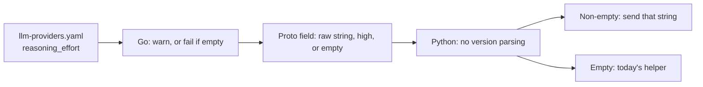

# Reasoning effort

**Status:** Final — decisions in [reasoning-effort-questions.md](reasoning-effort-questions.md)

## Overview

TARSy pins reasoning depth in the Python LLM service. OpenAI reasoning models and Gemini 3 get `high`. Gemini 2.5 gets a fixed thinking budget. Claude 4.x gets a 32k thinking budget; Claude generation 5 gets adaptive thinking with no effort set. xAI gets no reasoning parameter at all.

Operators cannot choose another depth without a code change. This design adds one optional string on the LLM provider, `reasoning_effort`.

When the field is set, that exact string is sent, on any model ID, including a custom `base_url`. TARSy does not reject unknown levels and does not rewrite them to a nearby one.

When the field is omitted, only current model generations change. Those models are sent `high`. Older models keep today's payload.

| Family | Omitted field sends `high` | Omitted field stays on the legacy path |
|---|---|---|
| OpenAI | `gpt-5.6` and newer (`gpt-6-sol`, `gpt-5.6-terra`, …), excluding IDs containing `-chat` or `-main` | the existing helper is unchanged: reasoning `high` for every other OpenAI model ID, and reasoning off for `gpt-5*`-chat and `gpt-5*`-main |
| xAI | `grok-4.6` and newer | older Grok stays with no reasoning parameter |
| Gemini | `gemini-3.8` and newer, excluding IDs containing `image` | the existing helper is unchanged: Gemini 2.5 keeps token budgets; every other Gemini ID, including 3.0–3.7 and image models, keeps hardcoded `thinking_level: high` |
| Claude | `4.8` and newer, including generation 5 and 5.5 (`claude-opus-4-8`, `claude-sonnet-5`, `claude-sonnet-5-5`, `claude-opus-5-5`) | `4.7` and older keep today's thinking kwargs. Sonnet 4.6 and Opus 4.6 stay on `budget_tokens: 32000` |

Vertex Claude uses the Claude rules. Vertex Gemini uses the Gemini rules. Both the LangChain backend and the Google native backend honor the field.

An explicit value on a model below the floor is still sent. The floor only picks the default path. Setting `reasoning_effort` on a Claude 4.6 or 4.7 provider opts that provider into adaptive thinking plus that effort. Configs that omit the field do not move.

Generation 5 already uses adaptive thinking. A user provider that omits the field is sent `output_config.effort: high`, which is the API default. Opus 4.7 still receives `budget_tokens` when the field is omitted. That model rejects the budget at the API; leaving the path in place is intentional so existing 4.7 providers are not retargeted.

Eligible builtin providers set a quality default below the unconstrained top where that top does not earn its cost, so they do not use the omitted-field `high` except where `high` is the chosen level:

| Builtins | Model | `reasoning_effort` |
|---|---|---|
| `openai-default`, `gpt-5.6`, `gpt-5.6-sol`, `gpt-5.6-terra`, `gpt-5.6-luna`, `gpt-6-sol`, `gpt-6-luna` | GPT ≥ 5.6 | `max` |
| `xai-default`, `grok-4.6`, `grok-4.7` | Grok ≥ 4.6 | `high` |
| `google-default`, `gemini-3.8-flash` | Gemini 3.8 | `high` |
| `anthropic-default`, `claude-sonnet-5-5`, `claude-opus-5-5`, `vertexai-default` | Claude Sonnet 5, Sonnet 5.5, Opus 5.5 | `xhigh` |

`claude-sonnet-5-5` is Claude Sonnet 5.5 (released 2026-09-28). It supports `low`, `medium`, `high`, `xhigh`, and `max`. The builtin uses `xhigh`: on FrontierCode, `max` scores below `xhigh`. The version parser already treats it as 5.5, which is above 4.8. `xhigh` is documented because it is generation 5. Grok builtins use `high` because `xhigh` does not raise the Intelligence Index and is worse on terminal-agent benches. Claude Sonnet 5 and Opus 5.5 builtins use `xhigh` because `max` adds token spend without a reliable quality gain, and on Terminal-Bench Opus 5.5 peaks at `xhigh`. GPT builtins stay at `max` because the Sol agentic ladder still climbs there. There is no `gpt-6-terra` on the OpenAI API as of 2026-09-28. The GPT-6 models are Astra, Sol, and Luna. Terra remains `gpt-5.6-terra`, which is already a builtin at `max`.

`max` is above `xhigh`. Gemini's documented set stops at `high`. Builtins below the floor stay unset: `gpt-5.2`, Gemini 3.7 and older, `google-image-flash`. A user `llm_providers` entry with the same name replaces the builtin wholesale and does not inherit this value. If that entry omits the field and the model is eligible, the omitted-field rule still sends `high`.

## Design principles

- The field lives on the LLM provider entry. Two efforts are two provider names. Chains, stages, and agents keep selecting a provider.
- The YAML value is a free string. Well-known constants are `low`, `medium`, `high`, `xhigh`, and `max`. They document the common models. They are not a closed enum.
- An empty or whitespace-only value fails config load. Every other value is forwarded unchanged: no trimming and no case-folding. ` high ` and `High` are not `high`.
- Warnings look at the configured YAML value only, not at the `high` injected when the field is omitted. One `slog.Warn` per provider. Startup still proceeds.
- Warn when the configured value is outside `low` / `medium` / `high` / `xhigh` / `max`. This applies with or without a custom `base_url`.
- Also warn when there is no custom `base_url`, the model ID is one we recognize, and the value is outside that model's documented set. A recognized model below its family floor, a `gpt-5*`-chat or `gpt-5*`-main ID, or a Gemini ID containing `image` has no documented set, so any configured value warns. An unrecognized model ID (`company-reasoner`) does not get this warning.
- A custom `base_url` skips the documented-set warning. `openai-gemini-proxy` can send a well-known level with no warning. Wiring `LLMConfig.base_url` into the LangChain client is out of scope: the Python service does not read that field today.
- TARSy does not clamp. If the provider rejects the level, the call fails with the provider's error.
- Eligible builtin providers set `max` for GPT 5.6+, `xhigh` for Claude 4.8+, and `high` for Grok 4.6+ and Gemini 3.8. Builtins below the floor leave the field unset. A user provider that omits the field still gets `high` when the model is eligible.

## Architecture



Go owns eligibility, the warning, and the empty-string check. Python does not parse model versions. It maps a non-empty proto field and otherwise calls today's helper.

`pkg/agent/llm_grpc.go` (`toProtoLLMConfig`) is the only place provider config becomes an `LLMConfig`. The field rides along with `model` and `native_tools`. No chain, stage, or agent resolver changes. `applyNativeToolsOverride` copies the provider struct, so the new string is kept on that clone. Do not rebuild `LLMProviderConfig` field by field.

Proto value:

1. Field set to a non-empty string → that string, any model.
2. Field omitted and the model is eligible → `high`.
3. Field omitted and the model is legacy → empty, which selects the legacy helper.

The config viewer shows the configured string when set. For an eligible provider with the field omitted, it shows the effective `high`. Legacy providers with the field omitted show nothing.

## Core concepts

### `reasoning_effort`

Optional string on `LLMProviderConfig`:

```yaml
llm_providers:
  gemini-3.8-flash:
    type: google
    model: gemini-3.8-flash
    api_key_env: GOOGLE_API_KEY
    reasoning_effort: medium
```

Wire values match the vendor APIs (`xhigh`, not "extra high"). `extra-high` is forwarded and produces a startup warning.

### Eligibility

Eligibility means "an omitted field sends `high` on the new parameter." It is parsed from the model ID, not from the provider name.

| Family | ID shapes | Eligible when |
|---|---|---|
| OpenAI | `gpt-5.6`, `gpt-5.6-sol`, `gpt-6`, `gpt-6-luna` | numeric version ≥ 5.6, and the ID does not contain `-chat` or `-main` |
| xAI | `grok-4.6`, `grok-4.7` | numeric version ≥ 4.6 |
| Gemini | `gemini-3.8-flash`, `gemini-3.8-pro-preview` | numeric version ≥ 3.8, and the ID does not contain `image` |
| Claude | `claude-opus-4-8`, `claude-opus-4.8`, `claude-sonnet-5`, `claude-sonnet-5-5`, `claude-opus-5-5` | parsed `(major, minor) >= (4, 8)`. Missing minor is 0, so `claude-sonnet-5` is 5.0 and `claude-sonnet-5-5` is 5.5. A trailing `YYYYMMDD` is ignored. `4-6` and `4.6` both parse as 4.6 |

`gpt-6-chat` is not eligible, so Go leaves the proto field empty. The OpenAI helper still turns reasoning on, because today's exclusion is only `gpt-5` plus `-chat` or `-main`. Do not treat "not eligible" as "send no reasoning."

`gpt-5.2`, `gemini-3.7-flash`, `gemini-2.5-pro`, `grok-4`, `claude-sonnet-4-6`, and `claude-opus-4-7` keep the legacy helpers when the field is omitted. The same IDs use the new parameter when the field is set. A recognized ID with no custom `base_url` also warns, including when the value is `high`. An explicit value on `gpt-5.6-chat`, `gpt-5-main`, or a Gemini image model does the same: the new parameter is sent, and the call warns. An ID that does not match a family pattern is unrecognized and only warns when the token itself is outside the well-known five.

### Vendor mapping

A non-empty proto field, and an eligible model whose field was omitted, map like this:

| Provider | Parameter |
|---|---|
| OpenAI | `reasoning.effort` on the Responses API. `summary` stays `auto`. `use_responses_api` stays on. |
| Claude, including Vertex Claude | `output_config.effort`, with `thinking: {type: "adaptive"}` and `max_tokens: 64000`. `budget_tokens` is not sent on this path. |
| xAI | `reasoning.effort` |
| Gemini, LangChain and google-native | `thinking_level`, with thoughts included |

Claude below 4.8 with the field omitted keeps today's helper: `budget_tokens: 32000` for 4.x, which is what Sonnet 4.6 and Opus 4.6 receive now. Generation 5 is eligible, so an omitted field is sent as adaptive thinking plus effort `high`, replacing today's adaptive-without-effort kwargs. Python still has that old helper for an empty proto field. Go must write `high` for every eligible model, including `claude-opus-4-8` and `claude-sonnet-5`. An empty field on `claude-opus-4-8` would otherwise fall through to `budget_tokens`, because the current adaptive regex only matches generation 5.

### Documented levels

Used only for the startup warning. A value outside this table is still sent.

| Recognized models | Documented levels |
|---|---|
| GPT ≥ 5.6, excluding `-chat` and `-main` | `low`, `medium`, `high`, `xhigh`, `max` |
| Grok ≥ 4.6 | `low`, `medium`, `high`, `xhigh` |
| Gemini ≥ 3.8, excluding `image` | `low`, `medium`, `high` |
| Claude ≥ 4.8 | `low`, `medium`, `high`, `max`. `xhigh` is documented for Opus ≥ 4.8 and for generation 5, including 5.5 (`claude-sonnet-5`, `claude-sonnet-5-5`, `claude-opus-5`, `claude-opus-5-5`, Fable 5) |

Any configured value on Sonnet 4.6 or Opus 4.6 warns, because those IDs are below the floor. The value is still sent. `xhigh` on Opus 4.8, Sonnet 5, or Sonnet 5.5 does not warn. `xhigh` on a hypothetical Sonnet 4.8 does, because `xhigh` is documented for Opus ≥ 4.8 and generation 5 only, including 5.5.

xAI currently receives no reasoning object. Eligible Grok models with the field omitted start receiving `reasoning.effort: high`. The vendor default is already `high`. The request shape changes.

## Implementation plan

### PR 1: Config, warnings, and the proto field - DONE

Lands the knob without changing any provider payload.

- Well-known `ReasoningEffort` constants in `pkg/config`. The struct field is a string.
- Set `reasoning_effort` on the eligible builtins in `initBuiltinLLMProviders` to the levels in the builtin table (`max` for GPT, `xhigh` for Claude, `high` for Grok and Gemini). Leave `gpt-5.2`, Gemini 3.7 and older, and `google-image-flash` unset. Cover the values in `pkg/config/builtin_test.go`.
- Add builtin `claude-sonnet-5-5`: type `anthropic`, model `claude-sonnet-5-5`, `reasoning_effort: xhigh`. Do not retarget `anthropic-default` or `vertexai-default`; those stay on `claude-sonnet-5`. Add the row to the built-in provider table in `docs/functional-areas-design.md` and a case in `pkg/config/builtin_test.go`. Do not add `gpt-6-terra`. That slug is not on the OpenAI API.
- `reasoning_effort` on `LLMProviderConfig`. Empty or whitespace fails load inside `validateLLMProviders` (`NewValidationError`, startup fails). Other values `slog.Warn` and are kept, including providers that no chain references. ` high ` and `High` warn as outside the well-known five. `high` on `claude-sonnet-4-6` warns as below the floor. `medium` on a custom `base_url` does not warn. `xhigh` on `gemini-3.8-flash` warns. `company-reasoner` with `medium` does not.
- Version parser with table tests: `gpt-5.6-sol` and `gpt-6` eligible, `gpt-5.2` and `gpt-5.6-chat` not; `grok-4.6` eligible, `grok-4` not; `gemini-3.8-flash` eligible, `gemini-3.7-flash` and `gemini-3.8-flash-image` not; `claude-opus-4-8`, `claude-sonnet-5`, `claude-sonnet-5-5`, and `claude-opus-5-5` eligible; `claude-sonnet-4-6`, `claude-opus-4.6`, `claude-opus-4-7`, and `claude-sonnet-4-6-20260217` not. An ID that does not match the family pattern is unrecognized, not eligible.
- `LLMConfig.reasoning_effort` is field 11 (`backend` is 10). Run `make proto-generate` so the Go and Python stubs both grow the field. `toProtoLLMConfig` writes the three proto rules in Architecture. Tests live next to the existing cases in `pkg/agent/llm_grpc_test.go`.
- System-config view (`buildLLMProviderView`) and dashboard `LLMProviderConfigView` / `LLMProviderDetails` use the same effective value as `toProtoLLMConfig`: the raw string when set, `high` when omitted on an eligible model, omitted from the JSON otherwise.
- `deploy/config/README.md` documents the field, the well-known levels, the per-family documented sets, and the default. Update the `LLMConfig` field list in `docs/functional-areas-design.md`.
- Tests: loader, empty-string rejection, the warning cases above, proto mapping.

Temporary gap: config accepts `reasoning_effort: medium`, but the LLM service still sends today's hardcoded payload until PR 2. Call this out in the PR description. Do not ship PR 1 alone to a branch that operators will run.

### PR 2: Apply the effort in the LLM service - DONE

Python trusts `LLMConfig.reasoning_effort`. It does not decide eligibility.

- Non-empty field: map that string for the provider, any model ID, using the vendor table above. This is both an explicit YAML value and the `high` Go wrote for an eligible model with the field omitted.
- Empty field: keep today's helpers. Claude generation 5 stays adaptive with no effort parameter. Claude 4.x, including 4.6, 4.7, and 4.8, stays on `budget_tokens: 32000`. OpenAI keeps `_get_openai_reasoning_kwargs`. Gemini 2.5 keeps budgets; other Gemini IDs keep hardcoded `thinking_level: high`. xAI keeps a constructor with no reasoning argument. Go is what puts 4.8 and generation 5 on the non-empty path.
- LangChain caches chat models on `(provider, model, api_key_env)` in `_get_or_create_model`, and reasoning kwargs are fixed at construction. Add the effective `reasoning_effort` (including empty) to that key so two providers that share a model ID and differ in effort do not share one client. Do not add `base_url` to the key in this change. Google native builds `ThinkingConfig` per request in `_get_thinking_config`; pass the proto field in there. No cache-key change on that path.
- Confirm `google-genai` `ThinkingLevel` accepts `low` and `medium`; bump the dependency only if a well-known level is missing. An unrecognized token is still passed as the string the SDK accepts, or via the raw request field if the enum cannot represent it. Do not drop it.
- Confirm `ChatAnthropic` accepts `output_config`; otherwise pass it through `model_kwargs`. Vertex already passes thinking via `model_kwargs`.
- Confirm `ChatXAI` (`reasoning_effort` or the Responses `reasoning` object) against the installed `langchain-xai`.
- Unit tests in `test_langchain_provider.py` and `test_google_native.py`: proto `reasoning_effort=high` on `claude-sonnet-5`, `claude-sonnet-5-5`, `claude-opus-5-5`, and `claude-opus-4-8` sends adaptive thinking and effort `high`; an empty field on `claude-sonnet-5` keeps adaptive thinking with no effort; an empty field on `claude-sonnet-4-6`, `claude-opus-4-7`, and `claude-opus-4-8` keeps `budget_tokens: 32000`; an explicit value on `claude-sonnet-4-6` uses adaptive thinking plus that effort; an unknown token is forwarded as-is; Gemini 2.5 with an empty field keeps its budget; Gemini 3.8 with proto `high` sends `thinking_level: high`; two LangChain builds of the same model with different efforts do not share a cache entry.

No e2e against live providers. The scripted LLM client does not see this parameter.
