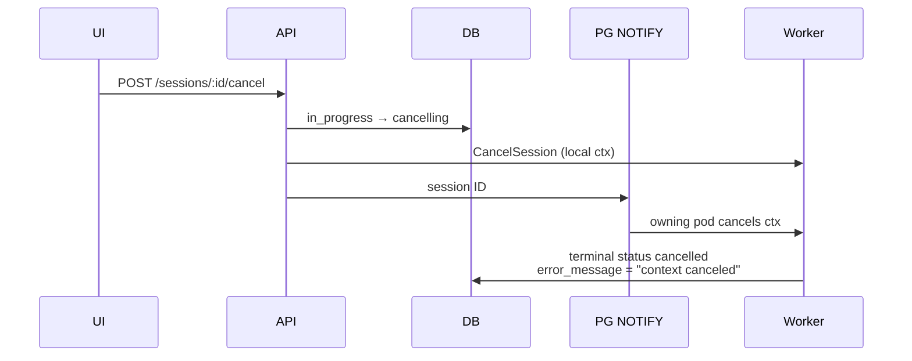

# Session Cancel Reason and Actor

**Status:** Final
**Decisions:** [session-cancel-reason-questions.md](session-cancel-reason-questions.md)

## Overview

Today a session can be cancelled from the dashboard (or `POST /api/v1/sessions/:id/cancel`), but TARSy does not record **who** cancelled it or **why**. The confirmation dialog is yes/no only. After the worker observes the cancelled context, `error_message` is typically `"context canceled"`, which is useless in the UI and Slack (`*Error:* context canceled`).

This design adds an optional cancel reason in the confirmation dialog, persists who cancelled and why on the session, and surfaces that as **cancel attribution** (not an error): tooltip on cancelled status in the main list, session header, detail copy, and Slack. Also in scope: attribute the rare system-initiated session cancel, record who stopped a follow-up chat, and let `cancel_agent` take an optional reason.

## Design Principles

- **Optional, never blocking.** The user (and the LLM) may omit a reason. Empty / whitespace-only becomes `NULL`.
- **Persist at request time.** Actor and reason are written to Postgres on the cancel HTTP request (the pod that served `POST /cancel`), as part of the same CAS as `cancelling` / `cancelled`. That is a shared-DB write, so it does not matter which pod owns the worker. Cross-pod `NOTIFY` only carries the session ID so the owning pod can cancel its in-memory context; it is not how metadata is delivered, and the worker must not be the source of who/why.
- **Do not overload session `error_message`.** That column is an error string and is currently overwritten with `context canceled` on terminal write. Session actor/reason are first-class nullable columns. Stage/execution `error_message` may hold a friendly attribution string for chat Stop and `cancel_agent` (same pattern as timeout causes today), but the dashboard keys display off **status**, not that string.
- **Cancelled is not failed.** Status stays `cancelled`. UI and Slack never treat cancelled work as `ErrorCard`, `severity="error"`, red accent, or `*Error:*`.
- **Ship in three PRs, all required.** PR1 is session/chat/Slack persistence (Go). PR2 is dashboard chrome (reason field, tooltip, cancelled ≠ failed). PR3 is `cancel_agent` reason (orchestrator). Do not merge PR3 into PR1 (different subsystem; attribution would show in `ErrorCard` until PR2). Do not swap PR2 and PR3 (that delays the session cancel dialog).
- **No new timeline event type.** Status fields plus existing `cancel_agent` tool-call arguments are enough. No general operator-audit table.

## Architecture / How It Works

### Current cancel path (unchanged control flow)



The worker still fail-fast cancels (no wrap-up). Chat-only cancel on an already-terminal session still uses the same endpoint and only stops the chat executor.

### What actually becomes `cancelled`

| Path | Session status today | This design |
|------|----------------------|-------------|
| Dashboard / API cancel while `in_progress` | `cancelling` then `cancelled` | Persist `cancelled_by` + optional `cancel_reason` on the CAS. Worker finalizes status; does not clobber those columns; does not write `"context canceled"` into session `error_message`. |
| Dashboard cancel while `pending` | API returns not-cancellable (UI already offers Cancel) | `pending` → `cancelled` immediately with actor + reason, `completed_at`, `review_status = reviewed`. Handler publishes `session.status` + `review.status` (no worker). No Slack (no start thread). |
| Chat Stop on a **terminal** session | session unchanged; chat stage `cancelled` | Same HTTP endpoint; not a session cancel. Persist `Cancelled by {actor}` on the in-progress chat stage (and its execution) at request time. |
| Session / orphan timeout, startup orphans | `timed_out` | Unchanged. |
| Graceful shutdown | leftovers orphan → `timed_out` | Unchanged. |
| Parent process context cancelled mid-flight | `cancelled` with `error_message = context canceled` | If `cancelled_by` is still null, set `cancelled_by = "system"` and `cancel_reason = "worker context cancelled"`. |
| Scoring / chat executor `Stop()` | scoring/chat records cancelled; **session** unchanged | Out of session-cancel scope. ScoreBadge may keep treating scoring `cancelled` as failed locally. |
| Orchestrator `cancel_agent` | sub-agent execution `cancelled`; session continues | Optional `reason`; friendly execution `error_message`; non-error UI. |

### Target session-cancel path

```mermaid
sequenceDiagram
    participant UI
    participant API
    participant DB
    participant Worker
    participant Slack

    UI->>API: POST /cancel { reason? }
    Note over API: extractAuthor from proxy headers
    alt pending
        API->>DB: cancelled + cancelled_by + cancel_reason<br/>completed_at, review_status=reviewed
        API->>API: publish session.status=cancelled<br/>and review.status=reviewed
    else in_progress
        API->>DB: cancelling + cancelled_by + cancel_reason
        API->>Worker: cancel context
        Worker->>DB: cancelled (do not clobber cancel fields;<br/>do not write "context canceled")
        Worker->>Slack: Analysis Cancelled + actor/reason
    end
```

Pending cancel has no Slack start thread today — do not invent a new Slack message for queued-only cancels. The worker is the only publisher of `session.status` / `review.status` today, so a pending cancel that only writes the row would leave other dashboards and the session page stuck on `pending` until a manual refresh. The handler must publish those events (same payloads as the worker) when the CAS lands on terminal `cancelled`.

### API

`POST /api/v1/sessions/:id/cancel` remains the only cancel endpoint.

- **Body optional** (backward compatible). Empty body / omitted `reason` is valid. Skip JSON bind when there is no body.
- When JSON is present:

```json
{ "reason": "duplicate of session abc" }
```

- Actor is **not** a client-supplied field. It comes from `extractAuthor` (`X-Forwarded-User` / email / `X-Remote-User` / `"api-client"`), same as alerts, chat, review, and scoring.

Validation (shared helper; HTTP vs tool map the error differently):

- Trim whitespace.
- Empty after trim → treat as omitted (`NULL`).
- Max **500 Unicode runes** (`utf8.RuneCountInString`). Over cap: session API returns HTTP 400 via existing `services.ValidationError` (`mapServiceError` already does this). `cancel_agent` returns a tool `IsError` result, not HTTP 400.
- Named constant, not a magic number (e.g. `MaxCancelReasonLength = 500`).
- Dashboard counter should match runes (`Array.from(s).length`), not UTF-16 `string.length`.

Handler still: persist cancel metadata + status transition, local `workerPool.CancelSession`, `chatExecutor.CancelBySessionID`, broadcast `NOTIFY`. Success if either the session or an active chat was cancelled.

`CancelSession` must return the status it wrote (`cancelling` or `cancelled`) so the handler can tell pending (already terminal) from in_progress (worker will publish later).

When the CAS writes **pending → `cancelled`**:

- Publish `session.status=cancelled` and `review.status=reviewed` using the same payload shapes as `Worker.publishSessionStatus` / `publishReviewStatus`. The handler already has `EventPublisher`. Dashboard list (`DashboardView`) and session detail only live-update on those events.
- Increment `metrics.SessionsTerminalTotal` with the session alert type and `cancelled` (worker does this today; pending would otherwise be invisible to that counter).

Do **not** start publishing `session.status=cancelling` for in_progress (that is existing behavior; the worker still publishes terminal `cancelled`).

Chat-only cancel (session already terminal): do **not** write session `cancelled_by` / `cancel_reason`. Before `CancelBySessionID`:

1. Resolve the chat (`ChatService.GetChatBySessionID`) and in-progress stage (`StageService.GetActiveStageForChat` — pending or active).
2. Set stage `error_message` and the active `agent_executions.error_message` to `Cancelled by {actor}` using a background write context (same pattern as `CancelSession`).
3. Attribution write is best-effort: log failure, still cancel. Cancel succeeding matters more than the string.

Then cancel locally and via NOTIFY (cross-pod chat cancel already exists in `cmd/tarsy/main.go`).

**Clobber:** `ChatMessageExecutor` terminal path writes `errMsg` from `execCtx.Err()` (`context canceled`) via `UpdateAgentExecutionStatus`, then `UpdateStageStatus` always `SetErrorMessage("all agents cancelled")`. Request-time attribution is useless unless those writes **skip a non-empty `error_message` on cancelled**. Apply that skip in `UpdateAgentExecutionStatus` / `UpdateStageStatus` (empty investigation stages still get `all agents cancelled`).

### Persistence

Two nullable columns on `alert_sessions` (match existing Ent style: `author` is optional nillable `string`; long notes are `Text`):

| Column | Type | Set when |
|--------|------|----------|
| `cancelled_by` | optional nillable string | User/API cancel: `extractAuthor`. System safety net: `"system"`. |
| `cancel_reason` | optional nillable text | Trimmed user/LLM/system text; `NULL` if omitted. |

Written **once** on the cancel request (CAS). Later terminal update must not overwrite these columns and must not `SetErrorMessage("context canceled")` for a cancelled session.

`CancelSession` CAS, in order:

1. If status is `pending`: set `cancelled`, `cancelled_by`, `cancel_reason`, `completed_at`, `review_status = reviewed`, `reviewed_at`. No `cancelling` hop — nothing is running. Return `cancelled`.
2. Else if status is `in_progress`: set `cancelling` + `cancelled_by` + `cancel_reason`. Return `cancelling`.
3. Else: existing `ErrNotFound` / `ErrNotCancellable` distinction (already `cancelling` stays not-cancellable; do not overwrite actor/reason).

If a worker claims the row between (1) and (2), the pending CAS misses and the in_progress CAS takes the cancelling path. Existing tests treat pending as `ErrNotCancellable` — those must flip.

Dashboard list SQL uses an **explicit** column select (`dashboardRow`). Add both fields there and map them onto `DashboardSessionItem`. Also expose on `SessionDetailResponse` and `SessionStatusResponse`.

No general audit table. Review keeps `session_review_activities`. Cancel is a one-shot current-state field on the object.

### Worker terminal write

`updateSessionTerminalStatus` currently copies `result.Error` into `error_message`. For `status = cancelled`:

- Do **not** write `context.Canceled` / `"context canceled"` into session `error_message`.
- Do **not** overwrite `cancelled_by` / `cancel_reason` if already set.
- If `cancelled_by` is still null (parent ctx cancelled with no API write): set `cancelled_by = "system"` and `cancel_reason = "worker context cancelled"`.
- Do **not** reclassify `timed_out` / orphans as cancelled. Do not treat scoring or chat `Stop()` as session cancel.

`notifySlackTerminal` must pass actor/reason from the session (reload or include on the result) into `SessionCompletedInput`. Do not put them in `ErrorMessage`.

### Slack

`BuildTerminalMessage` today prefixes any `ErrorMessage` with `*Error:*` for non-completed statuses, including `cancelled`.

For `status = cancelled`:

- Keep `:no_entry_sign:` / `Analysis Cancelled`.
- Append attribution, **not** `*Error:*`:
  - both: `Cancelled by alice@example.com: duplicate alert`
  - actor only: `Cancelled by alice@example.com`
  - historical / both null: header only
- Do not send `context canceled` as `ErrorMessage` on cancelled sessions.

Failed / timed_out Slack copy is unchanged. Update `docs/slack-integration.md` cancelled description in the same PR so it does not still imply an error body.

### Dashboard

**Cancel dialogs** (`SessionHeader` and `QueuedAlertsSection`): keep the existing confirm copy, add an optional multiline field (“Reason (optional)”) with a remaining-character counter (500). `cancelSession(id, reason?)` POSTs `{ reason }` only when non-empty. Chat Stop (`useChatState`) stays one click with no dialog and no body.

**Status tooltip** (main list, triage, session header): `StatusBadge` accepts optional tooltip text. `SessionListItem`, `TriageSessionRow`, and `SessionHeader` pass it when status is `cancelled`.

| Data | Tooltip |
|------|---------|
| `cancelled_by` + `cancel_reason` | `Cancelled by alice@example.com: duplicate alert` |
| `cancelled_by` only | `Cancelled by alice@example.com` |
| Historical row, both null | `Cancelled` (no extra tooltip, or the same label) |

Dashboard list already refetches on `session.status`, so list tooltips do not need extra WS fields. Session detail refetches on terminal status.

Other session copy (same format when fields are present):

- `SessionDetailPage` empty-timeline alert (“cancelled before processing started”).
- `FinalAnalysisCard` cancelled placeholder.

**Non-error display contract** (timeline / trace / chat / sub-agents):

`FAILED_EXECUTION_STATUSES` currently includes `cancelled` so scoring shutdown can reuse the error badge. Timeline components then treat cancelled as **both** failed and cancelled:

- `StageSeparator`: `ErrorCard` “Stage Failed” **and** “Stage Cancelled”
- `StageContent`: `ErrorCard` “Execution Failed” **and** “Execution Cancelled”; `deriveExecutionStatus` maps cancelled items to `failed`
- `SubAgentCard`: red accent + Failed card **and** Cancelled alert

Remove `cancelled` from `FAILED_EXECUTION_STATUSES`. Timeline **and trace** must key off status:

- Timeline: `StageSeparator`, `StageContent` (`isFailed` vs `isCancelled`, `deriveExecutionStatus`), `SubAgentCard` — grey/info **Cancelled** plus attribution; never `ErrorCard` / red accent.
- Trace: `ParallelExecutionTabs`, `SubAgentTabs`, and `StageAccordion` today render `error_message` as `Alert severity="error"` whenever it is set. For `cancelled`, use info/grey copy like the timeline, not an error alert. (`getStageStatusColor` already maps cancelled to `warning`, not `error` — leave that.)

`ScoreBadge` **must** keep a local failed set that includes scoring `cancelled`. `session_scores.status` allows `cancelled` (shutdown); the frontend `SCORING_STATUS` enum does not. Today ScoreBadge piggybacks on `FAILED_EXECUTION_STATUSES` — after the split, shutdown scoring would look unscored unless ScoreBadge lists `cancelled` itself.

Chat Stop actor string on stage/execution `error_message` is shown as that cancelled copy, never as a failure.

Historical cancelled sessions may still have session `error_message = "context canceled"`. Do not treat session `error_message` as a failure (or as “has analysis”) when status is `cancelled`. `FinalAnalysisCard`’s cancelled placeholder already ignores that string; keep it that way and include actor/reason from the new columns.

### `cancel_agent` (PR3)

Today: `cancel_agent({ execution_id })`. `SubAgentRunner.Cancel` calls `exec.cancel()` with no cause. Sub-agent `error_message` and `FormatSubAgentResult` usually say `context canceled`. `interruptedResult` already uses `context.Cause`. Timeouts already use `WithTimeoutCause`.

Add optional `reason` to the tool schema (`required` stays `["execution_id"]`). `SubAgentRunner.Cancel` uses `context.WithCancelCause`. Persist a friendly execution `error_message`: `Cancelled by {parent agent name}` plus `: {reason}` if present — not `context canceled`. Same 500-rune trim/omit/cap; over cap → tool `IsError` (do not truncate silently).

`NewSubAgentRunner` already has `parentExecID` but not the parent’s `agent_name`. Pass the parent execution’s `AgentName` into the runner at construction (`executor.go` / `chat_executor.go` already have `exec`). Fallback if empty: `Cancelled by orchestrator`.

No new `agent_executions` columns. Tool-call timeline already stores arguments.

Prompt: one line that a short reason is optional, not a demand to always supply one.

## Core Concepts

**Cancel metadata** — who asked and why, stored on the session at request time. Independent of the `cancelling` → `cancelled` status machine.

**Actor** — identity from proxy headers via `extractAuthor`, or `"system"` for the safety-net path. Not submitted in the JSON body.

**Reason** — optional free text, max 500 runes. Not a required audit category list.

**System cancel** — session reached `cancelled` without a user/API request (almost only: parent context cancelled while the worker was executing). Distinct from timeout/orphan (`timed_out`). `"system"` is a safety net only.

**Sub-agent cancel** — orchestrator-initiated stop of one worker. Session stays in progress. Reason lives on that execution’s `error_message` and the `cancel_agent` tool arguments, not on the session.

**Display contract** — `cancelled` means cancelled. Attribution strings are details, not errors.

## Implementation Plan

Each PR leaves the product working. New behavior lands incrementally.

### PR1 — Persist cancel metadata, Slack, chat actor (Go) - DONE

**Lands:**

- Ent fields + Atlas migration (`cancelled_by`, `cancel_reason` on `alert_sessions`). `make migrate-create NAME=add_session_cancel_metadata`, then `db-migration-review`. Nullable only; no backfill.
- Shared validation helper: trim, empty → omit, max 500 runes, typed constant. Session over-cap → `ValidationError` (HTTP 400).
- `SessionService.CancelSession(...)` returns the status written: pending → `cancelled` immediately (including `completed_at` + auto-review); in_progress → `cancelling` + metadata.
- Optional JSON body on `cancelSessionHandler`; `extractAuthor`; skip bind when there is no body; empty/omitted `reason` still works.
- Pending → `cancelled`: handler publishes `session.status` + `review.status` (worker payload shapes) and increments `SessionsTerminalTotal`.
- Worker/terminal write: do not clobber cancel columns; do not write `"context canceled"` on cancelled sessions; system safety net when `cancelled_by` is still null. Reload or copy fields before Slack notify (in-memory `session` is stale).
- Chat-only cancel: `GetActiveStageForChat` + write `Cancelled by {actor}` on stage and active execution (background ctx); `UpdateAgentExecutionStatus` / `UpdateStageStatus` do not overwrite a non-empty `error_message` on cancelled.
- Dashboard list SQL + `dashboardRow` + `DashboardSessionItem` / `SessionDetailResponse` / `SessionStatusResponse` expose the fields. Do not add them to `SessionStatusPayload` (refetch on `session.status` is enough).
- Slack: `SessionCompletedInput` gets `CancelledBy` / `CancelReason`; `BuildTerminalMessage` renders cancelled attribution without `*Error:*`; update `docs/slack-integration.md`.

**Tests in this PR:** `CancelSession` (in_progress with/without reason, actor, pending immediate cancel — **today pending is `ErrNotCancellable`**, not-cancellable for already-cancelling/completed); handler bind / empty body / over cap / trim; pending publishes status+review events; worker terminal write does not overwrite; system safety net; list/detail DTO mapping; Slack cancelled copy; chat attribution survives executor `UpdateStageStatus`. Existing in_progress e2e cancel tests still pass with empty body. Add a pending-cancel e2e (API 200, status `cancelled`, fields set).

**Temporary gap:** API accepts a reason; dashboard still sends none. Cancelled chats/sub-agents can still show failed chrome until PR2. Existing clients unchanged.

### PR2 — Dashboard reason, tooltip, non-error cancelled chrome

**Lands:**

- Optional reason field + counter in `SessionHeader` and `QueuedAlertsSection` dialogs; `cancelSession(id, reason?)`.
- `StatusBadge` optional tooltip; pass formatted actor/reason from list, triage, and session header.
- Session detail empty-timeline alert + `FinalAnalysisCard` cancelled copy when fields are present. `hasFinalContent` must not treat leftover session `error_message` as analysis for cancelled; the cancelled placeholder still renders.
- TypeScript types on list/detail/status.
- Remove `cancelled` from `FAILED_EXECUTION_STATUSES`. Fix `StageSeparator`, `StageContent` (`isFailed` vs `isCancelled`, `deriveExecutionStatus`), `SubAgentCard` so cancelled is grey/info only. Trace: `ParallelExecutionTabs`, `SubAgentTabs`, `StageAccordion` must not use `severity="error"` for cancelled `error_message`. `ScoreBadge` uses a **required** local set that includes scoring `cancelled`.
- `FinalAnalysisCard` cancelled placeholder includes actor/reason; do not surface leftover `"context canceled"` on cancelled sessions.

**Tests in this PR:** dialog submit with/without reason; badge tooltip; API client POST body; status-set unit tests (`FAILED_EXECUTION_STATUSES` no longer contains `cancelled`; ScoreBadge still treats scoring `cancelled` as failed).

**Browser:** cancel an in-progress and a pending session with and without a reason; confirm tooltip on the main list and session header; confirm other statuses unchanged; cancel a follow-up chat and confirm it is **Cancelled** with actor, not Stage/Execution Failed.

**Temporary gap:** `cancel_agent` still stores `context canceled` until PR3; after PR2 that string shows on the cancelled banner, not as an error.

### PR3 — `cancel_agent` optional `reason`

Required. Sequenced after PR2 so the friendly execution string lands on cancelled chrome, not `ErrorCard`. Reuses PR1’s 500-rune validation helper (tool `IsError` mapping, not HTTP).

**Lands:**

- Optional `reason` on the tool schema; same 500-rune validation (over-cap → tool `IsError`).
- Pass parent `AgentName` into `NewSubAgentRunner`. `Cancel` via `WithCancelCause`; cause becomes the friendly execution `error_message` (`Cancelled by {parent agent name}` plus `: {reason}` if present).
- Orchestrator prompt: reason is optional.
- Existing e2e `cancel_agent` test plus a case with reason.

**Tests in this PR:** tool schema/handler (omit reason still works; over-cap is a tool error, not HTTP); runner cause; `FormatSubAgentResult`; e2e with and without reason.

## Decisions

| # | Choice |
|---|--------|
| Q1 | Dedicated nullable columns on `alert_sessions` |
| Q2 | `cancelled_by` + `cancel_reason` only; `"system"` is safety net, not a source enum |
| Q3 | Pending → `cancelled` immediately with actor + reason; handler publishes WS (no worker) |
| Q4 | Chat Stop: no session fields, no dialog; actor on chat stage/execution `error_message`; do not clobber; non-error UI |
| Q5 | System safety net on worker terminal write; do not reclassify `timed_out` |
| Q6 | `cancel_agent` optional `reason` via `WithCancelCause`; friendly `error_message`; tool `IsError` over cap; required PR3 after dashboard chrome |
| Q7 | 500 Unicode runes; trim; empty → `NULL`; session HTTP 400 / tool `IsError` |
| Q8 | Tooltip + header + detail copy + Slack attribution; no new timeline event; no Slack for pending-only cancel |
