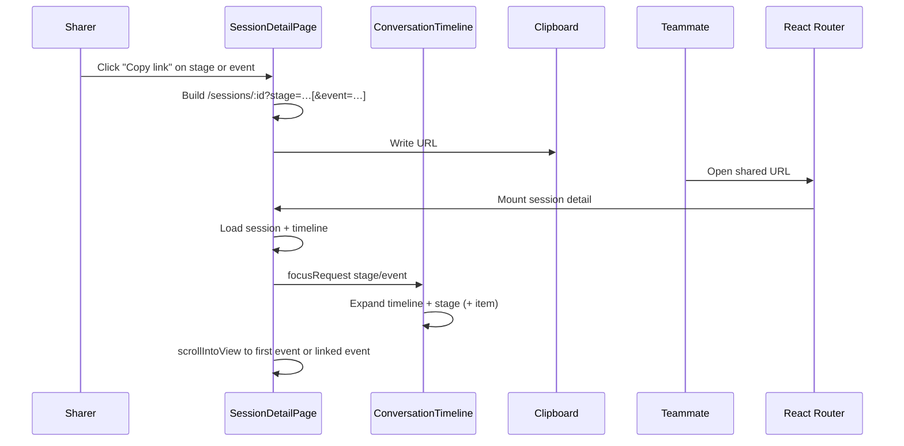

# Session Deep Links — Design

**Status:** Final  
**Decisions:** [session-deep-links-questions.md](session-deep-links-questions.md)

## Overview

Session pages are already shareable via `/sessions/:id`. Timeline stages (including follow-up chat turns) live on that same page with no URL identity, so teammates cannot point each other at a specific stage or event.

This design adds **shareable deep links** into the session detail timeline: copy a URL that opens the session, expands the target stage, and scrolls to a stage or event anchor. Auth stays unchanged — anyone who can open the session can open the deep link.

## Design Principles

1. **Reuse the session page** — deep links are query params on `/sessions/:id`, not a new route family.
2. **Stable server IDs only** — anchors are `stage_id` and `timeline_event.id` (no optimistic `temp-*` ids, no scroll offsets).
3. **Dashboard-only** — no backend API changes; both ids are already on `StageOverview` / `TimelineEvent`.
4. **Expand then scroll** — collapsed timelines, stages, and collapsible events open so the target is visible (same idea as in-session search).
5. **Graceful miss** — invalid anchors open the session normally with a non-blocking toast; never hard-fail the page.
6. **Copy-only URL updates** — the address bar is not live-synced while browsing; Copy link builds the share URL explicitly. This is about the **query string only**, not session data: after a deep link opens and focuses once, the page keeps behaving like a normal session detail view (WebSocket stream, new timeline events, new follow-up chats all still appear).

## Architecture / How It Works

### Current state (relevant facts)

```
AlertSession 1──0..1 Chat
Chat         1──* ChatUserMessage
ChatUserMessage 1──0..1 Stage (stage_type=chat)
Stage        1──* TimelineEvent
```

- Routes today: `/sessions/:id`, `/sessions/:id/trace`, `/sessions/:id/scoring` — no in-page focus params yet.
- `sessionDetailPath(id)` exists but does not yet accept query args (`web/dashboard/src/constants/routes.ts`).
- Product language “N follow-up chats” counts **chat stages (turns)**, not Chat entities (there is one Chat per session).
- Chat content renders **inline in `ConversationTimeline`**; `ChatPanel` is the input strip only.
- Timeline items expose `data-flow-item-id={timeline_event.id}` (FlowItem `id` = event id from `parseTimelineToFlow`).
- Stage separators use synthetic FlowItem ids `stage-sep-${stage.id}` and carry `stageId`, but **have no DOM `data-*` stage hook today**.
- Collapse state (`timelineCollapsed`, `stageCollapseOverrides`, `manualOverrides`) is **internal** to `ConversationTimeline`. External knobs today: `defaultCollapsed`, `expandCounter` (whole timeline only), `searchTerm` (search-driven expand).
- Terminal completed sessions often start with the timeline collapsed (`defaultCollapsed`).
- Optimistic chat messages use ids `temp-${timestamp}` until WebSocket replace — **never copy-link these**.
- Empty backend stages can render as separator-only groups (`items: []`).
- Page-level executive summary / final analysis cards sit **outside** the timeline FlowItems (legacy unstaged `executive_summary` events are filtered out of the flow). Stage-typed `exec_summary` stages may still appear **inside** the timeline.
- Dashboard has **no** `useSearchParams` usage yet; snackbars exist only as page-local MUI `Snackbar` on Triage/Usage — not on `SessionDetailPage`.

### Flow



### URL shape

```
/sessions/{sessionId}?stage={stageId}
/sessions/{sessionId}?stage={stageId}&event={timelineEventId}
```

| Link type | Params | Open behavior |
|-----------|--------|----------------|
| **Stage** | `stage` only | Expand timeline + stage; scroll/focus to the **first real timeline event** in the stage (for chat: the user question — chat `user_question` is sorted first in the parser). First event is resolved client-side — not baked into the URL. |
| **Event** | `stage` + `event` | Expand timeline + stage; expand the target event if collapsible; scroll/focus to `[data-flow-item-id="{event}"]`. |

**Copy** always emits absolute URLs via an extended helper:

```ts
sessionDetailPath(id, { stage?, event? })
// → /sessions/{id}?stage=…[&event=…]
```

`useSearchParams` is new for this feature (no existing dashboard pattern).

**Open robustness:** if the URL has `event` but omits `stage`, resolve `stage_id` from the matching timeline event when possible. Copy UI always includes `stage` when emitting event links.

### Focus plumbing (concrete API)

Do **not** reach into internal Maps from `SessionDetailPage`. Add a prop mirroring `searchTerm` / `expandCounter`:

```ts
/** Request ConversationTimeline to expand for a deep link; bump `nonce` to re-run. */
focusRequest?: {
  stageId: string;
  eventId?: string;
  nonce: number;
};
```

`ConversationTimeline` on `focusRequest` change:

1. Set `timelineCollapsed = false` (same effect as `expandCounter`).
2. Set `stageCollapseOverrides` so `stageId` is expanded (`false` = not collapsed).
3. If `eventId` is set and that FlowItem is collapsible/terminal, add it to `manualOverrides` so it expands (same as search expand).

`SessionDetailPage` owns:

1. Reading search params after REST load.
2. Validating stage/event against loaded `stages` / timeline FlowItems.
3. Emitting `focusRequest` + scrolling via `querySelector` (reuse search’s `[data-flow-item-id=…]` path).
4. Showing a **page-local MUI `Snackbar`** for miss/fallback (same approach as `TriageView` / `UsagePage`).

Add `data-stage-id={stageId}` on `StageSeparator` for empty-stage / fallback scroll targets.

### Resolution algorithm (on load)

1. Read `stage` / `event` from search params (ignore if both absent).
2. Wait until session + timeline REST load finishes and FlowItems are rendered.
3. Keep the normal session layout (executive summary / analysis cards unchanged — Q7).
4. Normalize params: if `event` present without `stage`, look up the event’s `stage_id`.
5. **Stage missing/invalid (and event not resolvable):** snackbar; show session unfocused.
6. **Stage valid, event absent:** emit `focusRequest` for stage; scroll to first non-`STAGE_SEPARATOR` FlowItem with that `stageId`, else to `[data-stage-id]` when the stage has no events yet (no toast).
7. **Stage + event valid:** emit `focusRequest` with both; scroll to `[data-flow-item-id="{event}"]`.
8. **Stage valid, event invalid:** snackbar + fall back to stage behavior (step 6).
9. Short-lived highlight on the focused element after scroll.

**First real timeline event** = first FlowItem in that stage group whose `type !== STAGE_SEPARATOR`, in parser/timeline order. Does **not** include `FinalAnalysisCard` (outside the flow).

### Copy-link UX

Available on **all stages** (investigation, synthesis, chat, exec_summary, scoring, etc.):

| Control | Location | URL built |
|---------|----------|-----------|
| Copy stage link | Stage separator; for chat also the user question | `?stage=` only |
| Copy event link | Individual timeline items within a stage (server ids only) | `?stage=&event=` |

- User-question “copy link” uses the **stage** URL (same landing for chat; more resilient than pinning the event id).
- Distinguish from existing **Copy content** (`CopyButton`) — use a link/icon affordance (e.g. `Link` icon / `CopyLinkButton`) that copies `origin + sessionDetailPath(...)`.
- Hide or disable copy-link when `item.id.startsWith('temp-')`.
- No live sync of `?stage=` / `?event=` as the user scrolls or expands stages (Q5). Params may remain in the address bar after opening a shared link; that is fine and is not live browsing sync.
- Deep-link focus runs **once** after the initial REST load. Live session updates continue as usual afterward; we do not re-scroll/re-focus when new events or chat turns arrive.

### Edge cases

| Case | Behavior |
|------|----------|
| Optimistic `temp-*` item | No copy-link control |
| `event` without `stage` | Resolve stage from timeline event; else snackbar |
| Stage exists, no events yet | Expand timeline + stage; silent scroll to `[data-stage-id]` (no toast) |
| Event in a different stage than `stage` param | Treat as invalid event → snackbar + stage fallback |
| Deep link while session still streaming | Focus once from the REST snapshot; WebSocket keeps appending new events as today — do not re-run focus/scroll on each update |

### Out of scope

- Public / unauthenticated sharing (see session-authorization proposals).
- Slack message format changes (can adopt deep links later).
- Trace / scoring page deep links.
- Live URL sync while browsing the timeline.
- Shared global toast/notification framework.

## Core Concepts

| Concept | Meaning |
|---------|---------|
| **Session link** | Existing `/sessions/:id` — whole investigation page |
| **Deep link** | Session link + `stage` / optional `event` query params |
| **Chat turn** | One `Stage` with `stage_type=chat` (one user message → one answer block) |
| **Stage anchor** | `stage_id` — opens on first real event in the stage (or stage separator if empty) |
| **Event anchor** | `timeline_event.id` — opens on that item inside its stage |
| **focusRequest** | Prop that asks `ConversationTimeline` to expand for a deep link |
| **Focus behavior** | Expand relevant UI + `scrollIntoView` (layout unchanged) |

## Implementation Plan

One phase = one PR. Scope is small enough for a single dashboard PR.

1. Extend `sessionDetailPath(id, { stage?, event? })` in `constants/routes.ts`.
2. Add `data-stage-id` on `StageSeparator`.
3. Add `focusRequest` prop to `ConversationTimeline` (expand timeline + stage + optional item).
4. On `SessionDetailPage`: `useSearchParams`, resolve after load, emit `focusRequest`, scroll, page-local `Snackbar`.
5. Add `CopyLinkButton` (or equivalent) for stage separators, chat user questions (stage URL), and event items; skip `temp-*`.
6. Brief highlight animation on the focused stage/event after scroll.
7. Tests: collapsed timeline, stage → first event (chat → user question), event expand+scroll, missing stage toast, missing event fallback, `temp-*` has no link, empty stage scroll-to-separator.

### Backend

**None.** Anchors are `stage_id` and `timeline_event.id` on existing session/timeline payloads.

## Decisions summary

| # | Decision |
|---|----------|
| Q1 | Stage + optional event |
| Q2 | Query parameters |
| Q3 | Stage + event copy controls; stage → first event; event → that item |
| Q4 | All stages from day one |
| Q5 | Copy-only (no live URL sync) |
| Q6 | Non-blocking snackbar; event miss falls back to stage focus |
| Q7 | Minimal layout — expand + scroll only |
