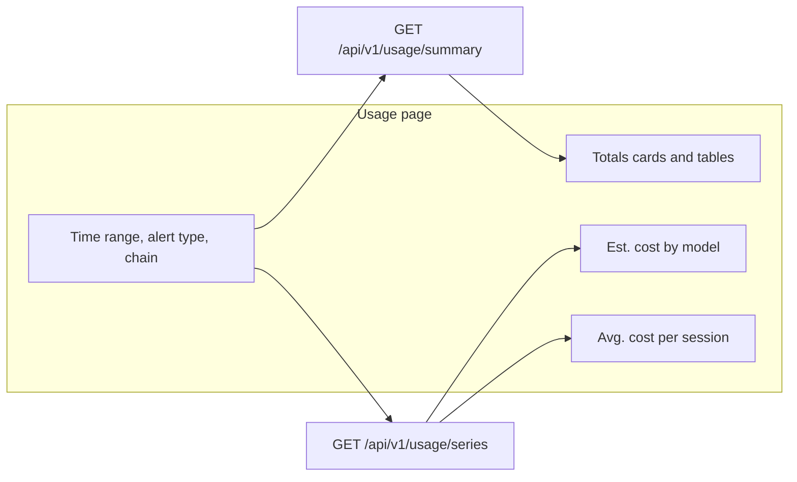

# Usage Charts

**Status:** Decided. Decisions are in [usage-charts-questions.md](usage-charts-questions.md). The dashboard is on Material UI 9 (`@mui/material` 9.4.0) and `@mui/x-date-pickers` 9.14.0. Charts use `@mui/x-charts` v9.

## Overview

The Usage page (`/usage`) already shows estimated spend for a date window: stat cards (including **Est. cost** and **Avg. cost / session**), plus tables by model, alert type, chain, and top sessions. Those numbers are a single snapshot. They do not show how spend accumulated, which models drove it, or whether a typical session got more expensive over the window.

This design adds two charts on that page, using the same filters (time range, alert type, chain):

1. **Estimated total cost, broken down by model** — a cumulative stacked area of list-price spend.
2. **Average estimated cost per session** — one line, the stat-card ratio computed per calendar day.

The Cursor usage chart is the inspiration for the cost chart. TARSy keeps its own labels (**Est.**), its existing completeness warnings, and does not add Cursor's Group-by or Metric controls.

Charts render only when cost estimation is enabled. Token tables stay as they are when estimation is off.

## Design Principles

1. **Same honesty as the stat cards.** Figures are list-price estimates, not invoices. Copy stays **Est.** Incomplete pricing uses the existing partial-cost warning; unpriced interactions contribute nothing to the stack and are not drawn as a fake model.
2. **Same window and filters.** Charts use the Usage page's `start_date` / `end_date`, optional `alert_type`, and optional `chain_id`. Soft-deleted sessions stay excluded. All `interaction_type` values count, matching session and Usage SUMs.
3. **Charts explain the cards.** Cost is attributed to session `created_at`. Within one series response, the sum of day costs equals that population's `totals.estimated_cost_usd`, the sum of day session counts equals `totals.session_count`, and the session-weighted average of the days equals `totals.average_cost_usd`. The live page loads summary and series separately, so the card and the chart can differ by a session that finished between the two calls until the next refresh.
4. **Server owns the calendar.** The client does not receive raw interactions. PostgreSQL buckets by calendar day, zero-fills empty days, and applies the operator timezone.
5. **Client owns geometry.** The API returns per-day deltas. The cost chart turns those into a cumulative stack. The average chart plots the per-day ratio.
6. **Tables remain the source for exact breakdowns.** Charts are for shape over time. The by-model table stays the full, uncollapsed list.
7. **Do not refetch the series for top-session ranking.** `rank_by` affects only the top-sessions table.

## Architecture / How It Works



The page already loads `GET /api/v1/usage/summary` for cards and tables. It loads `GET /api/v1/usage/series` in parallel, with the same window and filters plus the browser timezone. Changing **Rank top sessions** refetches the summary only.

The series request fails on its own. Tables still render. The chart region shows an error and a retry. A WebSocket terminal-session event refreshes both calls on the existing 2s throttle.

Charts render only when the summary says estimation is enabled. A parallel series call is safe when it is not: the disabled body is `{ "cost_estimation_enabled": false }`, and the page ignores it. After a summary has reported estimation disabled, later filter changes on that page skip the series call. The flag is process-wide, so this does not miss a toggle without a reload.

### Charts

Placed directly under the Totals cards. When the chart panel is at least 860px wide, the two charts share one row, each half the width and the same height, with their plot areas aligned. The cost legend sits above its plot and does not change that height. Below 860px they stack, cost chart on top, each full width.

**Cost chart.** Stacked area of cumulative estimated USD by model. The client adds each day's delta onto the previous days, treating a missing model that day as +0. A day with sessions and $0 spend keeps the stack flat; it is not a gap. The right edge of the stack matches the **Est. cost** card when the two responses see the same rows. Hovering a point shows that day's spend by model, the day total, and the cumulative total, with **Est.** in the title. Bands follow the `models` array (largest window cost first), then **Other** when that day has collapsed cost. MUI X stacks series in array order from the baseline, so the largest band sits on the bottom and Other on top; confirm that direction on the installed major. The **Other** row lists `other_models` for that day (cost descending, then `model_name`) with each model's Est. cost. When no day has collapsed cost, Other is absent from the stack and the legend.

**Average chart.** One line. Each point is that day's estimated cost divided by that day's session count (every non-deleted session created that day, including sessions with no LLM rows). Days with zero sessions break the solid line, so a quiet day does not read as a $0 session. A dotted segment joins the previous session-day to the next and has no mark of its own. The tooltip always includes the session count. A day with exactly one session uses a hollow mark, and the tooltip says the figure is that session's cost. Days with two or more sessions use a filled mark. The line is not split by model: a session that uses two models would be counted twice, and the by-model table already has **Avg. / session**.

Both charts use `formatEstimatedCostUsd`. The partial-completeness caption on the cost chart reads the series payload (`cost_completeness`, `unpriced_token_count`, `unpriced_interaction_count`) and uses the same copy as the **Est. cost** card. Per-day completeness is not shown.

When every returned day has `session_count == 0`, the chart region uses the tables' "No data in this window." treatment. It does not draw a flat $0 stack. A window that has sessions and $0 priced spend still draws the charts.

### Series query

Population matches the summary: non-deleted `alert_sessions` with `created_at >= start` and `created_at < end`, plus optional exact `alert_type` / `chain_id`. Two aggregates share that population:

- **Session counts** come from `alert_sessions`, grouped by the calendar day of `created_at`. This includes sessions with no LLM rows. The summary already counts those sessions with a separate `AlertSession` query; the series day counts must use the same set. Counting interaction rows would drop those sessions and break **Avg. cost / session**.
- **Cost** is `SUM(estimated_cost_usd)` of interactions (all `interaction_type` values) on those sessions, grouped by the calendar day of the **session's** `created_at` and by `model_name`. Null costs add nothing. Join interactions onto the session filter; do not bucket by `llm_interactions.created_at`.

The denominator of a day's average is that day's session count, not the number of sessions that called a given model.

A session that starts Monday and keeps chatting on Wednesday shows all of its cost on Monday. A session created before the window is excluded even if an interaction falls inside it. That is the same edge case the Usage page already documents.

Buckets:

- Every bucket is one calendar day, including Last day (usually one or two partial days).
- The dashboard sends the browser IANA timezone (`Intl.DateTimeFormat().resolvedOptions().timeZone`). Resolve it with `time.LoadLocation`. A known name is applied with `AT TIME ZONE` to session `created_at` (`timestamptz`). A missing or unknown name falls back to UTC and is not an error. The response `timezone` field is the zone actually used.
- Build days with `date_trunc('day', created_at AT TIME ZONE zone)` and `generate_series` stepped by `interval '1 day'` on that local timestamp, then convert the bucket bounds back with `AT TIME ZONE`. Do not step `timestamptz` by 24 hours; a DST day is not 24 hours long and the series would drift.
- The series is half-open. A window that ends exactly on local midnight does not include that day's bucket. The first bucket is the local day that contains `start`, and the last bucket is the local day that contains the instant just before `end`.
- Days inside the window with no sessions are still returned: `session_count: 0`, `estimated_cost_usd: 0`, `average_cost_usd` omitted, no model costs. Omit follows the summary's `omitempty` pattern. The client treats `session_count == 0` as a gap on the average line.
- Each point's `start` and `end` are that local day clipped to the request window, so the first and last days of a rolling range can be shorter than a calendar day. Tick labels are the calendar date of `start` in the applied timezone. The tooltip shows the clipped interval.

No new index in this feature. The series scans the same session population as the summary. If that proves slow, an index is a follow-up.

Model series: rank models by window priced cost descending, then `model_name` ascending. The first six with cost **greater than zero** become `models`. A model whose priced sum is zero, including a model that is only unpriced, does not take a slot and does not appear in `other_models`. Remaining models with a positive window cost are **Other**. Each point's `other_models` lists the collapsed models with a non-zero cost that day, cost descending then `model_name` ascending. The Other band is their sum. Fewer than six positive-cost models means a shorter `models` list and no Other. The by-model table is unchanged and still lists every model, including unpriced ones.

### API

```text
GET /api/v1/usage/series?start_date=&end_date=&alert_type=&chain_id=&timezone=
```

| Param | Required | Notes |
|-------|----------|--------|
| `start_date` | yes | RFC3339. Same half-open window rules as the summary, including the 365-day cap. |
| `end_date` | yes | RFC3339, exclusive. |
| `alert_type` | no | Exact match. |
| `chain_id` | no | Exact match. |
| `timezone` | no | IANA name, for example `America/Los_Angeles`. Missing or unknown → UTC. The response echoes the zone that was applied. |

When estimation is enabled:

```json
{
  "cost_estimation_enabled": true,
  "window": { "start": "2026-07-01T07:00:00Z", "end": "2026-08-01T07:00:00Z" },
  "timezone": "America/Los_Angeles",
  "bucket": "day",
  "cost_completeness": "partial",
  "unpriced_interaction_count": 12,
  "unpriced_token_count": 1200000,
  "models": ["claude-sonnet", "gpt-5"],
  "points": [
    {
      "start": "2026-07-01T07:00:00Z",
      "end": "2026-07-02T07:00:00Z",
      "session_count": 4,
      "estimated_cost_usd": 12.5,
      "average_cost_usd": 3.125,
      "by_model": { "claude-sonnet": 10.0, "gpt-5": 2.5 }
    }
  ]
}
```

The example is one day of the window. A real response includes every local day from `start` through the day before `end`, including days with no sessions.

- `bucket` is always `day`.
- `timezone` is the zone that was applied. It can be `UTC` when the request omitted the parameter or sent an unknown name.
- `models` is the stack order: up to six names, largest window cost first, then `model_name` ascending on ties. It does not include Other. The chart must not infer order from `by_model` key order.
- `by_model` contains only those named series. A missing key means zero for that day.
- `other_models` lists collapsed models with a non-zero cost that day, cost descending then `model_name` ascending. Omit the field when the day has none, as in the example above (both models fit in the top six). The Other band is the sum of these costs. The key is not a `model_name`, so a real model cannot collide with the label. Shape when the day has collapsed cost: `[{ "model_name": "gemini-flash", "estimated_cost_usd": 0.4 }]`.
- `average_cost_usd` is omitted when `session_count` is 0. Otherwise it is `estimated_cost_usd / session_count`.
- `estimated_cost_usd` on a point is the sum of `by_model` plus `other_models` (priced rows only).
- Completeness reuses `DeriveCostCompleteness` and the summary's token-bearing predicate (`tokenBearingPredicateSQL`, which includes cache columns) and the same unpriced-token SUM. The fields are repeated here so the chart caption does not wait on the summary. Compare cost totals with a small tolerance (`InDelta`), the same way the summary tests do.

When estimation is disabled, the handler still returns 200:

```json
{ "cost_estimation_enabled": false }
```

The first load may already have asked for the series in parallel; the page ignores this body. Later filter changes skip the call. The flag keeps a direct API caller consistent with the summary.

### Chart library

`@mui/x-charts` v9 (community), on the same 9.x line as `@mui/x-date-pickers` so they share `@mui/utils` and `@mui/x-internals`. Add it as `^9.14.0` next to the date pickers. Do not add v8: that major depends on `@mui/utils` v7.

Stacked area is `LineChart` with `area` and a shared `stack` id. The average chart is a `LineChart` with nulls for empty days. Colors come from a fixed categorical palette so series keep their color across refreshes, and the colors stay readable in both `data-theme` schemes. A custom tooltip renders the day breakdown.

v9 defaults that this feature sets explicitly:

- `showMark` is off by default. Leave it off on the cost area. Set it on the average line, with a hollow mark when `session_count` is 1.
- The axis tooltip hook is `useAxesTooltip`. The tooltip is portaled into the chart container, so style it from the chart rather than from `document.body`.
- The line x-axis domain is strict (`preferStrictDomainInLineCharts` is the default). The axis matches the first and last day, with no extra padding. That is the range these charts want.

## Core Concepts

### Bucket

A half-open calendar day in the applied timezone. Points cover the request window without gaps in the day sequence. Each session in the window is assigned to exactly one day, the local day of its `created_at`. A session created before `start` is not in the window, even when that local day overlaps the window.

### Attributed cost

`SUM(estimated_cost_usd)` of interactions belonging to sessions created on that day. Null costs add nothing. Explicit `$0` is a real zero. This is the same SUM the summary uses, split by day and model.

### Average cost per session

`day estimated_cost_usd / day session_count`, with `session_count` equal to non-deleted sessions created that day, including sessions with no LLM rows. The population matches **Avg. cost / session** on the Totals card (`usageAverageCostUSD`). It is a fleet ratio, not a per-model ratio. The field is omitted when `session_count` is 0. The solid line gaps there, and a dotted segment bridges to the next session-day. A day with one session is drawn as a hollow mark because the ratio is that session's cost.

### Named series and Other

A display grouping for the cost chart. Up to six models with positive window cost get their own band, in `models` order. **Other** is the sum of `other_models` on that day and is not a `model_name`.

## Out of Scope

- Group-by (alert type, chain) and a metric toggle (tokens vs spend). The cost chart is by model. The average chart is one fleet line.
- Token time series.
- Hourly buckets.
- Per-bucket completeness markers, confidence intervals, and a "fewer than N sessions" fade beyond the single-session hollow mark.
- Cache-token series on the charts. Cost already includes cache pricing at write time; the charts do not draw cache volume. That matches the existing note that Usage charts do not SUM cache tokens.
- Budget lines, forecasts, and invoice reconciliation.
- A new database index, unless the series query shows up as slow later.
- Changes to how the summary, stat cards, or breakdown tables compute their numbers.

## Implementation Plan

One PR. The series endpoint exists to feed these charts, and nothing else calls it. Landing the API alone leaves an unused route. The Go query and the two charts are one feature, and the diff stays reviewable: one handler, one service query, and a chart section on the Usage page.

### PR — Usage cost charts

**Lands**

- Route next to the summary in `pkg/api/server.go`.
- Handler in `pkg/api/handler_usage.go`: reuse the summary's window validation (RFC3339, `start < end`, ≤ 365 days). Resolve `timezone` with `time.LoadLocation`. Missing or unknown names use UTC. Echo the applied zone on the response.
- DTOs in `pkg/models/session.go`.
- Query in `pkg/services/` (alongside `session_service_usage.go`): session counts from `alert_sessions`, cost from interactions grouped by the session's local day, zero-fill, top six models with cost greater than zero, `other_models` for the rest, average, completeness via `DeriveCostCompleteness` and `tokenBearingPredicateSQL`. `date_trunc` / `generate_series` stepped by `interval '1 day'` / `AT TIME ZONE` in PostgreSQL.
- Operator doc: a series section in `docs/session-usage-cost.md`, plus a line in the API lists in `README.md`, `docs/architecture-overview.md`, and `docs/functional-areas-design.md`.
- E2E helper next to `GetUsageSummary` in `test/e2e/helpers.go`.
- Dependency: `@mui/x-charts` v9 (`^9.14.0`), same major as `@mui/x-date-pickers`. See [Chart library](#chart-library).
- `getUsageSeries` beside `getUsageSummary` in `web/dashboard/src/services/api.ts`, and the response types in `web/dashboard/src/types/api.ts`.
- A small chart section component used by `web/dashboard/src/pages/UsagePage.tsx`, under Totals.
- Parallel fetch of the series. Request deps: `start`, `end`, `alert_type`, `chain_id`, browser IANA timezone. Not `rank_by`.
- Cumulative stacked cost chart and per-day average chart, hidden when estimation is disabled.
- Average line: solid line gaps on `session_count == 0`, with a dotted bridge to the next session-day; hollow mark when `session_count == 1`; tooltip includes the count.
- Cost tooltip: named models, day total, cumulative total, and the Other breakdown from `other_models`.
- Empty window: the same "No data in this window." treatment as the tables, in the chart region.
- Series error does not clear the tables.
- Live refresh refetches the series with the summary.

**Tests**

- `pkg/services/session_service_usage_test.go` (Postgres, same harness as the summary tests):
  - Sessions split across two days and two models land in the right points.
  - A day with no sessions is present, cost 0, and `average_cost_usd` omitted. A session with no LLM rows still counts toward that day's `session_count`.
  - Sum of `estimated_cost_usd` matches the summary total for the same params within `1e-9`. Sum of `session_count` equals `totals.session_count`. The session-weighted average of the days matches `totals.average_cost_usd`.
  - Soft-deleted sessions, `alert_type`, and `chain_id` match summary behavior.
  - A session created before the window is excluded even if an interaction falls inside it.
  - A session created on Monday with an interaction on Wednesday contributes its cost to Monday.
  - Unpriced rows do not add cost and do not create a series by themselves.
  - More than six models with positive cost: `models` has length 6 in cost-then-name order, and the rest appear under `other_models` on the days they have cost. An unpriced model appears in neither. A tie on the sixth slot follows `model_name` ascending.
  - A timezone offset puts a timestamp on the local calendar day. An unknown timezone falls back to UTC.
  - Estimation disabled returns `cost_estimation_enabled: false` and no points.
- Handler tests: window rules, and missing or unknown `timezone` still returns 200 with `timezone: "UTC"`.
- One e2e assertion in `test/e2e/usage_cost_test.go` that a series for the window sums to the summary cost when estimation is on, and that the disabled case omits the series payload.
- Extend `web/dashboard/src/test/pages/UsagePage.test.tsx` (and a focused component test if the chart markup is easier to assert there):
  - Charts render when the series payload has points and estimation is on.
  - Charts are absent when the summary says estimation is off. A disabled series payload is not rendered. After that summary, another filter change does not call the series client.
  - Changing rank-by does not call the series client again.
  - A partial-completeness caption is visible.
  - A failed series request leaves the totals cards on the page.
  - The cost tooltip lists `other_models` when that day has collapsed cost.
  - A one-session day is distinguishable from a multi-session day (hollow mark or equivalent accessible label).

Browser check of the Usage page (desktop width, and a narrow width so the full-width charts still fit) before calling the PR done: hover a cost point and confirm the tooltip lists that day, including Other when present, and confirm filters still refetch.

The summary response stays unchanged. Existing Usage tables stay as they are when estimation is disabled.

## Decisions

| # | Topic | Choice |
|---|--------|--------|
| [Q1](usage-charts-questions.md#q1-which-timestamp-fills-the-buckets) | Timestamp used to bucket | Session `created_at` |
| [Q2](usage-charts-questions.md#q2-how-should-estimated-total-cost-be-drawn) | Cost chart | Cumulative stacked area; tooltip has the day split, day total, and cumulative total |
| [Q3](usage-charts-questions.md#q3-what-should-the-average-chart-plot) | Average chart | Per-day fleet average; solid line gaps when there are no sessions, with a dotted bridge; hollow mark when there is one |
| [Q4](usage-charts-questions.md#q4-how-long-is-a-bucket) | Bucket size | Calendar day |
| [Q5](usage-charts-questions.md#q5-whose-calendar-is-a-day) | Timezone | Browser IANA zone; missing or unknown falls back to UTC; response echoes the zone used |
| [Q6](usage-charts-questions.md#q6-how-many-models-stay-visible) | Model series | Top 6 by window cost; the rest are Other, listed in that day's tooltip |
| [Q7](usage-charts-questions.md#q7-where-does-the-time-series-live) | API | `GET /api/v1/usage/series` |
| [Q8](usage-charts-questions.md#q8-which-chart-library) | Chart library | `@mui/x-charts` v9, matching Material UI 9 and the date pickers |
