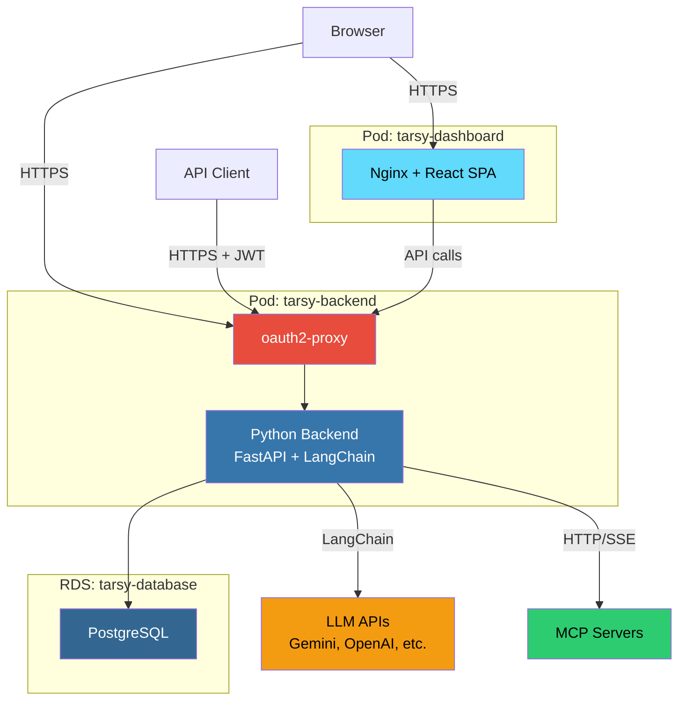
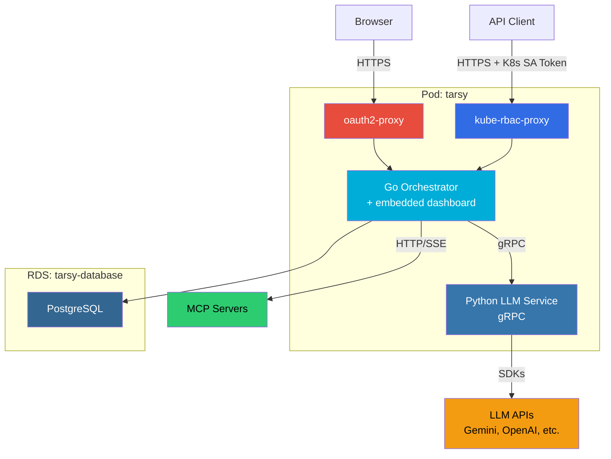
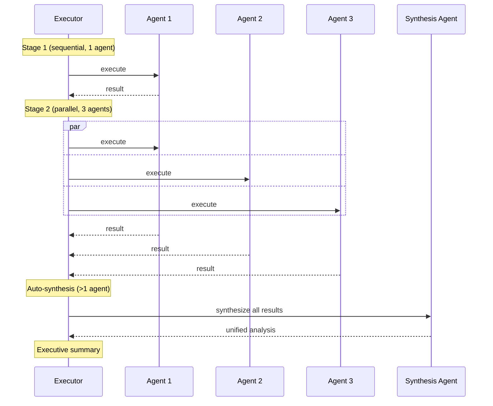
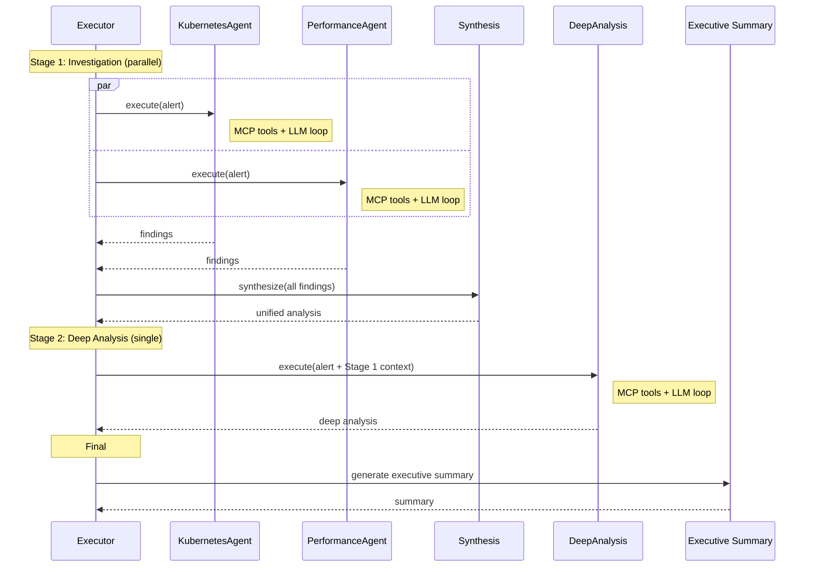

# TARSy Rewrite: Code Statistics

Comparison of old TARSy (`tarsy-bot`, Python monolith) vs new TARSy (Go/Python split architecture).

## Old TARSy

| Component | Code | Tests | Total |
|---|--:|--:|--:|
| Python backend | 37,331 | 109,174 | 146,505 |
| Dashboard (React/TS) | 32,094 | 10,047 | 42,141 |
| **Total** | **69,425** | **119,221** | **188,646** |

- Architecture: Python monolith (FastAPI + SQLAlchemy + LangChain)
- Test-to-code ratio: **1.7x**
- Python test-to-code ratio: **2.9x**

## New TARSy

| Component | Code | Tests | Total |
|---|--:|--:|--:|
| Go orchestrator | 27,840 | 32,997 | 60,837 |
| Python LLM service | 1,505 | 1,776 | 3,281 |
| Dashboard (React/TS) | 20,655 | 2,790 | 23,445 |
| **Hand-written total** | **50,000** | **37,563** | **87,563** |
| Ent ORM (generated) | 58,593 | — | 58,593 |
| **Including generated** | **108,593** | **37,563** | **146,156** |

- Architecture: Go orchestrator + Python LLM microservice + gRPC
- Hand-written test-to-code ratio: **0.75x**
- Development: 11 phases, AI-assisted (Cursor + Claude)

## Comparison

| Metric | Old | New | Change |
|---|--:|--:|---|
| Hand-written code | 69,425 | 50,000 | **-28%** |
| Hand-written tests | 119,221 | 37,563 | **-68%** |
| Hand-written total | 188,646 | 87,563 | **-54%** |
| Python application code | 37,331 | 1,505 | **-96%** |
| Python tests | 109,174 | 1,776 | **-98%** |
| Dashboard code | 32,094 | 20,655 | **-36%** |
| Dashboard tests | 10,047 | 2,790 | **-72%** |

## Architecture: Old TARSy (Production)

2 Deployments, 3 containers, 4 Routes.

## Architecture: New TARSy (Production)

1 Deployment, 4 containers, 1 Route.

**Key differences:**
- 3 Deployments → 2 (dashboard embedded in Go binary)
- 5 Routes → 1 (single entry point)
- Custom JWT auth → kube-rbac-proxy (K8s-native, zero key management)
- Python does everything → Python only talks to LLMs

## Chain Execution: Parallel Agents

Stages run agents in parallel using goroutines. A single-agent stage is just N=1 — no special case.

## Chain Execution: Full Pipeline

## Why Fewer Lines

- **Go's type system + Ent ORM** eliminated entire categories of tests that Python required (type validation, schema enforcement, FK constraints)
- **Python went from 37K to 1.5K** — the LLM service is just a stateless gRPC proxy; all orchestration moved to Go
- **Dashboard** kept the same UI but rewrote the data layer against a cleaner API, dropping ~11K lines
- **Test ratio dropped from 1.7x to 0.75x** — not less coverage, but compile-time guarantees replacing runtime checks
